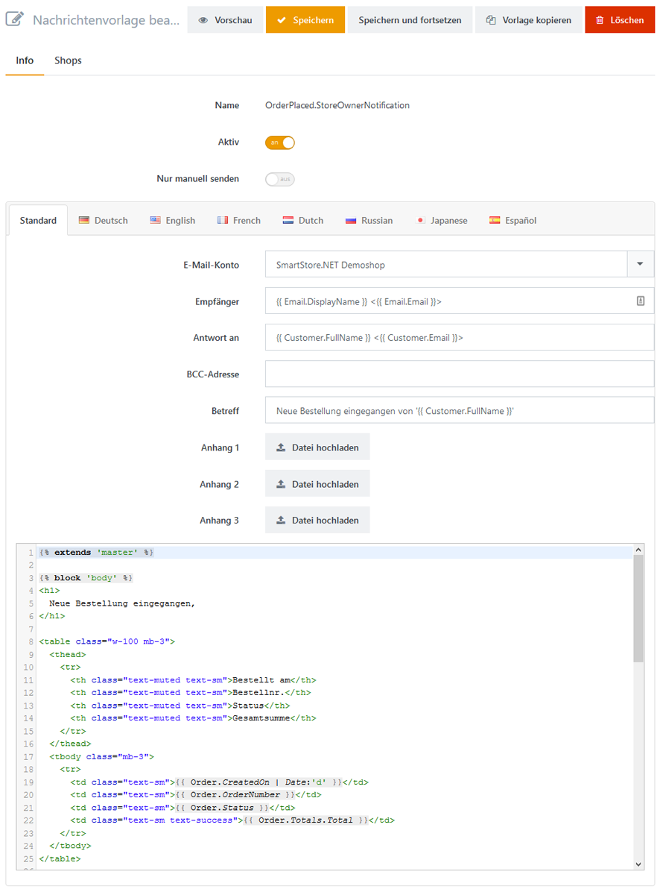
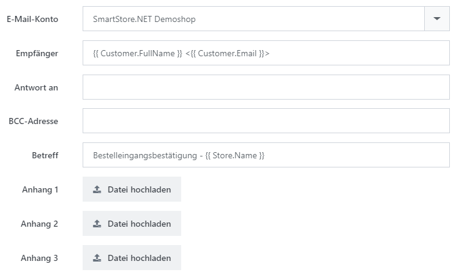
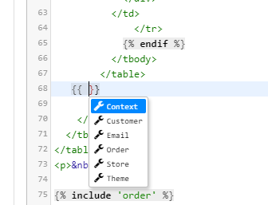
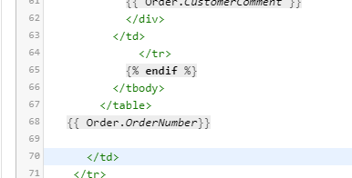

# Nachrichtenvorlagen anpassen

Wenn Sie einen Shop betreiben, gibt es mehrere Gelegenheiten, zu denen Sie Ihre Kunden über ein bestimmtes Ereignis informieren müssen. Wenn beispielsweise eine Bestellung eingeht, muss der Kunde eine Bestätigung erhalten, da er sich sonst fragt, ob die Bestellung erfolgreich war. Auch der Betreiber des Shops muss sofort informiert werden. Smartstore schickt im Fall einer getätigten Bestellung automatische E-Mails, eine an den Kunden als Bestellbestätigung und eine weitere an den Shopbetreiber, um ihn über die neue Bestellung in Kenntnis zu setzen. Weitere Ereignisse, bei denen E-Mails verschickt werden, sind Kundenregistrierungen, Newsletterabonnements, Produktempfehlungen u.s.w. Die E-Mails werden durch Nachrichtenvorlagen erstellt, die Sie Ihren Bedürfnissen anpassen können. Sie können diese Vorlagen bearbeiten, indem Sie zu **CMS > Nachrichtenvorlagen** gehen.

## Wie Sie eine Nachrichtenvorlage konfigurieren

Sie können eine Nachrichtenvorlage konfigurieren, indem Sie einfach auf die verlinkte Nachrichtenvorlage klicken.

Die allgemeinen Einstellungen sind im Reiter **Info** untergebracht. Im Reiter **Shops** können Sie die Nutzung einer Nachrichtenvorlage auf Shops begrenzen. So können Sie z.B. eine Nachrichtenvorlage mit der Funktion **Vorlage kopieren** zunächst duplizieren und dann jeweils für einzelne Shops entsprechend anpassen, wenn Sie mehrere Shops verwenden. Sie können aber auch mit der Funktion **Vorlage kopieren** unterschiedliche Nachrichtenvorlagen anlegen, welche nur zu bestimmten Zeiten, z.B. an Weihnachten aktiviert werden. Die Nachrichtenvorlagen können Sie über **Aktiv** aktivieren und deaktivieren.

Nun können Sie angeben, welcher E-Mail-Account genutzt werden soll, um die E-Mail zu senden (wenn Sie mehr darüber erfahren möchten, wie man E-Mail-Konten in Smartstore einrichtet, lesen Sie bitte [E-Mail Konten einrichten](../../benutzer-handbuch/konfiguration/e-mail-konten-einrichten.md)) sowie die Betreffszeile und eine Blindkopie (BCC) einrichten. Des Weiteren können Sie der Nachrichtvorlage bis zu drei Anhänge zufügen, die der Email beim Versenden angehängt werden sollen. Der Inhalt der Vorlage wird in einem HTML-Editor erfasst, in welchem Sie die Vorlage direkt bearbeiten können. Sie können auch sprachabhängige Versionen der Vorlage für jede Sprache erfassen, die Sie in Ihrem Shop angelegt haben. Für weitere Informationen über die Einrichtung von Sprachen lesen Sie bitte [Sprachen verwalten](../../benutzer-handbuch/konfiguration/sprachen-verwalten.md). 

## Vorlagentexte bearbeiten

Vorlagentexte werden als 'liquid templates' geschrieben. Liquid ist eine von Shopify entwickelte und als Open Source verfügbare Template-Sprache.  Liquid schafft auf eine sehr einfache Weise eine Brücke zwischen HTML und einem Datenspeicher, aus dem die im Template verwendeten Daten wie Aufträge und Kundendaten bezogen werden. Dies geschieht durch den Zugriff auf Variablen innerhalb des Templates mit einer einfach zu verwendenden und lesbaren Syntax.

## Auf Daten zugreifen

Sie können auf Daten wie Name des Kunden oder die Lieferadresse mittels zur Verfügung stehender Objekte und ihrer Eigenschaften zugreifen.

Liquid-Objekte werden immer durch doppelte geschweifte Klammern gekennzeichnet. Im Template-Editor werden per Intellisense alle Eigenschaften und Methoden eines Objektes angezeigt.

## Mit Platzhaltern arbeiten

Wenn Sie Ihre Nachrichtenvorlage konfigurieren, möchten Sie vielleicht Informationen über den derzeitigen Vorgang, für den die Vorlage genutzt wird, der Nachricht hinzufügen. Wenn Sie beispielsweise an der Vorlage arbeiten, die Ihren Kunden darüber informiert, dass eine Bestellung erfolgreich eingegangen ist, sollten Sie auf jeden Fall die Auftragsnummer in die Mail schreiben. Aus diesem Grund gibt es Platzhalter. Sie können zur Verfügung stehende Platzhalter überall in Ihrer Vorlage platzieren, diese werden, bevor die Email verschickt wird, aufgelöst. Der Platzhalter für die Auftragsnummer sieht so aus: {{ Order.OrderNumber}}.

> [!INFO]
> ### Platzhalter wählen
> Um einen Platzhalter in Ihrer Vorlage einzufügen, können Sie den Cursor irgendwo im HTML-Editor platzieren und den gewünschten Platzhalter wie folgt beschrieben einfügen.  
> An der gewünschten Stelle im Editor zwei sich öffnende geschweifte Klammern und direkt danach ein Leerzeichen eingeben und auf die Auswahl **Order** klicken. Danach einen Punkt eingeben und in der Auswahl die Option **OrderNumber** anklicken. Zum Abschluss die Änderungen speichern.
> 
> 
> 