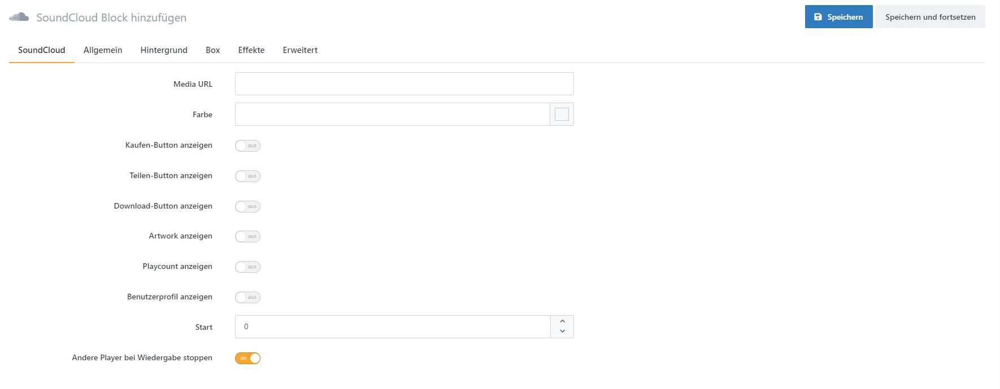

# Blockspezifische Einstellungen

# Text

Der Text-Block bietet umfassende Möglichkeiten, Text zu formatieren. Mit dem Feld *Titel* können Sie dem Block einen formatierten Titel vergeben. Der Titel wird über dem Intro- und Textelement angezeigt. Zusätzlich erhält der Block im [*Block-Manager*](../../smartstore-page-builder/benutzeroberflache/block-manager.md) den Titel als Namen. Alternativ können Sie den Titel auch verstecken, wodurch dieser nicht als Text innerhalb des Blockes angezeigt wird. Die *Tagline* wird oberhalb und das *Intro* unterhalb des Titels dargestellt. Das Textfeld, welches für Fließtext gedacht ist, verfügt über einen umfangreichen Texteditor, mit dem Sie Ihren Fließtext formatieren können. Des Weiteren bieten die einzelnen Textelemente Optionen um Schriftgröße, Schriftart, Schriftfarbe, HTML-Tags und Abstände zu konfigurieren.

Alternativ finden Sie ein Video zur Erläuterung des Text-Blockes unter: [https://www.youtube.com/watch?v=TRuKwwOs-nl&list=PLog4smYIQ2NSZ5gflnsPxi-qGxMKCOf-s&index=2](https://www.youtube.com/watch?v=TRuKwwOs-nI&list=PLog4smYIQ2NSZ5gfInsPxi-qGxMKCOf-s&index=2)

# Bild

Bei dem Bild-Block gibt es neben der Auswahloption der Grafik auch die Möglichkeit, die maximale Größe, der längsten Seite des Bildes, in Pixeln zu beschränken.

# Produktliste

Mit dem Produktlisten-Block können Sie eine Auswahl von Produkten anschaulich präsentieren. Hierbei stehen Ihnen Darstellungsoptionen wie Slider-, Raster- oder Listenansicht zur Verfügung. Konfigurieren Sie die Anzahl und Darstellung der angezeigten Produkte. Zum Beispiel können Sie bestimmen, ob Preise, Kurzbeschreibung, Lieferzeiten oder andere Attribute des Produktes angezeigt werden sollen.

# Warengruppen

Mit dem Warengruppen-Block  können Sie eine Auswahl von Warengruppen anschaulich präsentieren. Der Warengruppen-Block verfügt über dieselben Konfigurationsoptionen wie der Produktlistenblock.

# Herstellerliste

Mit dem Herstellerlisten-Block können Sie eine Auswahl von Produkten anschaulich präsentieren. Der Herstellerlistenblock verfügt über dieselben Konfigurationsoptionen wie der Produktlistenblock.

# IFrame

Mit dem IFrame-Block können Sie eine externe Seite innerhalb eines Fensters anzeigen lassen. Hierfür müssen Sie die Seiten-URL angeben.

# Video

Ihr Video sollten Sie als MP4-Datei hochladen, da dieses Dateiformat von den meisten Browsern unterstützt wird. Zusätzlich können Sie WebM- und Ogg-Dateien hochladen. Des Weiteren gibt es verschiedene Einstellungsmöglichkeiten wie Bildformat oder Steuerelemente, um Ihren Videoplayer anzupassen.

# YouTube

Der YouTube-Block bietet ähnliche Einstellungsoptionen wie der Videoblock. Anstelle eines Videos hochzuladen, müssen Sie die YouTube-ID oder die URL angeben. Neben Optionen wie Bildformat und Datenschutzmodus können Sie auch einen Zeitabschnitt im Video bestimmen, welcher abgespielt werden soll. 

# SoundCloud

Mit diesem Block lassen sich Audio-Streams des Dienstes [*SoundCloud*](https://soundcloud.com/) einbinden. Geben Sie zum Einbinden einfach die URL an. Zusätzlich stehen diverse Optionen für die Konfiguration der Darstellung bereit.

# Code

Mit dem Code-Block können Sie eigenen Code einfügen. Sie können dadurch als Beispiel benutzerdefinierte Funktionalitäten einbauen  oder selbst Ihren Text formatieren. Beim Coden werden Sie von IntelliSense unterstützt.

# Google Maps

Mit dem Google Maps-Block können Sie eine Adresse auf Google Maps anzeigen lassen. Hierfür müssen Sie Ihren Google Maps API Key sowie die Koordinaten - Längen- und Breitengrad - der gewünschten Position angeben.  

# MVC Route

Verwenden Sie den Route-Block um eine Action direkt anzusteuern um das (partial) ViewResult auszugeben. Dafür müssen Sie Ihre Route als JSON-Objekt angeben. Dieser Block ist für erfahrene Entwickler gedacht.

JSON Beispiel:  
{  
„Area“:““,  
„Controller“:“News“,  
„Action“:“HomePageNews“  
}

In dem Beispiel steuern wir den Controller *News* an um das ViewResult der Action-Methode *HomePageNews* zu bekommen. Mit diesem Beispiel werden News ausgegeben.

Ein Video zum MVC Route-Block finden Sie unter: [https://www.youtube.com/watch?v=rsTuHDK47rQ&list=PLog4smYIQ2NSZ5gfInsPxi-qGxMKCOf-s&index=4](https://www.youtube.com/watch?v=rsTuHDK47rQ&list=PLog4smYIQ2NSZ5gfInsPxi-qGxMKCOf-s&index=4)

# Story

Mithilfe des Story-Blockes können Sie komplette [*Stories*](../../smartstore-page-builder/story.md) als ein atomares Element in Ihre derzeitige Story einfügen. Dadurch ist es möglich, komplexe Storytelling, welche aus diversen kleinen Stories bestehen und sich über die komplette Seite erstrecken, einfach und übersichtlich innerhalb einer Story zu organisieren und zu verwalten.