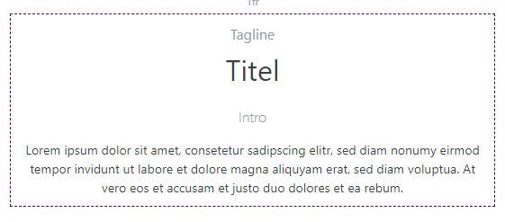

# Toolbox Block-Optionen

Wenn Sie einen Block ausgewählt haben, werden in der [*Toolbox*](../../smartstore-page-builder/benutzeroberflache/toolbox.md) die Block-Optionen angezeigt. Hier können Sie die Darstellung und Ausrichtung der Inhalte für die aktuelle Auflösungsstufe anpassen. Da sich Stories, je nach Bildschirmgröße, dynamisch auf den verfügbaren Platz ausbreiten, sollten Sie für jede Auflösungsstufe die Ausrichtung der Inhalte überprüfen und ggf. anpassen, damit die Story auf allen Auflösungen richtig dargestellt wird.

**① Abstände:** Hier werden *margin* (äußerer Blockabstand) und *padding* (innerer Blockabstand) definiert. Um diese Werte anzupassen, klicken Sie mit der Maus in eines der Kästchen und ziehen Sie die Maus mit gedrückter (linker) Maustaste nach oben, um den Abstand zu erhöhen, oder nach unten, um den Abstand zu verringern. Dabei kann man Werte von 0 bis 6 bestimmen. 0 steht dabei für *kein Abstand* und 6 für einen *sehr großen Abstand*. Wenn das Feld keinen Wert eingetragen hat wird der Wert der vorherigen Auflösungsstufe übernommen.

**② Horizontale Ausrichtung:** Bestimmt, wie der Blockinhalt in der horizontalen Achse ausgerichtet werden soll (*Anfang*, *Mitte*, *Ende*). Standardmäßig beansprucht der Block die komplette Breite der Zelle *(Ausdehnen)*.

**③ Vertikale Ausrichtung:** Bestimmt, wie der Blockinhalt in der vertikalen Achse ausgerichtet werden soll (*Start*, *Mitte*, *Ende*). Standardmäßig beansprucht der Block die komplette Höhe der Zelle *(Ausdehnen)*.

**④ Textausrichtung:** Bestimmt die horizontale Textausrichtung. Dabei können Sie zwischen links-, mittig oder rechtsbündig wählen.

**⑤ z-index:** Bestimmt die Darstellungsreihenfolge der Blöcke in der Story und die Reihenfolge im [*Block-Manager*](../../smartstore-page-builder/benutzeroberflache/block-manager.md).

**⑥ Erweitert:** *(Nur für erfahrene Anwender)* Hier kann die Block-Position gemäß CSS-Grid-Spezifikation manuell editiert werden. Von Spalte/Zeile (einschließlich), bis Spalte/Zeile (ausschließlich). Dies entspricht den CSS-Attributen *grid-column: StartCol / EndCol* und *grid-row: StartRow / EndRow*.