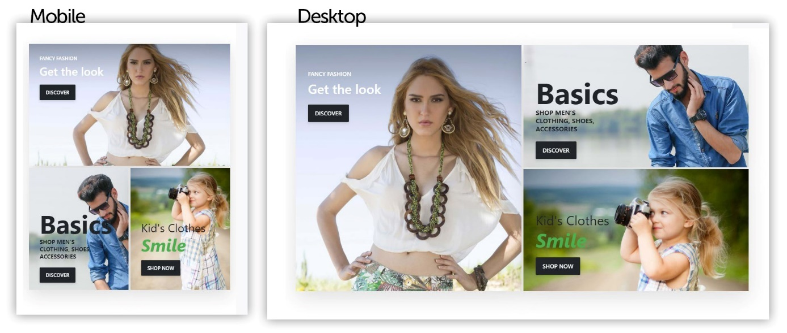
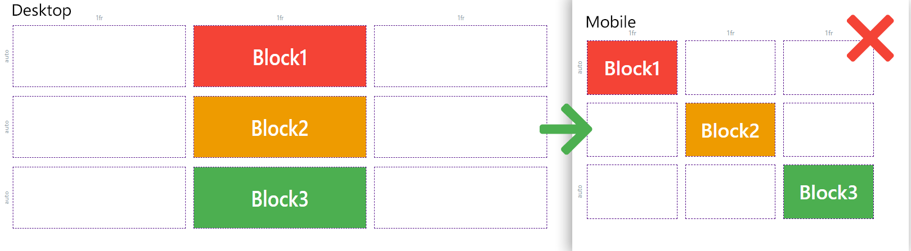

# Responsive Darstellung

# Mobile First

Um eine responsive Darstellung für alle Auflösungen und Endgeräte zu verwirklichen, verfolgt der Page Builder das Mobile **First Konzept**. Unter Mobile First versteht man, dass die Darstellung auf mobilen Endgeräten die höchste Priorität bei der Gestaltung einer Seite besitzen soll. Daher wird zuerst die mobile Version der Story konfiguriert. Darauf aufbauend werden für höhere Auflösungen stufenweise Anpassungen vorgenommen, um das Layout auf den dabei verfügbaren Platz auszulegen.

Hier sehen Sie einen Vergleich zwischen der mobilen Ansicht und der Ansicht für Desktopauflösungen, der *For Sale* Story.

Wie Sie sehen können, wurden die Positionierungen der Inhalte angepasst, um den gesamten Platz bei der Desktopauflösung zu nutzen. Die Blöcke werden dabei größer dargestellt, um den verfügbaren Platz effektiver zu beanspruchen. Es gibt fünf verschiedene Auflösungsstufen, um eine passende Darstellung für alle Endgeräte und Auflösungen zu ermöglichen.

**Hinweis:** Beachten Sie die richtige Konfigurationsreihenfolge der Auflösungsstufen von Stories.

Richtige Konfigurationsreihenfolge – Mobile zu Desktop:

Änderungen, die in der mobilen Ansicht vorgenommen wurden, sind auch in der Desktopansicht richtig übernommen.

Falsche Konfigurationsreihenfolge – Desktop zu Mobile:

Änderungen, die in der Desktopansicht vorgenommen wurden, sind von der mobilen Ansicht **nicht** übernommen worden.

# Device-Slider

Stories sind responsiv und werden dynamisch auf unterschiedliche Auflösungen angepasst. Die Einstellungen der Inhalte können unterschiedliche Konfigurationen pro Auflösungsstufe haben, wodurch jede Stufe abweichende Konfigurationen in Design und Layout zulässt. Das Raster selbst ist allerdings global für die Story gültig.

Durch die Positionierung des Device-Sliders auf den jeweiligen farbigen Abschnitt wird die aktuelle Auflösungseinstellung ausgewählt. Es gibt 5 Auflösungsstufen: Mobile > Mobile Landscape > Tablet > Tablet Landscape und Desktop.

Durch das **Mobile First**\-Konzept übergibt jede Auflösungsstufe Ihre Einstellungen an die nächst höhere Auflösungsstufe, wenn diese keine eingetragenen Werte für die jeweilige Einstellung hat. Das bedeutet, dass sämtliche mobile Konfigurationen auch auf allen anderen Auflösungen wie Tablet oder Desktop angewendet werden, wenn keine expliziten Einstellungen bei den jeweiligen Auflösungen angegeben wurden.  

Sollten Sie nachträglich Änderungen an Ihrem Layout oder den Inhalten vornehmen, vergewissern Sie sich, dass Einstellungen auf höhere Auflösungen nach wie vor wie gewünscht sind.

Wenn Sie nun die Story-Vorlage Fashion betrachten, werden Sie sehen, dass sich die mobile Anordnung der Inhalte von der Desktopdarstellung unterscheidet.

