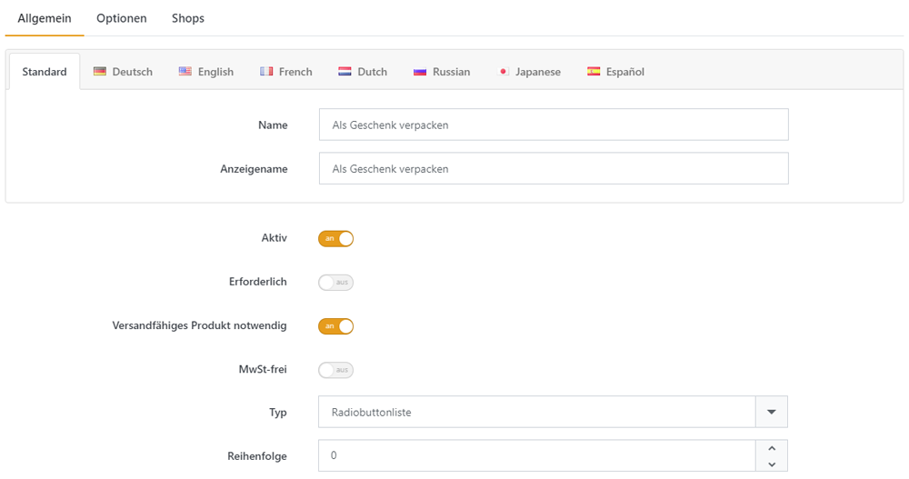

# Checkout Attribute verwalten

Sie können Checkout Attribute verwalten, indem Sie zu **Katalog > Checkout Attribute** navigieren.

## Anwendungsszenario

Stellen Sie sich vor, dass Sie Produkte verkaufen, die mit hoher Wahrscheinlichkeit verschenkt werden (z. B.: Schmuck oder Blumen). Dann möchten Sie vielleicht Ihren Kunden eine Option anbieten, die gekauften Produkte in Geschenkpapier verpacken zu lassen. Da die meisten Ihrer Produkte potentielle Geschenke sind, sollten Sie eine systemweite Option erstellen, um dies zu ermöglichen. **Checkout Attribute** sind die ideale Lösung für diesen Zweck, da sie in der Warenkorbübersicht in der ersten Seite des Checkout-Vorgangs angezeigt werden und Ihre Kunden sich an dieser Stelle dafür entscheiden können. 

## Ein Checkout Attribut erstellen

Bei der Erstellung eines Checkout Attributs erstellen und konfigurieren Sie zunächst das gewünschte Attribut, und fügen dann die Werte zu, aus denen Ihre Kunden während des Checkout-Vorgangs wählen können. 

### Allgemein Eigenschaften 

| **Feld** | **Beschreibung** |
| --- | --- |
| Name | Der Name des Checkout-Attributs. |
| Anzeigename | Anzeigename. |
| Aktiv | Legt fest, ob das Checkout-Attribut in Ihrem Shop aktiv ist. |
| Erforderlich | Legt fest, ob ein Kunde einen Wert angeben muss, bevor der Bestellprozess fortgesetzt werden kann. |
| Versandfertiges Produkt notwendig | Legt fest, ob zur Anzeige des Attributes versandfähige Produkte im Warenkorb liegen müssen. |
| Mwst-frei | Bestimmt, ob diese Option steuerfrei ist (beim Checkout an der Kasse wird keine Steuer berechnet) |
| Typ | Bestimmt den Steuerelement-Typen für die Erfassung der Attribut-Werte. |
| Reihenfolge | Legt die Anzeige-Priorität fest (1 steht für das erste Element in der Liste) |

### Attribut-Wert Eigenschaften

| **Feld** | **Beschreibung** |
| --- | --- |
| Name | Der Name des Checkout-Attribut-Werts. |
| Preis anpassen | Die Preisanpassung, die durchgeführt wird, wenn man diesen Attributwert auswählt, z. B. '10' um 10 Dollar hinzuzufügen. |
| Gewicht anpassen | Die Gewichtsanpassung, die durchgeführt wird, wenn man diesen Attributwert auswählt. |
| Ist Voreinstellung | Legt fest, ob dieser Attributwert für den Kunden vorausgewählt wird. |
| Reihenfolge | Die Anzeigenreihenfolge des Attributwerts. 1 steht für das erste Objekt in der Attributwertliste. |