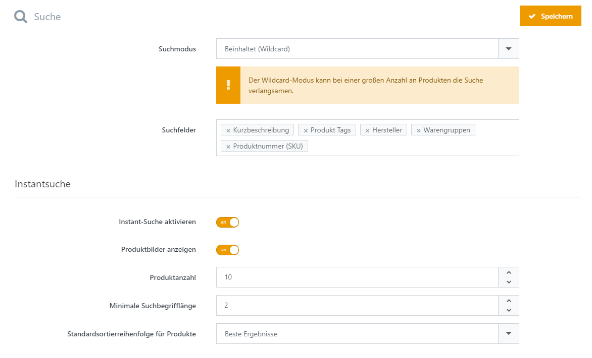

# Suche

Im Bereich **Suche** wird u.a. festgelegt welche Suchfelder für die Suche berücksichtigt werden und welche Filter in den Produktlisten angezeigt werden.

|     |     |
| --- | --- |
| Suchmodus | Legt den Suchmodus fest. Bitte beachten Sie, dass der Suchmodus die Geschwindigkeit der Suche (abhängig von der Produktanzahl) beeinflusst. 'Ist gleich' ist am schnellsten, 'Beinhaltet' am langsamsten.  > [!INFO] > Der Wildcard-Modus kann bei einer großen Anzahl an Produkten die Suche verlangsamen. |
| Suchfelder | Legt zusätzlich zu durchsuchende Felder fest. Der Produktname wird grundsätzlich immer durchsucht. |
| Standardsortierreihenfolge | Legt die Standardsortierreihenfolge für Produkte in den Suchergebnissen fest. |

### Ergebnisfilterung

In der Ergebnisfilterung wird festgelegt welche Filter in den Produktlisten angezeigt werden und wie viele Filter maximal pro Gruppe angezeigt werden.

|     |     |
| --- | --- |
| Minimale Trefferanzahl für Filter | Legt die minimale Anzahl an Suchtreffern fest, ab dem ein Filter angezeigt wird. |
| Maximale Anzahl an Filtern | Legt die maximale Anzahl an Filtern pro Gruppe fest. |

Unter den Reitern Marke, Preis, Bewertung, Lieferzeit, Verfügbarkeit und Neuheit können einzelne Filter für die Anzeige deaktiviert werden.  
Zusätzlich kann dort die Reihenfolge geändert werden und es besteht die Möglichkeit andere Namen für die Mehrsprachigkeit auszuwählen.

