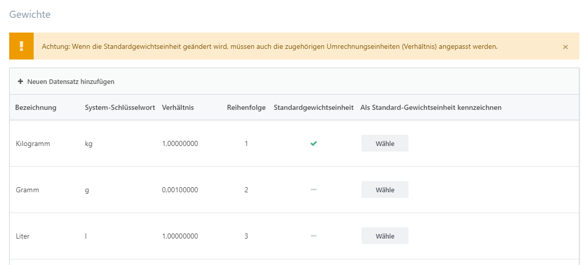

# Gewichte, Verpackungseinheiten & Abmessungen verwalten

## Gewichte verwalten

Sie können Gewichte verwalten, indem Sie zu **Konfiguration > Listen > Gewichte** gehen. Die Gewichtseinheit, die Sie nutzen, wenn Sie Produkte und Versandarten konfigurieren ist immer die **Standardgewichtseinheit**. Das **Verhältnis** wird verwendet, wenn Gewichtswerte in andere Gewichtseinheiten konvertiert werden müssen (z. B. wenn bestimmte Versandarten den Gewichtswert in einer Einheit übermitteln müssen, die von der **Standardgewichtseinheit** abweicht) .

> [!INFO]
> Wenn Sie Ihre **Standardgewichtseinheit** wechseln, müssen auch die zugehörigen Umrechnungsverhältnisse (Spalte: **Verhältnis**) angepasst werden.

## Verpackungseinheiten verwalten

Sie können Verpackungseinheiten verwalten, indem Sie zu **Konfiguration > Listen > Verpackungseinheiten** navigieren. Die Verpackungseinheiten, die Sie hier anlegen, können bei Produkten in der Registerkarte [Allgemein](../../benutzer-handbuch/katalog/produkte-verwalten/produkte-erstellen-und-bearbeiten.md) verwendet werden. 

## Abmessungen verwalten

Sie können Abmessungen verwalten, indem Sie zu **Konfiguration > Listen > Abmessungen** gehen. Die Maßeinheit, die verwendet wird, wenn Sie Produkte konfigurieren, ist stets die **Standardmaßeinheit**. Das **Verhältnis zur Standardmaßeinheit** wird verwendet, wenn die Werte der Abmessungen in andere Maßeinheiten konvertiert werden müssen (z.B. wenn bestimmte Versandarten die Maßeinheit in einer Einheit übermitteln müssen, die von der  **Standardmaßeinheit** abweicht).

> [!INFO]
> Wenn die **Standard-Maßeinheit** geändert wird, müssen auch die zugehörigen Umrechnungsverhältnisse (Verhältnis) angepasst werden.

