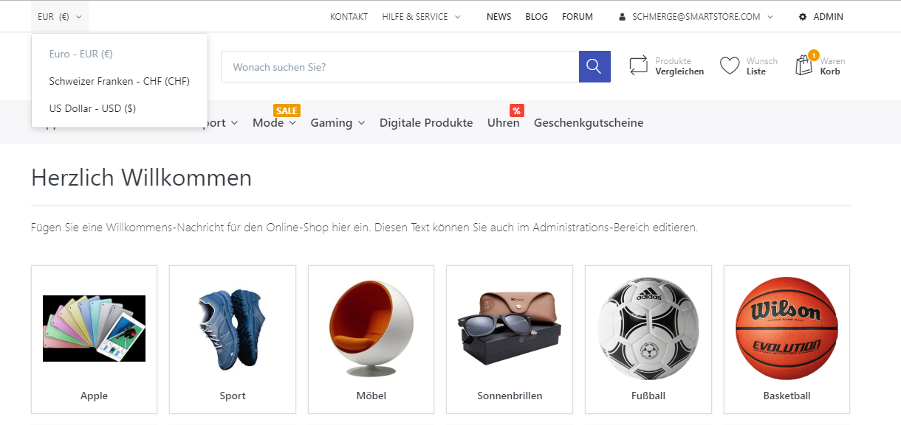

# Währungen verwalten

In Smartstore können Sie abhängig von Ihrer Zielkundengruppe verschiedene Währungen konfigurieren. Auf diese Weise können Sie Ihren Kunden die Anzeige von Preisen und den Kauf Ihrer Produkte in der von Ihnen gewünschten Währung ermöglichen. Um Währungen zu verwalten, gehen Sie zu **Konfiguration > Regionale Einstellungen > Währungen**.  

## Leitwährung

Abhängig von der Anzahl der installierten Wechselkurs-Plugins können Sie Ihren bevorzugten **Online Wechselkursdienst**  auswählen und festlegen, ob der Dienst die Wechselkurse automatisch aktualisieren soll, indem Sie das Kästchen **Autoupdate aktiviert** anklicken. Sie können Ihre Wechselkurse auch manuell aktualisieren, indem Sie auf **Wechselkurse aktualisieren** klicken. Wenn Ihr **Wechselkursdienst** eine Aktualisierung der Wechselkurse durchführt, greift er auf die aktuellen Wechselkurse auf einem Server zu (im Fall von ECB ist es der Server der Europäischen Zentralbank) und überschreibt die Wechselkurse Ihrer Währung mit dem aktuellen Wert des Servers. Die **Leitwährung** ist die Umrechnungswährung mit deren Hilfe die Wechselkurse berechnet werden.

## Leitwährung des Shops

Die Währung, die als **Leitwährung des Shops** festgelegt wurde, ist die Währung, in der im Administrationsbereich Ihres Shop Preise von Produkten und andere Kosten angegeben werden.

## Währungsdetails

|     |     |
| --- | --- |
| Name | Name der Währung |
| ISO Code | Der aus drei Buchstaben bestehende ISO 4217 Währungscode. |
| Kurs | Der Wechselkurs im Verhältnis zur Hauptwährung des Shops. |
| Länderspezifische Formatierung | Formatiert die Währung gemäß der gewählten länderspezifischen Formatierung. |
| Individuelle Formatierung | Die individuelle Formatierung wird auf die Währungsfelder angewendet. |
| Domain Endungen | Wählt diese Währung als Standardwährung auf Basis der Domain-Endung aus. Beispiel: .ch |
| Veröffentlicht | Legt fest, ob die Währung im Shop aktiv ist und angezeigt wird. |
| Anzeigereihenfolge | Legt die Anzeige-Priorität fest (1 steht bspw. für das erste Element in der Liste) |

## Runden

|     |     |
| --- | --- |
| Beträge aller Bestellpositionen runden | Legt fest, ob die Beträge aller Bestellpositionen gerundet werden sollen (Produkte, Gebühren, Steuern etc.) |
| Bestellsumme runden | Legt fest, ob die Bestellsumme gerundet werden soll. |

Alle Währungen, die veröffentlicht sind, können von Ihren Kunden im Frontend Ihres Shops, wie im nachfolgenden Screenshot dargestellt, ausgewählt werden. 

