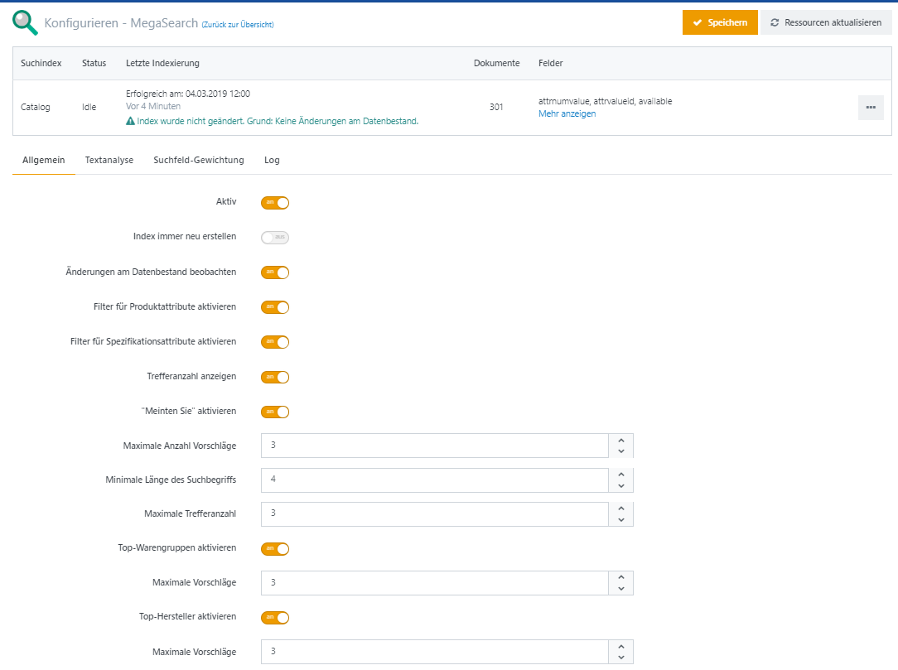
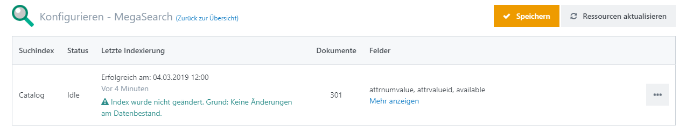

# MegaSearch Plugin

In den Smartstore kann die bisherige Suchfunktion durch eine auf Apache Lucene basierende Suche ersetzt werden. Schon während der Eingabe des Suchbegriffes kann die Instant-Suche unterhalb der Eingabezeile relevante Vorschläge zur aktuellen Suche anzeigen.

## Konfiguration des MegaSearch Plugins

### Tab "Allgemein"

| **Eingabefeld / Option** | **Beschreibung** |
| --- | --- |
| Aktiv | aktiviert/deaktiviert das MegaSearch Plugin |
| Index immer neu erstellen | Legt fest, ob der Suchindex durch die geplante Aufgabe stets neu erstellt anstatt aktualisiert werden soll. |
| Änderungen am Datenbestand beobachten | Legt fest, ob Änderungen am Datenbestand beobachtet werden sollen, um diese bei der nächsten Indexierung mit in den Suchindex aufzunehmen. |
| Filter für Produktattribute aktivieren | Legt fest, ob Filter bzw. Facetten für Produktattribute aktiviert sind. Diese Einstellung ist nur unter Verwendung des 'MegaSearchPlus' Plugins wirksam. Für Informationen über Filter/Facetten lesen Sie bitte wie funktionieren Filter/Facetten. |
| Filter für Spezifikationsattribute aktivieren | Legt fest, ob Filter bzw. Facetten für Spezifikationsattribute aktiviert sind. Diese Einstellung ist nur unter Verwendung des 'MegaSearchPlus' Plugins wirksam. Für Informationen über Filter/Facetten lesen Sie bitte wie funktionieren Filter/Facetten. |
| Trefferanzahl anzeigen | Legt fest, ob bei Filtern bzw. Facetten die jeweilige Trefferanzahl angezeigt werden soll. |
| "Meinten Sie" aktivieren | Legt fest, ob auf Basis des Suchbegriffs Vorschläge mit ähnlichen Begriffen angezeigt werden sollen. |
| Maximale Anzahl Vorschläge | Legt die maximale Anzahl an Vorschlägen fest, die unter 'Meinten Sie' angezeigt werden sollen. |
| Minimale Länge des Suchbegriffs | Legt die minimale Länge des Suchbegriffs fest. Bei einer geringeren Länge werden keine Vorschläge unter 'Meinten Sie' angezeigt. |
| Maximale Trefferanzahl | Legt die maximale Anzahl von Produkttreffern fest, bis zu der Vorschläge unter 'Meinten Sie' angezeigt werden. |
| Top-Warengruppen aktivieren | Legt fest, ob zu einem Suchbegriff Vorschläge für Warengruppen angezeigt werden sollen. |
| Maximale Vorschläge | Legt die maximale Anzahl der angezeigten Warengruppen fest. |
| Top-Hersteller aktivieren | Legt fest, ob zu einem Suchbegriff Vorschläge für Hersteller/Marken angezeigt werden sollen. |
| Maximale Vorschläge | Legt die maximale Anzahl der angezeigten Hersteller/Marken fest. |

### Gewichtung der Suchfelder (Boost)

Mit der Gewichtung der Felder kann die Reihenfolge von Suchtreffern beinflusst werden.  
  

> [!INFO]
> Gewichten Sie Felder, um die Reihenfolge von Suchtreffern zu beeinflussen. Im Falle eines Treffers im betreffenden Feld reiht ein höherer Wert das Produkt weiter vorne in der Liste der Suchtreffer ein.

### Tab "Textanalyse"

Mit der Textanalyse kann die Anzahl der Treffer erweitert erhöht werden. Es können u.a. auch Synonyme verwendet werden.

> [!INFO]
> Änderungen zur erweiterten Textanalyse werden erst nach einer Reindexierung wirksam!

| **Eingabefeld / Option** | **Beschreibung** |
| --- | --- |
| Erweiterte Textanalyse aktivieren | Legt fest, ob die erweiterte Textanalyse aktiviert werden soll. |
| Art der Textanalyse | Legt die Art der Textanalyse fest. Whitespace ist eine vereinfachte Analyse, bei der lediglich nach Leerzeichen getrennt wird. |
| Abkürzungen | Legt Abkürzungen (z.B. cm, kg, W) fest, um mehr Suchbegriffe zu erzielen. Suchbegriffe mit und ohne Leerzeichen werden gefunden. Beispiel: Ein Produkt mit dem im Produktnamen enthaltenen Text "23cm" wird auch bei der Suche nach "23 cm" gefunden. |
| Synonyme | Ermöglicht die Festlegung von Synonym-Gruppen. Geben Sie pro Zeile alle Werte einer Gruppe durch Komma getrennt ein. Beispiel: notebook,laptop,convertible,ipad. |

### Statuszeile

In der Statuszeile wird der Status der letzten Indexierung und die Felder angezeigt, die für die Suche berücksichtigt werden.  
Über den rechten Button kann der Suchindex reindexiert, aktualisiert, optimiert und bearbeitet werden.

 

### MegaSearchPlus Plugin

Erweiterungen für das MegaSearch Plugin. Ergänzt die Produktdaten des Suchindex um lokalisierte Daten und um Multistore- und Zugriffsbeschränkungen. 

## Keywords

Bei der Produktbearbeitung können im Tab **Suche** Keywords festgelegt werden, über die das Produkt bei einer Suche gefunden wird. Für Druckerpapier könnten hier beispielsweise die Namen kompatibler Drucker eingegeben werden. Pro Zeile wird dabei immer ein Keyword festgelegt. Damit die Keywords berücksichtigt werden, müssen sie in den Sucheinstellungen als Suchfeld ausgewählt sein. In der MegaSearch-Konfiguration lässt sich über die Gewichtung der Suchfelder zudem die Reihenfolge der Suchtreffer über das Keyword-Feld beeinflussen.

Keywords können im Rahmen eines Imports von Produktdaten importiert werden. Verwenden Sie dazu die Spalte **MegaSearch.Product.Keywords** für Keywords, die in der Standardsprache des Shops importiert werden sollen. Sollen Keywords in einer anderen Sprache importiert werden, hängen Sie den entsprechenden Gebietsschema-Code in eckigen Klammern an den Spaltennamen an. Für Englisch lautet der Spaltenname beispielsweise **MegaSearch.Product.Keywords\[en-US\]**. Mehrere Werte pro Feld werden wahlweise durch Semikolon, Komma oder Pipe-Symbol | voneinander getrennt.