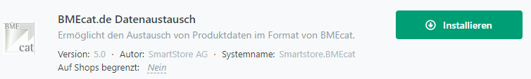

# Plugins oder Themes installieren

Smartstore wird mit bereits installierten Plugins und Themes ausgeliefert. Weitere Plugins und Themes finden Sie auf dem [Smartstore Marketplace](http://community.smartstore.com/index.php?/files/) von Smartstore selbst und von Drittanbietern. Smartstore Plugin- und Theme-Dateien haben das Dateiformat Zip und die Endung `.zip`.

## Wie man ein Plugin hochlädt und installiert

Wählen Sie den Menüpunkt Plugins > Plugins verwalten und klicken Sie auf die Schaltfläche Plugin hochladen. Wählen Sie die Zip-Datei, die das Plugin enthält. Das Plugin wurde nun hochgeladen und kann in der Plugin-Verwaltung installiert und konfiguriert werden.

Das Plugin wurde nun hochgeladen und kann im Bereich der Plugin-Verwaltung installiert und konfiguriert werden.

## Wie man ein Theme hochlädt und aktiviert

Wählen Sie den Menüpunkt **Konfiguration>Themes** und klicken Sie auf die Schaltfläche **Theme hochladen**. Wählen Sie die Zip-Datei aus, die das Theme enthält.

Das Theme wurde nun hochgeladen und kann im Bereich der Theme-Verwaltung konfiguriert und aktiviert werden.

## Manueller upload

Sie können Themes und Plugins auch manuell hochladen, indem Sie sie in den entsprechenden Ordner hochladen. Themes werden in das Verzeichnis `/Themes` hochgeladen, und Plugins gehören in das Verzeichnis `/Modules`. Nach dem Upload müssen Sie die Liste der Themes neu laden, indem Sie im Konfigurationsbereich des Themes auf die Schaltfläche **Themes neu laden** klicken oder bei Plugins auf die Schaltfläche **Bearbeiten > Liste der Plugins neu laden**. Nun wird Ihr neues Theme oder Plugin im entsprechenden Konfigurationsbereich angezeigt und ist bereit, konfiguriert und verwendet zu werden.