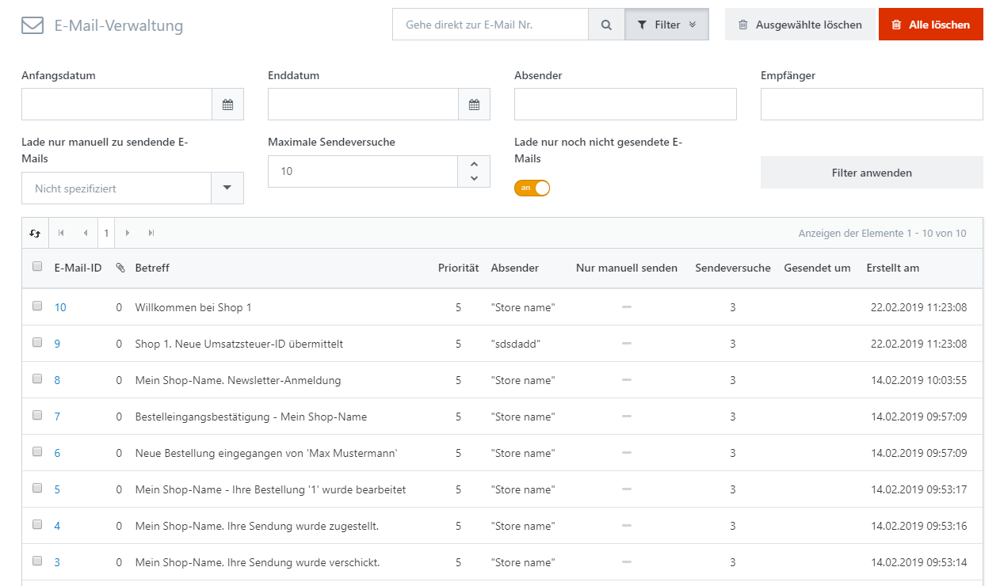

# E-Mail-Korrespondenz analysieren

Sie können Ihre Korrespondenz analysieren, indem Sie auf **System > E-Mail-Verwaltung** gehen. In diesem Bereich finden Sie jede Nachricht (z. B. Bestell-E-Mails, Forum-Nachrichten, Accountaktivierungs-E-Mails, u.s.w.), die von Ihrem Shop verschickt wurde oder darauf wartet verschickt zu werden. In der Detailansicht einer E-Mail können Sie die Nachricht bearbeiten und sie erneut für den Versand einordnen.

