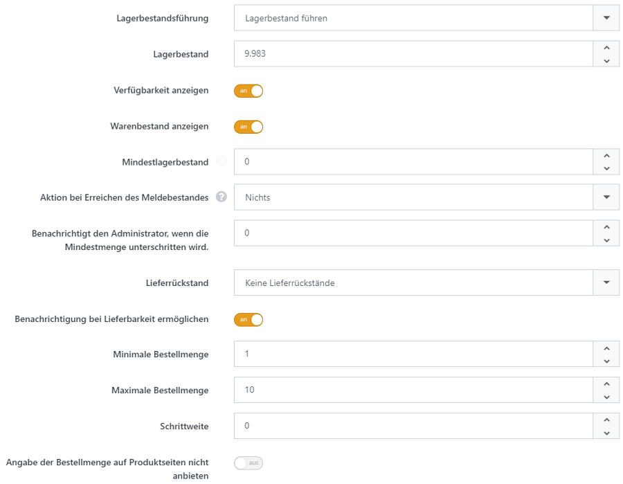

# Lagerbestand führen

In dem Bereich **Inventar** können Sie festlegen, ob Sie den Lagerbestand eines Produkts führen möchten. Wenn Sie diese Funktion aktivieren,  können Sie den Lagerbestand für das Produkt angeben und Handlungen festlegen, die ausgeführt werden sollen, sobald der Lagerbestand unter einen bestimmten Schwellwert fällt und nachbestellt werden muss.

|                                                          |                                                                                                                                                                                                                                                                                                                                                                                                                                                                                                                                                                                                                                                                                                         |
| -------------------------------------------------------- | ------------------------------------------------------------------------------------------------------------------------------------------------------------------------------------------------------------------------------------------------------------------------------------------------------------------------------------------------------------------------------------------------------------------------------------------------------------------------------------------------------------------------------------------------------------------------------------------------------------------------------------------------------------------------------------------------------- |
| Lagerbestandsführung                                     | Legt die Lagerbestandsführungs-Methode fest. Wenn aktiviert, wird der Lagerbestand bei jeder Bestellung automatisch angepasst. Führt bei niedrigem Lagerbestand eine Aktion aus und/oder benachrichtigt den Betreiber.                                                                                                                                                                                                                                                                                                                                                                                                                                                                                  |
| Lagerbestand                                             | Legt den aktuellen Lagerbestand des Produktes fest.                                                                                                                                                                                                                                                                                                                                                                                                                                                                                                                                                                                                                                                     |
| Verfügbarkeit anzeigen                                   | Legt fest, ob Kunden die Warenverfügbarkeit einsehen können.                                                                                                                                                                                                                                                                                                                                                                                                                                                                                                                                                                                                                                            |
| Mindestlagerbestand                                      | Legt den Mindestlagerbestand fest. Fällt der Bestand unter diesen Wert, so können bei aktivierter Lagerbestandsverwaltung verschiedene Aktionen ausgeführt werden (z.B. Benachrichtigung oder Deaktivierung des Produktes).                                                                                                                                                                                                                                                                                                                                                                                                                                                                             |
| Aktion bei Erreichen des Meldebestands                   | 
Zu ergreifende Maßnahme, wenn die Bestandsmenge unter den Mindestbestand fällt.  <strong>Möglichkeiten</strong>  - <em>Nichts</em> - Es passiert gar nichts. Das Produkt ist weiterhin genauso bestellbar wie vor dem Eintreten des Meldebestandsereignis. - <em>Kaufen-Button deaktivieren</em> - Der Button <em>Zum Warenkorb hinzufügen</em> wird für dieses Produkt nicht mehr angezeigt, so dass Ihre Kunden das Produkt nicht mehr kaufen können, wenn der Lagerbestand zu niedrig ist. - <em>Nicht veröffentlicht</em> - Das Produkt wird nicht mehr angezeigt, so dass Ihre Kunden das Produkt weder sehen noch kaufen können, sobald der Lagerbestand zu niedrig ist.
 |
| Benachrichtigung bei Lieferbarkeit ermöglichen           | Benachrichtigt den Administrator, wenn die Mindestmenge unterschritten wird.                                                                                                                                                                                                                                                                                                                                                                                                                                                                                                                                                                                                                            |
| Lieferrückstand                                          | 
Legt den Modus für Lieferrückstände fest.  <strong>Möglichkeiten:</strong>  - <em>Keine Lieferrückstände</em> - Kunden können das Produkt nicht kaufen, wenn das Produkt nicht auf Lager ist. - <em>Menge kleiner als 0 zulassen</em> - Kunden können das Produkt weiterhin kaufen, auch wenn das Produkt nicht mehr auf Lager ist. - <em>Menge kleiner als 0 zulassen und den Benutzer informieren</em> - Kunden können das Produkt kaufen, auch wenn es nicht mehr auf Lager ist und werden darüber informiert, dass das Produkt derzeit nicht auf Lager ist.
                                                                                                                |
| Benachrichtigung bei Lieferrückstand ermöglichen         | Legt fest, ob Kunden sich für eine Email-Benachrichtigung anmelden können, die die Lieferbarkeit von zuvor vergriffenen Produkten meldet.                                                                                                                                                                                                                                                                                                                                                                                                                                                                                                                                                               |
| Minimale Bestellmenge                                    | Legt die minimale Bestellmenge fest.                                                                                                                                                                                                                                                                                                                                                                                                                                                                                                                                                                                                                                                                    |
| Maximale Bestellmenge                                    | Legt die maximale Bestellmenge fest.                                                                                                                                                                                                                                                                                                                                                                                                                                                                                                                                                                                                                                                                    |
| Schrittweite                                             | Bestimmt den Wert, um den die Bestellmenge erhöht bzw. vermindert wird, wenn ein Kunde die +/- Steuerelemente benutzt. Die Bestellmenge ist auf ein Vielfaches dieses Wertes beschränkt.                                                                                                                                                                                                                                                                                                                                                                                                                                                                                                                |
| Angabe der Bestellmenge auf Produktseiten nicht anbieten | Bestimmt ob ein Element zur Angabe der Bestellmenge auf Produktdetailseiten dargestellt wird.                                                                                                                                                                                                                                                                                                                                                                                                                                                                                                                                                                                                           |
