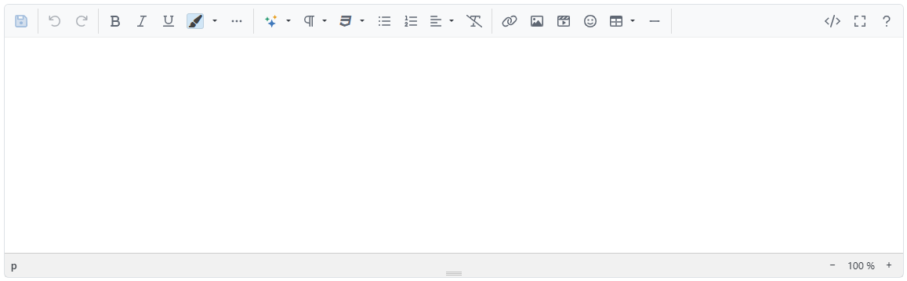

# HTML Inhalte bearbeiten

HTML-Inhalte für das Frontend bearbeiten Sie an verschiedenen Stellen im Administrationsbereich, beispielsweise wenn Sie [Ihre eigenen Seiten und Inhalte erstellen](../content-management/seiten-inhalte-verwalten.md) oder ausführliche Produktbeschreibungen pflegen.

Für die Bearbeitung steht der Editor _Summernote_ zur Verfügung.


**Aufruf des HTML-Editors**

Bei neuen Produkten und Warengruppen öffnen Sie den HTML-Editor über "Hier klicken, um HTML zu editieren..". Bei vorhandenen Inhalten klicken Sie dazu in das Langtextfeld.

