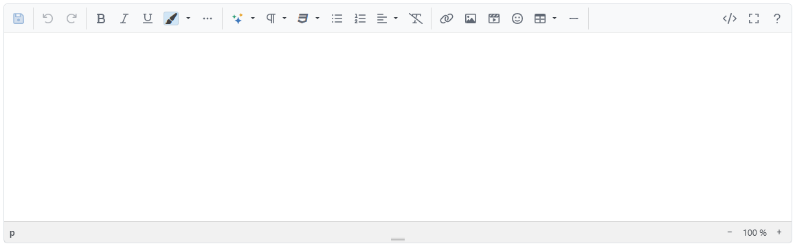

# HTML Inhalte bearbeiten

HTML-Inhalte für das Frontend bearbeiten Sie an verschiedenen Stellen im Administrationsbereich, beispielsweise wenn Sie [Ihre eigenen Seiten und Inhalte erstellen](../content-management/seiten-inhalte-verwalten.md) oder ausführliche Produktbeschreibungen pflegen.

Smartstore verwendet dafür einen angepassten HTML-Editor auf Basis von [Summernote](https://summernote.org/). Die folgenden Funktionen beziehen sich auf die Smartstore-Version des Editors. Sie öffnen ihn über die Vorschau und nutzen die Symbolleiste für die Gestaltung.


**Aufruf des HTML-Editors**

Klicken Sie in die Vorschau des Inhalts, um den Editor zu öffnen. Bei einem neuen Eintrag ist die Vorschau noch leer; bei einem vorhandenen Eintrag zeigt sie den gespeicherten Inhalt.


## Texte gestalten

Über die Symbolleiste formatieren Sie Text, wählen Absatzformate und Überschriften und erstellen Aufzählungen oder nummerierte Listen. Markieren Sie zuerst den betreffenden Text, wenn Sie nur einen Teil des Inhalts ändern möchten.

## Links und Medien einfügen

Für einen Link markieren Sie den gewünschten Text und wählen das Link-Symbol. Bilder fügen Sie über das Bild-Symbol ein: Laden Sie eine Datei hoch oder wählen Sie ein vorhandenes Bild aus. Klicken Sie ein eingefügtes Bild an, um unter anderem seine Größe, Ausrichtung und Darstellung anzupassen. Videos fügen Sie über das Video-Symbol mit einem Videolink ein.


Dateiauswahl: Standardmäßig öffnet sich der integrierte Dateibrowser. Ist das kostenpflichtige Enterprise-Plugin [Medien-Manager](../plugins/mediamanager.md) installiert, öffnet sich stattdessen dessen Auswahlfenster. Der Medien-Manager ist dann auch über CMS → Medien im Administrationsmenü erreichbar, sofern Sie die entsprechende Berechtigung haben.


## Formatierungen bereinigen

Kopieren Sie Text aus Word oder von einer Webseite in den Editor, können Schriftarten, Farben und andere Formatierungen mitkommen. Diese können das Erscheinungsbild Ihres Shops beeinträchtigen. Wenn Sie Formatierungen aus Word übernehmen, gelangt zudem ungültiges HTML in den Inhalt. Entfernen Sie solche Formatierungen beim Einfügen oder bereinigen Sie den Text anschließend.

Beim Einfügen wählen Sie im Dialog zwischen Formatierung behalten und Formatierung entfernen. Mit Formatierung entfernen übernehmen Sie den Text ohne die mitkopierten Schrift- und Absatzformate. Bereits vorhandene Formatierungen entfernen Sie, indem Sie den betreffenden Text markieren und in der Symbolleiste Zurücksetzen wählen. Prüfen Sie danach Überschriften, Listen und Links im Ergebnis.

## Texte mit KI bearbeiten

Wenn das kostenpflichtige Enterprise-Plugin [AI](../plugins/ai.md) eingerichtet ist, erscheint in der Symbolleiste eine KI-Schaltfläche. Ohne Textauswahl können Sie neuen Text erzeugen oder einen vorhandenen Text fortsetzen. Markieren Sie Text, um ihn zu bearbeiten: Sie können etwa Sprachstil oder Ton ändern, ihn zusammenfassen, den Schreibstil verbessern, vereinfachen, ausführlicher formulieren oder gliedern. Prüfen und überarbeiten Sie den Vorschlag vor dem Übernehmen.

## Tabellen und HTML bearbeiten

Mit dem Tabellen-Symbol erstellen Sie eine Tabelle. Klicken Sie anschließend in eine Zelle, um Zeilen oder Spalten hinzuzufügen, zu entfernen oder einen Tabellenstil zu wählen. Über Quellcode anzeigen können Sie den HTML-Quelltext direkt bearbeiten; wechseln Sie danach zurück zur normalen Ansicht, um das Ergebnis zu prüfen.

## Im Vollbild arbeiten

Wählen Sie Vollbild in der Symbolleiste, wenn Sie mehr Platz zum Bearbeiten benötigen. Über dieselbe Schaltfläche verlassen Sie den Vollbildmodus wieder.

## Änderungen speichern

Speichern Sie den bearbeiteten Eintrag über die Schaltfläche Speichern im Formular. Wenn die Symbolleiste des Editors eine eigene Schaltfläche Speichern zeigt, können Sie damit den HTML-Inhalt direkt speichern.

## Profi-Tipp: Konfiguration für Administratoren


Die Symbolleiste wird in wwwroot/lib/editors/summernote/globalinit.js konfiguriert. Die JSON-Datei wwwroot/lib/roxyfm/conf.json steuert nur den integrierten Dateibrowser, etwa seine Ansicht und Upload-Einstellungen. Sie konfiguriert weder den Editor noch das Plugin Medien-Manager. Änderungen an diesen Dateien werden bei einem Update überschrieben und müssen danach erneut vorgenommen werden.

