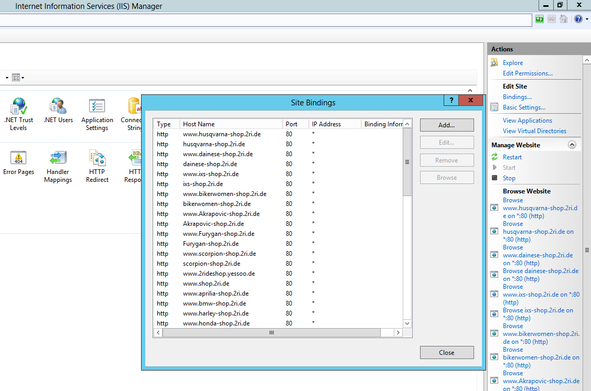

# Mit mehreren Shops arbeiten

Mit mehreren Shops sind Sie in der Lage, Ihre Auswahl an Produkten auf Ihre Zielgruppe abzustimmen. Jeder Shop kann über eine eigene Domain angesteuert und [individuell konfiguriert](../konfiguration/einstellungen/den-einstellungsbereich-festlegen.md) werden.

## Anwendungsszenario

Stellen Sie sich vor, Sie betreiben einen Shop für ein Modelabel. Möglicherweise möchten Sie dann unterschiedliche Shops für Frauen, Männer, Kinder und eventuell für jede Marke eröffnen, die Sie anbieten. Auf diese Weise können Sie das Aussehen und die Atmosphäre Ihrer Shops auf Ihre Zielgruppen ausrichten, indem Sie jeweils eigene Farben und Layouts auswählen.

## Voraussetzung

Die Website Ihres Shops muss korrekt im IIS konfiguriert sein, damit alle angefragten Hostnamen (Domänen-Namen) Ihrer Smartstore-Installation zugeordnet werden. Dies kann durch das Hinzufügen einer Sitebindung für jeden Hostnamen erreicht werden.

## Einen neuen Shop anlegen

Um einen neuen Shop anzulegen, navigieren Sie im Administrationsbereich zu **Konfiguration > Shops** und klicken auf **Neu**. Sie können Ihr eigenes Shop-Logo festlegen, einen Shop-Namen aussuchen und die URL eingeben, unter der man den Shop erreichen kann. Weitere Konfigurationsmöglichkeiten finden Sie in der folgenden Tabelle.

| **Eingabefeld**              | **Beschreibung**                                                                                                                                                                                                                                                                                                                                                                                                                                                                                                   |
| ---------------------------- | ------------------------------------------------------------------------------------------------------------------------------------------------------------------------------------------------------------------------------------------------------------------------------------------------------------------------------------------------------------------------------------------------------------------------------------------------------------------------------------------------------------------ |
| Content Delivery Network URL | Die URL eines CDN, z.B. [https://xxx.cloudfront.net](https://xxx.cloudfront.net) oder [http://xxx.cloudflare.net](http://xxx.cloudflare.net). Diese Einstellung bewirkt, dass statische Mediendateien durch das CDN bereitgestellt werden.                                                                                                                                                                                                                                                                         |
| Leitwährung                  | Legt die Leitwährung des Shops fest.                                                                                                                                                                                                                                                                                                                                                                                                                                                                               |
| Umrechnungswährung           | Legt die Umrechnungswährung für diesen Shop fest.                                                                                                                                                                                                                                                                                                                                                                                                                                                                  |
| SSL                          | Aktivieren Sie diese Option, wenn Ihr Shop SSL verschlüsselt sein soll.                                                                                                                                                                                                                                                                                                                                                                                                                                            |
| HOST Werte                   | 
Kommaseparierte Liste mit möglichen HTTP_POST Werten (z.B. "<a href="http://mein-shop.com">mein-shop.com</a>,<a href="http://www.mein-shop.de">www.mein-shop.de</a>"). Diese Einstellung wird nur in einer Multi-Shop Umgebung benötigt, um den aktuellen Shop zu ermitteln.  <strong>Info</strong> Die Hostwerte müssen den Seitenbindungen entsprechen, die im IIS angegeben wurden. Sie sind verantwortlich für die korrekte Zuordnung und Weiterleitung von HTTP-Serveranfragen zu Ihrem Shop.
 |
| ID des HTML-Body             | 
Emöglicht es, individuelles CSS und Javascript für einen Shop zu verwenden. Wenn Sie einen Wert eingeben (z. B. <strong>my-first-shop)</strong>, haben Sie einen eindeutigen Bezeichner, durch den Sie die DOM-Struktur des Shops unabhängig von anderen konfigurierten Shops erreichen können.  <code>&#x3C;br>#my-first-shop table {&#x3C;br> border: 1px solid black;&#x3C;br>}&#x3C;br></code>
                                                                                                    |
| Reihenfolge                  | 
Die Reihenfolge für diesen Shop. 1 bedeutet Anfang der Liste.  <strong>Achtung</strong> Für zusätzlich erstellte Shops die Reihenfolge erhöhen. Ansonsten kann es zu Problemen mit dem TaskScheduler kommen.
                                                                                                                                                                                                                                                                                       |

## Produkte & Warengruppen zu einem Shop hinzufügen

Standardmäßig werden neu erstellte Produkte und Warengruppen in all Ihren konfigurierten Shops angezeigt. Wenn Sie Produkte oder Warengruppen bearbeiten, finden Sie links eine Registerkarte, mit der Sie die Anzeige auf bestimmte Shops beschränken können. Dafür müssen Sie lediglich das Feld **Auf Shops begrenzt** anklicken und die Shops auswählen, in denen das Produkt oder die Warengruppe angezeigt werden soll.

## Einstellungen in einer Multistore-Umgebung konfigurieren

Sie können unterschiedliche Einstellungen für jeden Ihrer angelegten Shops vornehmen. Für weitere Informationen lesen Sie bitte [den Einstellungsbereich festlegen](../konfiguration/einstellungen/den-einstellungsbereich-festlegen.md).

## Plugins bei mehreren Shops konfigurieren

Sie können Plugins für einzelne Shops aktivieren bzw. deaktivieren. Für weitere Informationen lesen Sie bitte [Plugins verwalten](../plugins/plugins-verwalten.md).
