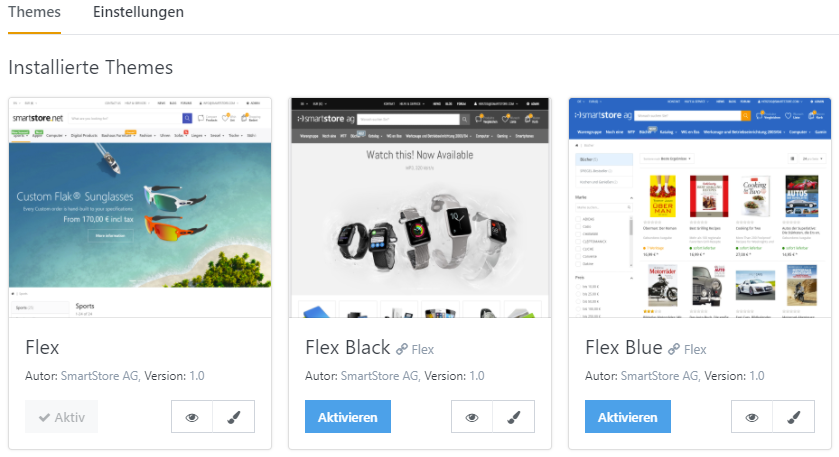
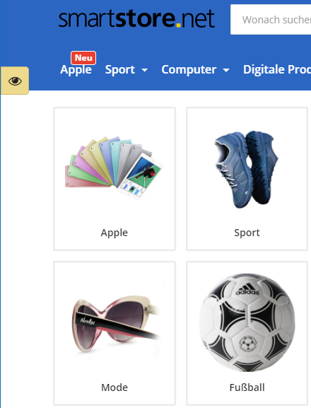
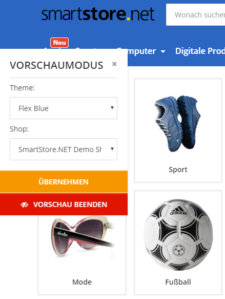

# Vorschau für Designs & Shops

Prüfen Sie ein neues Shopdesign in der Vorschau, bevor Sie es veröffentlichen. Öffnen Sie dazu **Admin > Konfiguration > Themes** und klicken Sie beim gewünschten Theme auf **Vorschau**.

Das Shop-Frontend öffnet sich im Vorschaumodus. Über das Symbol am linken Rand des Browserfensters wechseln Sie zwischen Themes und Shops.

