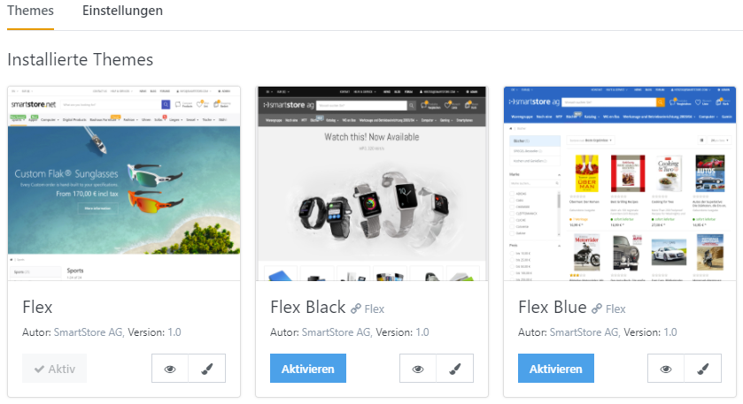
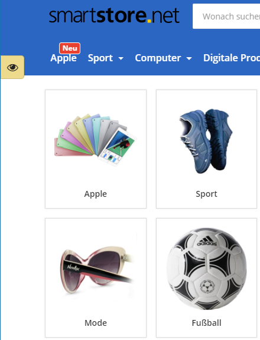
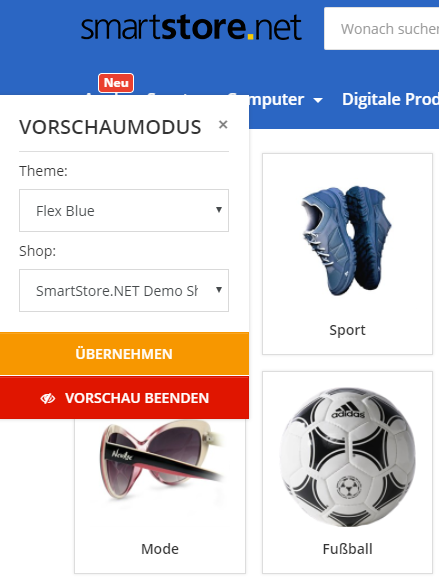

# Vorschau für Designs & Shops

Prüfen Sie ein neues Shopdesign in der Vorschau, bevor Sie es veröffentlichen. Öffnen Sie dazu **Admin > Konfiguration > Themes** und klicken Sie beim gewünschten Theme auf **Vorschau**.

Das Shop-Frontend öffnet sich im Vorschaumodus. Über das Symbol am rechten Rand des Browserfensters wählen Sie Theme und Shop aus. Ihre Auswahl erscheint sofort in der Vorschau, ohne die aktive Theme-Einstellung des Shops zu ändern.

Möchten Sie das gewählte Theme für den Shop übernehmen, klicken Sie auf Anwenden. Mit Beenden verlassen Sie den Vorschaumodus, ohne die Theme-Einstellung zu ändern.
