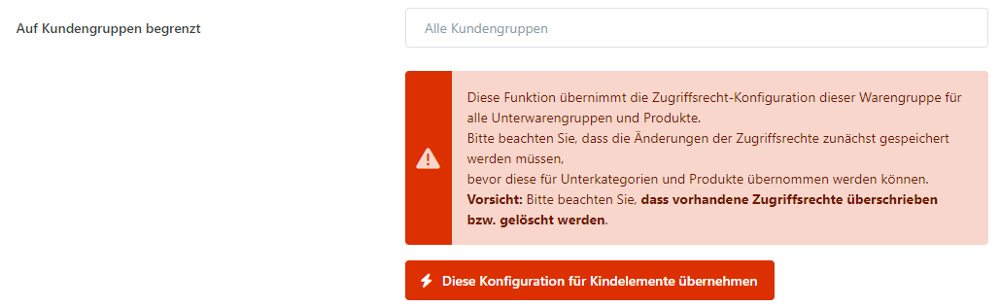

# Zugriffsbeschränkungen (ACL)

**Smartstore** bietet **Access Control Lists (ACLs)** zur Verfügung. Damit steuern Sie, welche Kundengruppen bestimmte Warengruppen und Produkte im Frontend sehen und bestellen können. So blenden Sie geschützte Shopbereiche nur für autorisierte Kunden ein.

## Anwendungsszenario

Angenommen, Sie verkaufen altersbeschränkte Produkte. Legen Sie dafür eine Kundengruppe an und erlauben Sie ihr den Zugriff auf die entsprechende Warengruppe. Nachdem Sie den Altersnachweis eines Kunden geprüft haben, ordnen Sie ihn dieser Kundengruppe zu. Erst dann sind die geschützten Produkte für diesen Kunden sichtbar und bestellbar.

## Wie Sie Zugriffsbeschränkungen konfigurieren

Sie können den Zugriff auf Warengruppen und Produkte beschränken und festlegen, welche Kundengruppen im Frontend Ihres Shops Zugriff auf die jeweiligen Warengruppen und Produkte erhalten. Die Vergabe von Zugriffsrechten für eine Warengruppe oder ein Produkt ist identisch. Navigieren Sie einfach zu der Registerkarte **Zugriffsbeschränkung** der jeweiligen Warengruppe oder des jeweiligen Produkts und fügen Sie dort die Kundengruppen hinzu, denen der Zugang erlaubt ist.


**Diese Konfiguration für Kindelemente übernehmen**

Diese Funktion überträgt die Zugriffsrechte der Warengruppe auf alle Unterwarengruppen und Produkte.\
Speichern Sie die geänderten Zugriffsrechte, bevor Sie sie auf die Kindelemente übertragen.\
**Vorsicht**: Vorhandene **Zugriffsrechte werden dabei überschrieben beziehungsweise gelöscht**.

