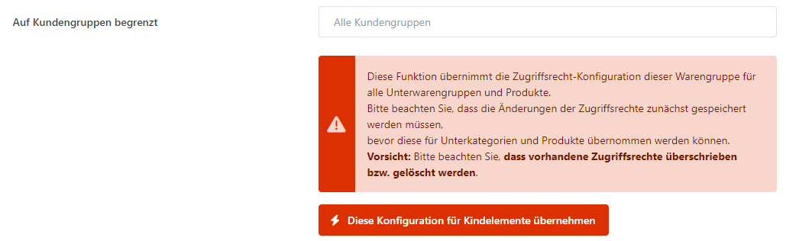

# Zugriffsbeschränkungen (ACL)

Mit **Access Control Lists (ACLs)** legen Sie in **Smartstore** fest, welche Kundengruppen bestimmte Shop-Inhalte sehen können. Beispielsweise können Sie ein Händlersortiment nur für registrierte Geschäftskunden freigeben. Beschränken Sie dazu die Warengruppe und die zugehörigen Produkte auf die Kundengruppe „Händler“.

## Was Sie mit Zugriffsbeschränkungen steuern

Neben Warengruppen und Produkten können Sie Herstellerseiten und Inhaltsseiten (Topics) auf Kundengruppen beschränken. Menüs und einzelne Menüeinträge lassen sich abhängig von der Kundengruppe anzeigen. Bei Newsletter-Kampagnen begrenzen die zugewiesenen Kundengruppen den Empfängerkreis. Wenn Sie eine Herstellerseite einschränken, gilt das nicht automatisch für deren Produkte. Wenn Sie einen Menüeintrag ausblenden, bleibt die verlinkte Seite ohne eigene Zugriffsbeschränkung erreichbar.

## Wie Sie Zugriffsbeschränkungen konfigurieren

Öffnen Sie die Registerkarte **Zugriffsbeschränkung** der Warengruppe oder des Produkts. Wählen Sie die Kundengruppen aus, denen Sie Zugriff gewähren möchten, und speichern Sie. Die Beschränkung einer Warengruppe wird nicht automatisch auf enthaltene Produkte übertragen. Dafür steht die unten beschriebene Übernahmefunktion zur Verfügung.


**Diese Konfiguration für Kindelemente übernehmen**

Diese Funktion überträgt die Zugriffsrechte der Warengruppe auf alle Unterwarengruppen und Produkte.\
Speichern Sie die geänderten Zugriffsrechte, bevor Sie sie auf die Kindelemente übertragen.\
**Vorsicht**: Vorhandene **Zugriffsrechte werden dabei überschrieben beziehungsweise gelöscht**.

