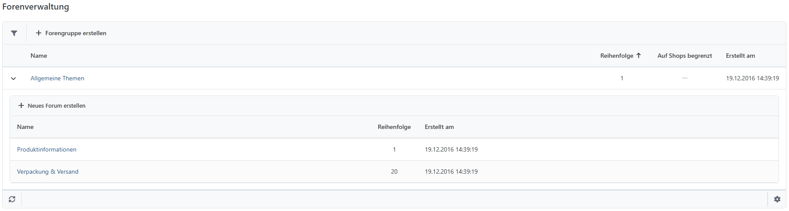
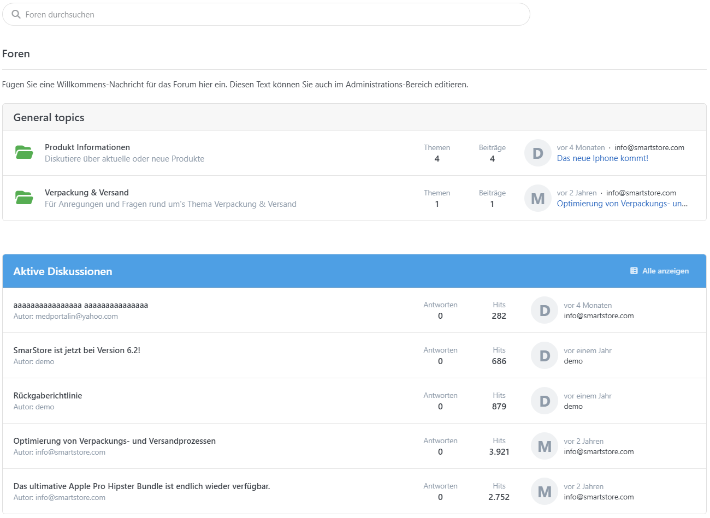
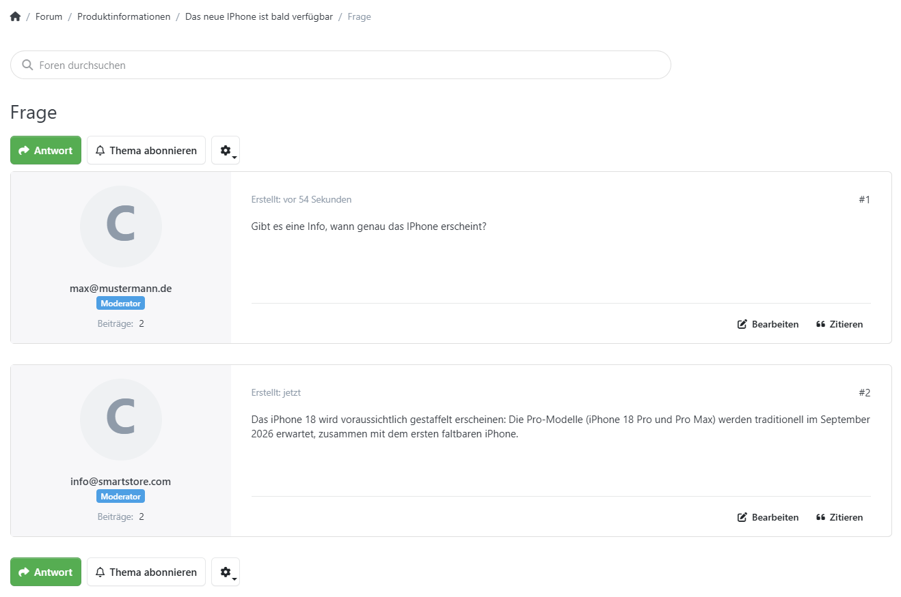

# Foren verwalten

Smartstore gibt Ihnen die Mittel an die Hand, um ein Nutzerforum einfach zu verwalten. Auf Administrationsebene können Sie **Forengruppen** und **Unterforen** anlegen und konfigurieren. Die Verwaltung der von Ihren Kunden erstellten Themen wird im Frontend vorgenommen. Der Nutzer, der für die Verwaltung der Themen verantwortlich ist, benötigt ein Zugriffsrecht, um die Foren verwalten zu können. Der Name des zugehörigen Zugriffsrechts lautet **Admin Area. Manage Forums.** Für weitere Informationen zu Zugriffsrechten lesen Sie bitte [Zugriffsbeschränkungen (ACL)](../allgemeine-konzepte/zugriffsbeschrankungen-acl.md).

## Konfiguration im Backend

Sie können Ihr Forum konfigurieren, indem Sie zu **CMS > Foren** gehen. Hier können Sie Forengruppen anlegen, für die Sie **Namen**, eine **Beschreibung** und die **Reihenfolge** festlegen können, die die Anzeigereihenfolge im Frontend steuert. Für Unterforen können Sie die Forengruppe festlegen, in der das Forum angezeigt werden soll, außerdem den **Namen**, die **Beschreibung**, die unterhalb des Forennamens im Frontend angezeigt wird und die **Reihenfolge** der Anzeige.

## Verwaltung im Frontend

Die Verwaltung kundengenerierter Themen kann im Frontend vorgenommen werden. Der Nutzer, der Foreneinträge verwaltet, benötigt Zugriffsrechte für die Verwaltung der Foren. Das dazugehörige Zugriffsrecht heißt Admin Area. Manage Forums. Für weitere Informationen zu Zugriffsrechten lesen Sie bitte [Zugriffsbeschränkungen (ACL)](../allgemeine-konzepte/zugriffsbeschrankungen-acl.md).

Wenn Sie eingeloggt sind und das Zugriffsrecht für die Verwaltung des Forums haben, können Sie die erstellten Themen in jedem Forum **Bearbeiten**, **Löschen** und **Verschieben**.

