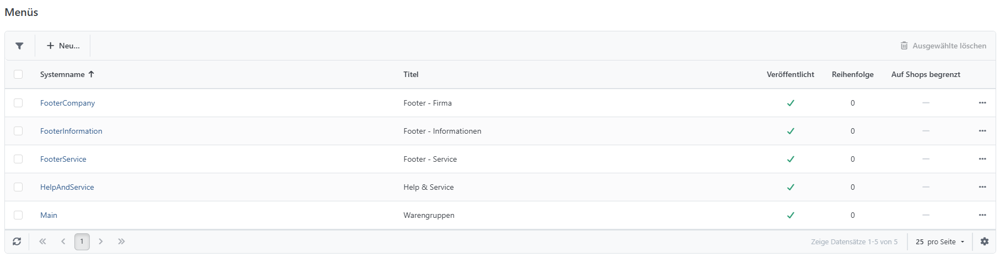
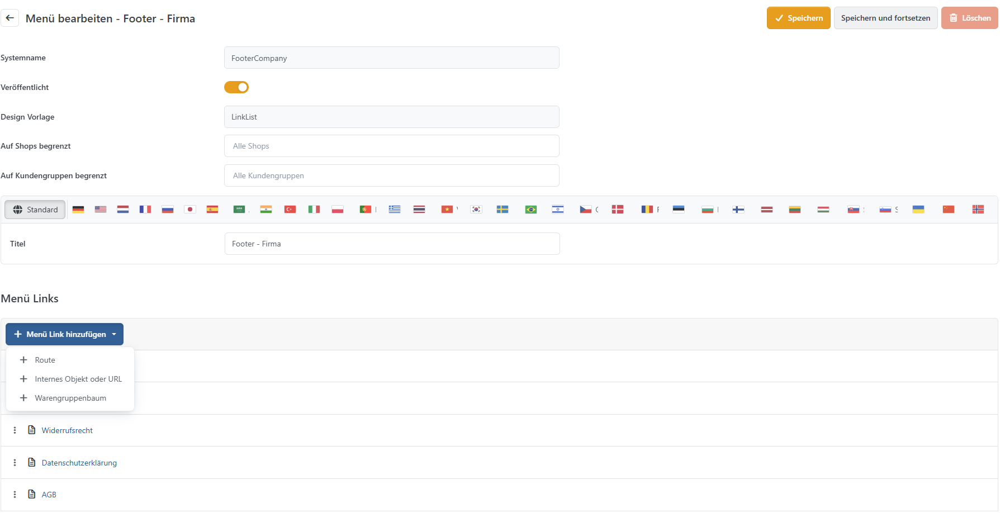

# Menüs

Mit dem Menü Builder unter **CMS > Menüs** können Sie neue Menüs erstellen oder bestehende Menüs bearbeiten und erweitern.\


## Bestehende Menüs bearbeiten / erweitern

Für die Bearbeitung der Footer-Menüs, der Menüleiste im Kopfbereich sowie des Warengruppen-Menüs auf den entsprechenden Systemnamen klicken.



## Menü-Typen

Es stehen unterschiedliche Menütypen zur Verfügung.\
Internes Objekt oder URL, Route und Warengruppenbaum.

**Internes Objekt oder URL**

| **Eingabefeld**            | **Beschreibung**                                                                                                                                                                         |
| -------------------------- | ---------------------------------------------------------------------------------------------------------------------------------------------------------------------------------------- |
| Ziel                       | Legt das Ziel des Links fest. Dies kann ein Link zu einem Produkt, einer Warengruppe, einer Hersteller-Seite, einer selbst erstellten Seite, einer Datei oder einer beliebigen URL sein. |
| Übergeordnetes Menüelement | Legt das übergeordnete Menüelement fest. Lassen Sie das Feld leer, um ein Menüelement erster Ebene zu erzeugen.                                                                          |
| Veröffentlicht             | Legt fest, ob das Menüelement im Shop sichtbar ist.                                                                                                                                      |
| Titel                      | Legt den Titel fest.                                                                                                                                                                     |
| Kurzbeschreibung           | Legt eine Kurzbeschreibung fest. Wird als `title`-Attribut für das Menüelement verwendet.                                                                                                |
| Erforderliche Rechte       | Legt Zugriffsrechte fest, die für die Anzeige des Menüelementes erforderlich sind (mindestens ein Recht muss gewährt sein).                                                              |
| Reihenfolge                | Legt die Reihenfolge des Menüelements innerhalb einer Menüebene fest.                                                                                                                    |
| Gruppe beginnen            | Fügt vor den Link ein Trennelement sowie optional eine Überschrift ein (Kurzbeschreibung).                                                                                               |
| Icon                       | Legt ein optionales Icon fest.                                                                                                                                                           |
| nofollow                   | Gibt das HTML-Attribut rel='nofollow' aus.                                                                                                                                               |
| In neuem Browsertab öffnen | Öffnet das Ziel in einem neuen Browsertab.                                                                                                                                               |
| HTML ID                    | Legt das HTML-ID-Attribut für das Menüelement fest.                                                                                                                                      |
| CSS-Klasse                 | Legt eine CSS-Klasse für das Menüelement fest.                                                                                                                                           |

**Route**

Mit einer Route ist es möglich, eine Action direkt durch Klicken auf einen Link auszuführen. Mittels JSON müssen je nach Action der Controller-, Action- sowie Area-Name und ggf. Parameter übergeben werden.

Alternativ können auch z.B. News verlinkt werden. Dabei ist zu beachten, dass anstelle von Controller-Namen etc. der SEO-Name übergeben wird.

Diese Konfigurationsoptionen sind eher etwas für Entwickler.

| **Eingabefeld**  | **Beschreibung**                                                                                      |
| ---------------- | ----------------------------------------------------------------------------------------------------- |
| Ziel             | Legt das Ziel des Links fest. In dem unteren Eingabefeld werden die Routenwerte als JSON eingetragen. |
| Weitere Optionen | Die weiteren Optionen sind identisch mit den Optionen des Menü-Typs **Internes Objekt oder URL.**     |

### Beispiel DevTools

Ziel: SmartStore.DevTools

```
{  
"Controller":"DevTools",  
"action":"Test",  
"area":"SmartStore.DevTools"  
"parameter":"0"  
}
```

### Beispiel MenüItem

Ziel: NewsItem

```
{  
"SeName":"die-zuse-z3"  
}
```

**Warengruppenbaum**

| **Eingabefeld**  | **Beschreibung**                                                                                  |
| ---------------- | ------------------------------------------------------------------------------------------------- |
| Ziel             | Der Warengruppenbaum wird dynamisch in das Menü eingebunden.                                      |
| Weitere Optionen | Die weiteren Optionen sind identisch mit den Optionen des Menü-Typs **Internes Objekt oder URL.** |
