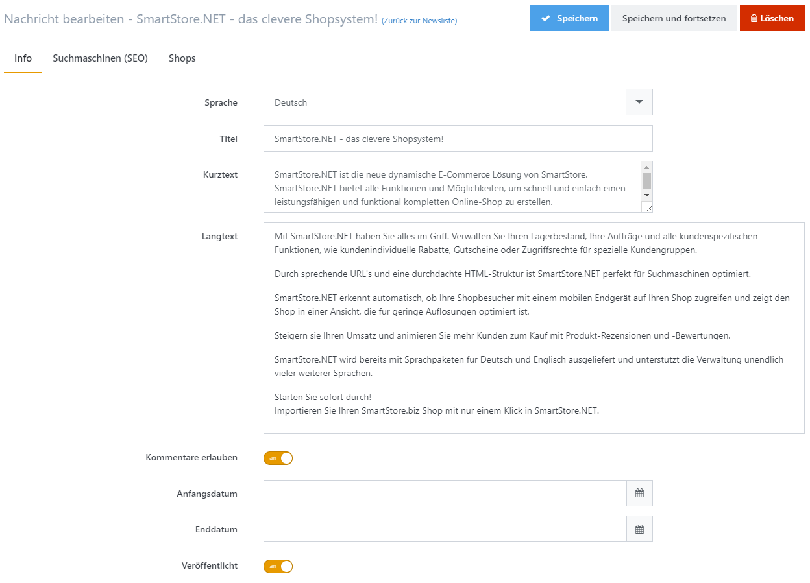

# News verwalten

*Content is King* ist eine häufig verwendete Losung, wenn es um Suchmaschinenoptimierung geht – und das mit gutem Grund. Google bevorzugt neue Inhalte und verleiht Seiten, die häufig neue Textinhalte enthalten, ein besseres Ranking. Smartstore enthält ein System, um News-Einträge zu verwalten und versetzt Shop-Betreiber somit in die Lage regelmäßig neue Inhalte zu erstellen. Die Newsbeiträge können auf der Homepage Ihres Shops angezeigt werden und werden zusätzlich durch einen RSS-Feed zugänglich, je nach den Einstellungen, die Sie in den [News-Einstellungen](../../benutzer-handbuch/konfiguration/einstellungen/news-einstellungen.md) konfiguriert haben.

## Newsbeiträge erstellen

### Info

| **Eingabefeld** | **Beschreibung** |
| --- | --- |
| Sprache | Die Sprache dieses Newseintrags. Ein Kunde sieht nur Einträge in der von ihm gewählten Sprache. |
| Titel | Der Titel des Newseintrags. |
| Kurztext | Kurzer Beschreibungstext. |
| Langtext | Langer Beschreibungstext. |
| Kommentare erlauben | Legt fest, ob Kommentare zum Newseintrag erlaubt sind. |
| Anfangsdatum | Legt fest, ab wann der Newseintrag angezeigt werden soll (optional). |
| Enddatum | Legt fest, bis wann der Newseintrag sichtbar sein soll (optional). |
| Veröffentlicht | Legt fest, ob der Newseintrag bereits öffentlich sichtbar ist. |

### Suchmaschinen (SEO)

In dieser Registerkarte können Sie spezifische SEO-Werte für einen Newseintrag festlegen, z. B. **Meta Title**, **Meta Keywords** oder einen SEO-freundlichen **URL Alias**. Für weitere Informationen zu den Feldern in der Registerkarte **Suchmaschinen**, lesen Sie bitte [SEO](https://smartstore.atlassian.net/wiki/display/SMNET/SEO).

### Shops

In dieser Registerkarte können Sie festlegen, in welchem / welchen Shop(s) der Newseintrag veröffentlicht werden soll. Für weitere Informationen zur Arbeit mit mehreren Shops lesen Sie bitte [Mit mehreren Shops arbeiten](../../benutzer-handbuch/allgemeine-konzepte/mit-mehreren-shops-arbeiten.md).

## Neue Kommentare verwalten

Wenn die Kommentarfunktion bei Newseinträgen für Ihre Kunden aktiviert wurde, müssen Sie die Kommentare überprüfen und gegebenenfalls löschen.  Sie können die Kommentare zu Ihren Newseinträgen verwalten, indem Sie zu **CMS > News > Kommentare**. gehen. In diesem Bereich erhalten Sie einen Überblick über alle Kommentare. Darüber hinaus sehen Sie zusätzliche Informationen wie den Namen des Kunden, der den Kommentar erstellt hat, seine IP-Adresse und das Datum, an dem der Kommentar erstellt wurde. Hier können Sie die Kommentare auch löschen.

