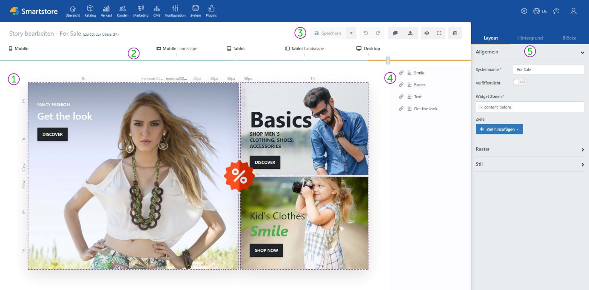
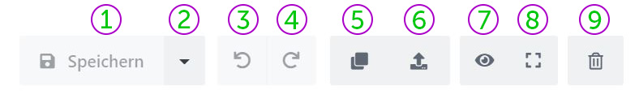

# Benutzeroberfläche

**① Raster:** Im Raster wird die Story komponiert. Hier können Sie Layout und Inhalte bearbeiten. Zudem sehen Sie direkt, wie Ihre Story dargestellt wird. (Siehe [_Das Raster_](benutzeroberflache/das-raster.md))

**② Device-Slider:** Die Position des Sliders bestimmt die aktuell ausgewählte Auflösungseinstellung. Die Story-Vorschau passt sich direkt auf die Veränderung der Schieberposition an. (Siehe [_Responsive Darstellung - Device Slider_](story/responsive-darstellung.md))

**③ Allgemeine Steuerelemente:** Diese Buttons bieten grundlegende Funktionalitäten wie u. a. _Story speichern_, _Änderung rückgängig machen_, _Story löschen_ usw.

**④** **Block-Manager:** Hier sehen Sie alle Blöcke, die in einer Story Verwendung finden. Die Reihenfolge in der Liste bestimmt, in welcher Reihenfolge die Blöcke dargestellt werden. (Siehe [_Block-Manager_](benutzeroberflache/block-manager.md))

**⑤ Toolbox:** Die Toolbox bietet Zugriff auf essenzielle Story-Features und -Inhalte. Sie können die Darstellung und Veröffentlichung der Story konfigurieren und haben über die Toolbox Zugriff auf die Blockbibliothek. Wenn ein Block selektiert ist, werden an dieser Stelle blockbezogene Einstellungen angezeigt. (Siehe [_Toolbox_](benutzeroberflache/toolbox.md))

### Allgemeine Steuerelemente

**①** **Speichern:** (_STRG + S_) Speichert die Story.

**②** **Speichern unter:** Über das Dropdownmenü können Sie die Story als Vorlage speichern.

**③ Rückgängig:** (_STRG+Z_) Macht die letzte Änderung rückgängig.

**④ Wiederherstellen:** (_STRG+Y_) Stellt die vorherige Änderung wieder her.

**⑤ Duplizieren:** Erstellt eine exakte Kopie der aktuellen Story.

**⑥ Exportieren:** Exportiert die Story als Vorlage.

**⑦** **Vorschaumodus:** (_STRG+ALT+P_) Zeigt eine Vorschau der Story. Die Vorschau zeigt Ihre Story wie sie nach der Veröffentlichung auf der Seite dargestellt werden wird, ohne Raster und mit Effekten, Videos und Audio.

**⑧ Vollbildmodus:** (_STRG + F11_) Zeigt den Page Builder im Vollbild.

**⑨ Löschen:** Löscht die aktuelle Story permanent.
