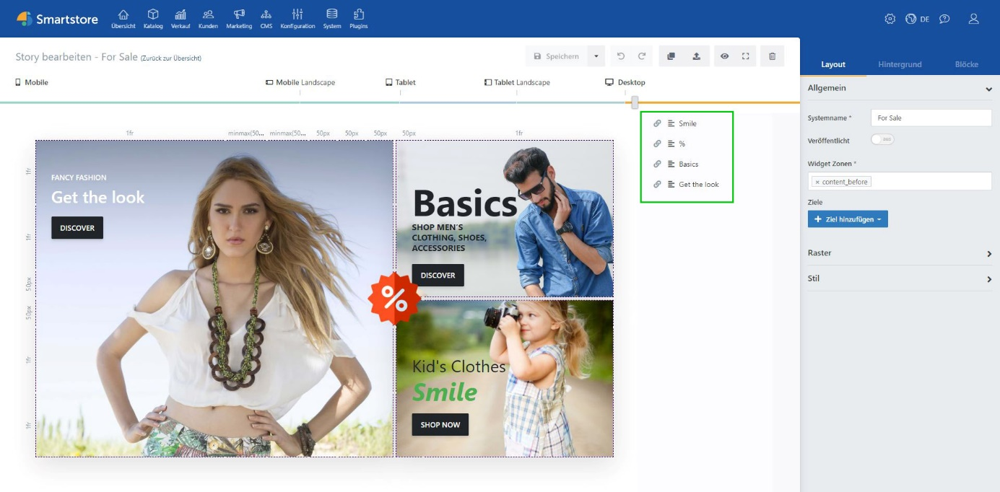

# Block-Manager

Im Block-Manager rechts neben Ihrer Story, sehen Sie alle in der Story platzierten [*Blöcke*](../../smartstore-page-builder/blocke.md) übersichtlich aufgelistet. Der Block-Manager bietet die Möglichkeit Blöcke zu bearbeiten, die Reihenfolge anzupassen und die Darstellung des Blockes zu aktivieren oder zu deaktivieren. 

Die Reihenfolge der Auflistung, sowie die Darstellungsreihenfolge der Blöcke innerhalb der Story, wird mithilfe der [*z-index*](../../smartstore-page-builder/blocke/toolbox-block-optionen.md)\-Einstellung des Blockes bestimmt.  Die Darstellungsreihenfolge von Blöcken kann daher frei angepasst werden. Dadurch können vor oder hinter jedem Block weitere Elemente platziert werden. Dies ermöglicht es Ihnen, durch Überlagerung verschiedener Blöcke, moderne und anschauliche Designs zu kreieren.

# Einstellungen

Im Block-Manager wird links neben den Blöcken jeweils ein kleines Symbol angezeigt. Dieses Symbol zeigt die derzeitige Darstellungseigenschaften des Blockes an. Es ist möglich, Blöcke bei verschiedenen Auflösungsstufen anzuzeigen oder zu verbergen.

 

**① Unbestimmt:** Block bekommt Sichtbarkeit von vorheriger Auflösung übertragen

**② Sichtbar:** Block wird angezeigt

**③ Unsichtbar:** Block wird nicht angezeigt

Beachten Sie an dieser Stelle, dass der Block *Smile* nicht mehr dargestellt wird, da die Sichtbarkeit des Blockes ausgeschaltet wurde. Der Block *Basics* wird allerdings auf jeden Fall dargestellt werden, da dieser nun die Einstellung der vorherigen Auflösung überschreibt.