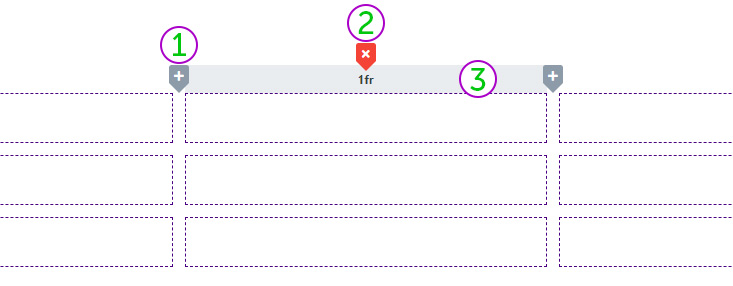

# Das Raster

Mithilfe des nativen [*CSS Grid-Layoutsystems*](https://smartstore.atlassian.net/wiki/download/attachments/2510950064/image045.jpg?version=1&modificationDate=1732292452367&cacheVersion=1&api=v2) ist es möglich, Raster mit einer beliebigen Zeilen- und Spaltenanzahl zu definieren. Auf so einem Raster können Inhalte platziert werden, welche responsiv und geräteunabhängig in allen Auflösungen dargestellt werden. Die enthaltenen Inhalte bestimmen, ggf. je nach Raster-Konfiguration, die Größe der einzelnen Zellen.

# Rasterwerkzeuge

Mit den Rasterwerkzeugen können Sie das Layout der Story definieren und anpassen. Diese Werkzeuge werden angezeigt, wenn Sie mit der Maus über den Rand des Rasters fahren.

**① Hinzufügen:** Fügt eine neue Zeile beziehungsweise Spalte hinzu.

**② Löschen:** Löscht die selektierte Zeile beziehungsweise Spalte.

**③ Größe definieren:** Bestimmt die Größe (Breite oder Höhe) der Zellen in dieser Achse. Neben dem Größenwert können auch die Größeneinheiten festgelegt werden.