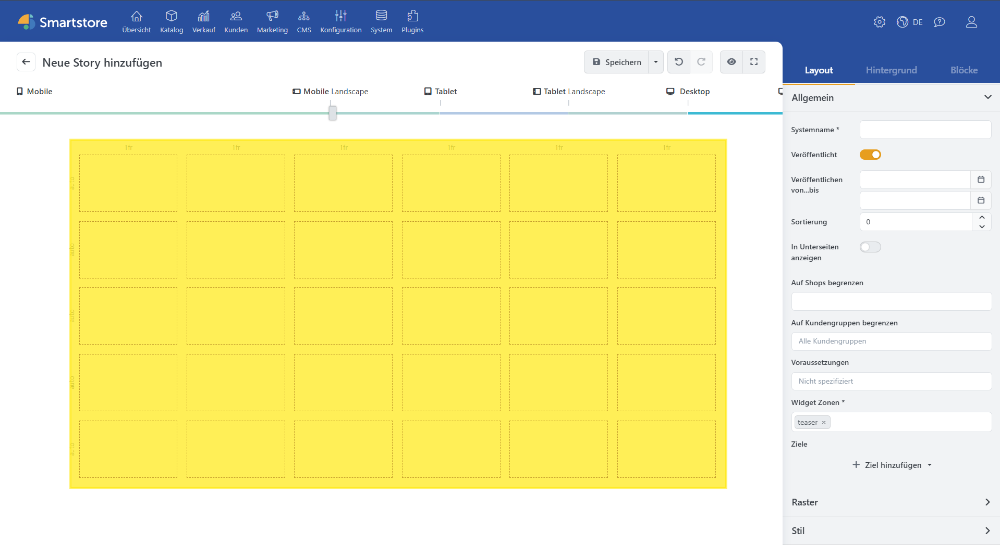
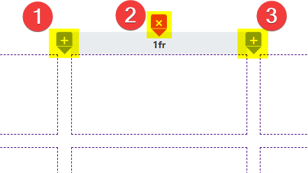

# Das Raster

Mithilfe des nativen _CSS Grid-Layoutsystems_ ist es möglich, Raster mit einer beliebigen Zeilen- und Spaltenanzahl zu definieren. Auf einem solchen Raster können Inhalte platziert werden, die responsiv und geräteunabhängig in allen Auflösungen dargestellt werden. Die enthaltenen Inhalte bestimmen, gegebenenfalls je nach Raster-Konfiguration, die Größe der einzelnen Zellen.

## Rasterwerkzeuge

Mit den Rasterwerkzeugen können Sie das Layout der Story definieren und anpassen. Diese Werkzeuge werden angezeigt, wenn Sie mit der Maus über den Rand des Rasters fahren.

**① Hinzufügen:** Fügt eine neue Zeile beziehungsweise Spalte hinzu.

**② Löschen:** Löscht die selektierte Zeile beziehungsweise Spalte.

**③ Größe definieren:** Bestimmt die Größe (Breite oder Höhe) der Zellen in dieser Achse. Neben dem Größenwert können auch die Größeneinheiten festgelegt werden.
