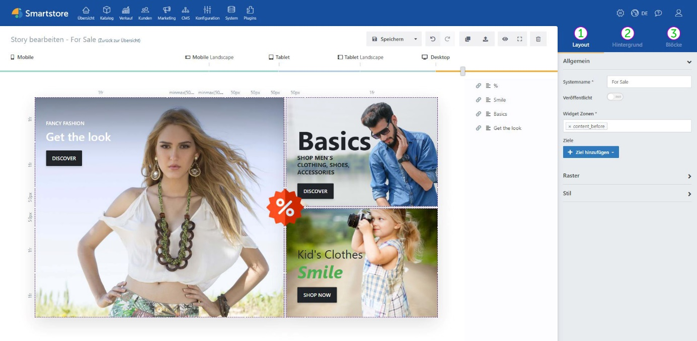
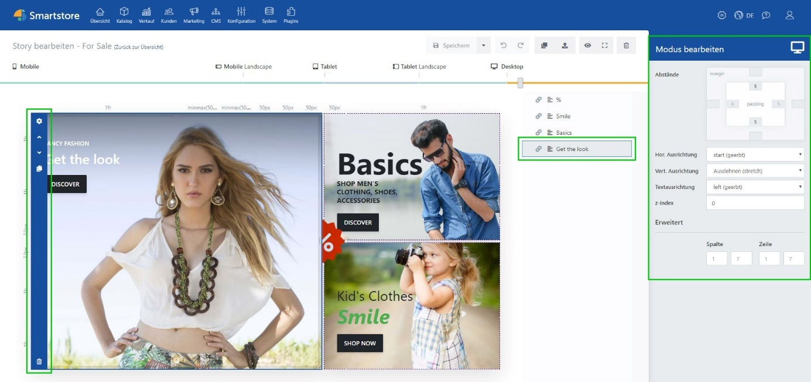

# Toolbox

## Story-Ansicht

**① Layout:** Beinhaltet allgemeine Story-Optionen. Zum Beispiel Veröffentlichungsoptionen oder Darstellungsoptionen. (Siehe [_Layout_](../story/toolbox-story-optionen.md))

**② Hintergrund:** Bietet Optionen zur Anpassung des Hintergrundes der Story mit Bildern, Farbeffekten oder Videos. (Siehe [_Hintergrund_](../blocke/block-basiseinstellungen.md#hintergrund))

**③ Blöcke:** Bietet eine Auswahl aller verfügbaren Blöcke. (Siehe [_Blöcke Übersicht_](../blocke.md))


Die Ansicht der Toolbox ändert sich, wenn ein Block ausgewählt wird. Um wieder die Story-Optionen anzeigen zu lassen, wählen Sie den Block ab oder klicken auf einen freien Bereich innerhalb Ihrer Story.


## Block-Ansicht

Wenn Sie einen Block auswählen, wird dieser markiert und in den Vordergrund gehoben. Zusätzlich werden am linken Rand des Blocks die [_Block-Aktionen_](../blocke.md) angezeigt. Das Zahnrad-Icon öffnet den Bearbeitungsmodus des Blocks, mit dem Inhalte und Effekte konfiguriert werden.

Auch im [_Block-Manager_](block-manager.md) wird der aktuell ausgewählte Block markiert.

Wenn ein Block ausgewählt ist, werden in der [_Toolbox_](toolbox.md) am rechten Rand der Seite blockbezogene Optionen wie Inhaltsausrichtung und Abstände angezeigt. Änderungen an blockbezogenen Einstellungen werden immer auf die aktuelle Auflösung angewendet, die mit dem oberen [_Device-Slider_](../story/responsive-darstellung.md) bestimmt wird. Diese Einstellungen werden auch an höhere Auflösungen weitergegeben, wenn dort keine abweichende Konfiguration vorgenommen wurde. (Siehe [_Toolbox Block-Optionen_](../blocke/toolbox-block-optionen.md))
