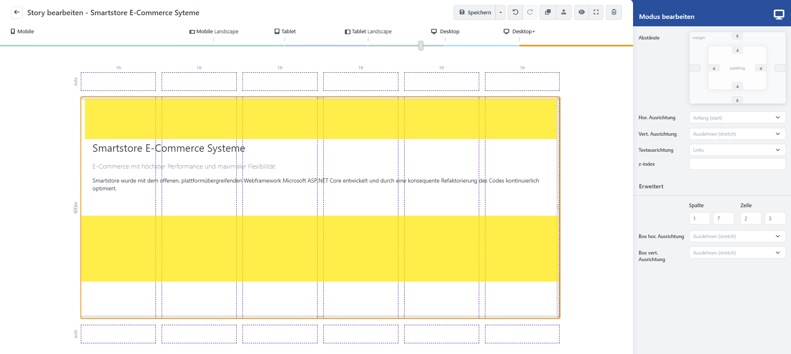
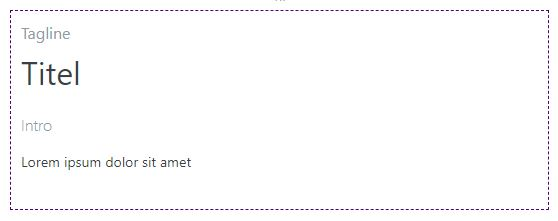
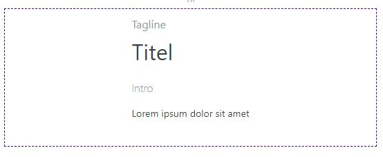
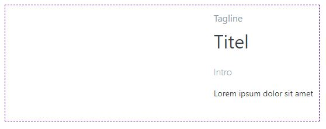
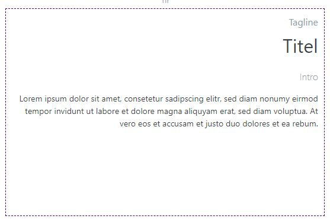
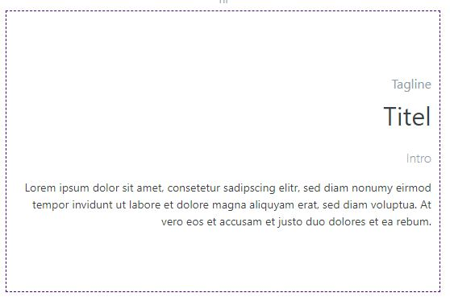
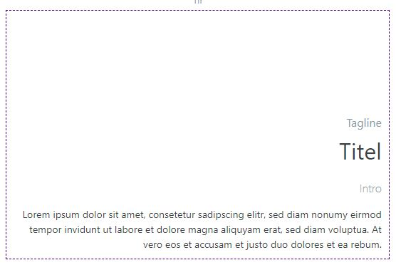
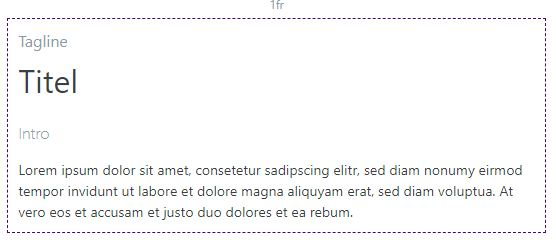
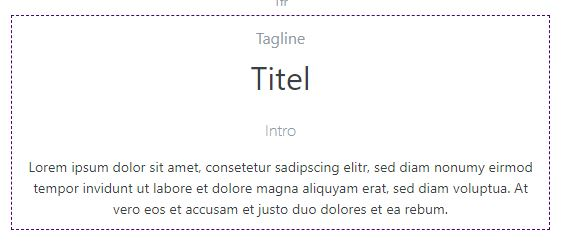
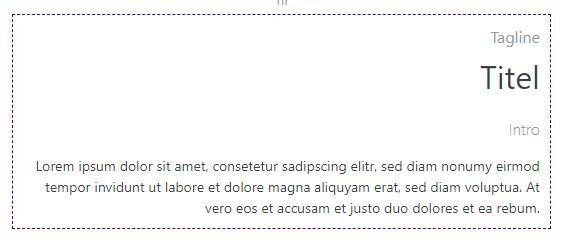

# Toolbox Block-Optionen

Wenn Sie einen Block ausgewählt haben, werden in der [_Toolbox_](../benutzeroberflache/toolbox.md) die Blockoptionen angezeigt. Hier können Sie die Darstellung und Ausrichtung der Inhalte für die aktuelle Auflösungsstufe anpassen. Da sich Stories je nach Bildschirmgröße dynamisch auf den verfügbaren Platz ausbreiten, sollten Sie für jede Auflösungsstufe die Ausrichtung der Inhalte überprüfen und ggf. anpassen, damit die Story auf allen Auflösungen richtig dargestellt wird.

**① Abstände:** Hier werden _margin_ (äußerer Blockabstand) und _padding_ (innerer Blockabstand) definiert. Um diese Werte anzupassen, klicken Sie mit der Maus in eines der Kästchen und ziehen Sie die Maus mit gedrückter (linker) Maustaste nach oben, um den Abstand zu erhöhen, oder nach unten, um den Abstand zu verringern. Dabei können Sie Werte von 0 bis 6 bestimmen. 0 steht dabei für _kein Abstand_ und 6 für einen _sehr großen Abstand_. Wenn das Feld keinen Wert eingetragen hat, wird der Wert der vorherigen Auflösungsstufe übernommen.

**② Horizontale Ausrichtung:** Bestimmt, wie der Blockinhalt in der horizontalen Achse ausgerichtet werden soll (_Anfang_, _Mitte_, _Ende_). Standardmäßig beansprucht der Block die komplette Breite der Zelle _(Ausdehnen)_.

**③ Vertikale Ausrichtung:** Bestimmt, wie der Blockinhalt in der vertikalen Achse ausgerichtet werden soll (_Start_, _Mitte_, _Ende_). Standardmäßig beansprucht der Block die komplette Höhe der Zelle _(Ausdehnen)_.

**④ Textausrichtung:** Bestimmt die horizontale Textausrichtung. Dabei können Sie zwischen links-, mittel- und rechtsbündig wählen.

**⑤ z-index:** Bestimmt die Darstellungsreihenfolge der Blöcke in der Story und die Reihenfolge im [_Block-Manager_](../benutzeroberflache/block-manager.md).

**⑥ Erweitert:** _(Nur für erfahrene Anwender)_ Hier kann die Block-Position gemäß CSS-Grid-Spezifikation manuell editiert werden. Von Spalte/Zeile (einschließlich) bis Spalte/Zeile (ausschließlich). Dies entspricht den CSS-Attributen _grid-column: StartCol / EndCol_ und _grid-row: StartRow / EndRow_.
