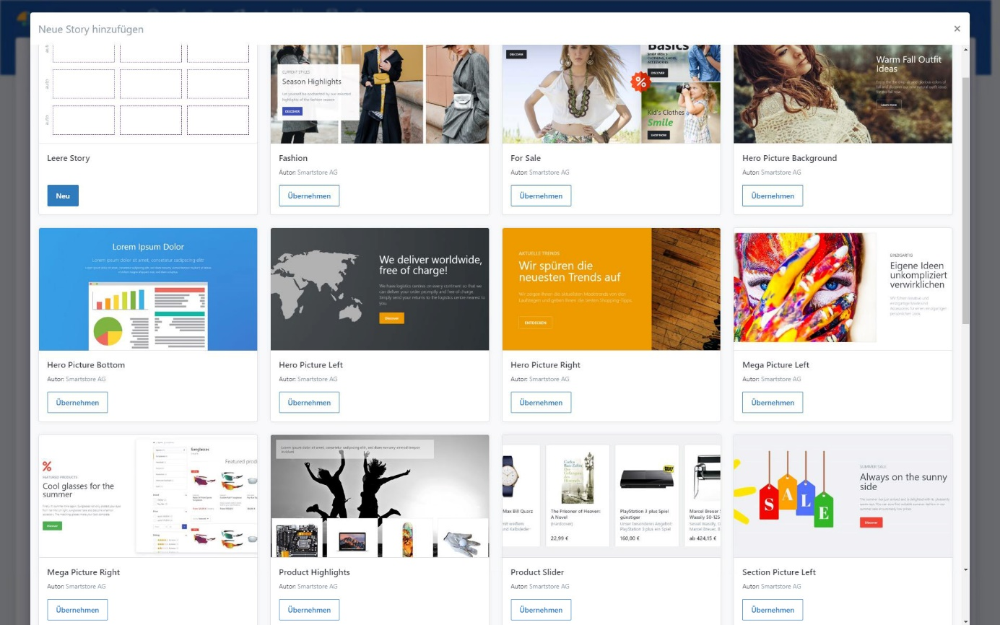

# Story

Jede Story kann als Vorlage gespeichert oder exportiert werden. So verwenden Sie vorhandene Stories schnell als Vorlage für neue Stories. Wir liefern bei der Installation des Page Builders einige Vorlagen für verschiedene Anwendungsfälle mit.

Zudem können Sie weitere Story-Vorlagen von unserem [_Marketplace_](http://community.smartstore.com/index.php?/files/category/32-page-builder-templates/) herunterladen.

