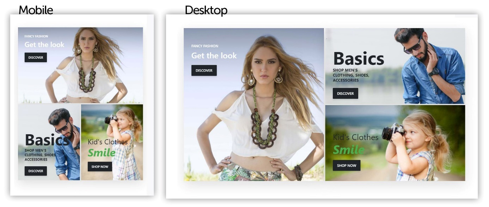
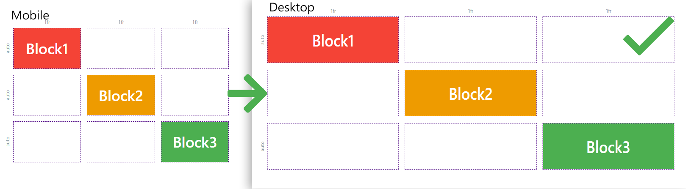
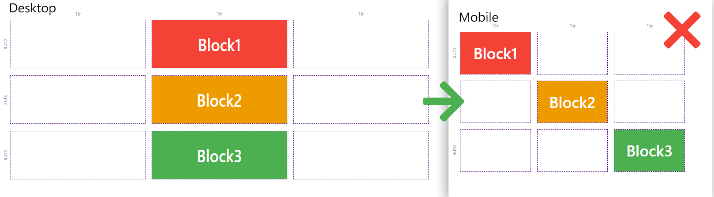
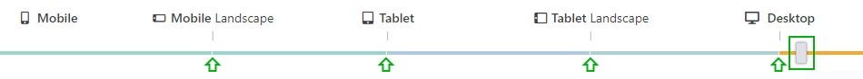
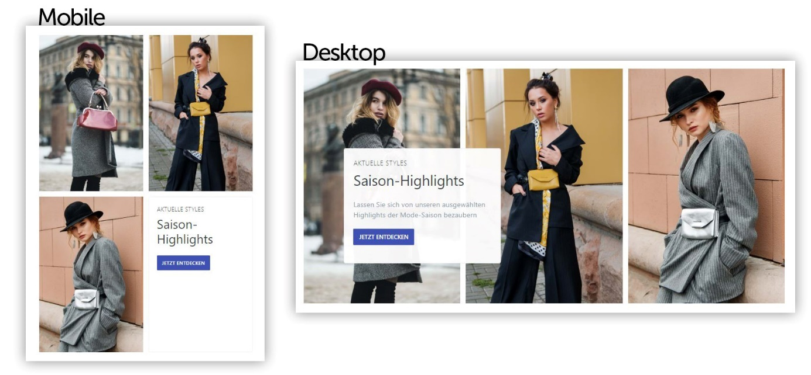

# Responsive Darstellung

## Mobile First

Für eine responsive Darstellung auf allen Auflösungen und Endgeräten folgt der Page Builder dem Mobile-**First-Konzept**. Unter Mobile First versteht man, dass die Darstellung auf mobilen Endgeräten die höchste Priorität bei der Gestaltung einer Seite besitzt. Daher wird zuerst die mobile Version der Story konfiguriert. Darauf aufbauend werden für höhere Auflösungen stufenweise Anpassungen vorgenommen, um das Layout auf den dabei verfügbaren Platz auszulegen.

Hier sehen Sie einen Vergleich zwischen der mobilen Ansicht und der Ansicht für Desktopauflösungen der Story _For Sale_.

Wie Sie sehen können, wurden die Positionierungen der Inhalte angepasst, um den gesamten Platz bei der Desktopauflösung zu nutzen. Die Blöcke werden dabei größer dargestellt, um den verfügbaren Platz effektiver zu beanspruchen. Es gibt fünf verschiedene Auflösungsstufen, um eine passende Darstellung für alle Endgeräte und Auflösungen zu ermöglichen.

**Hinweis:** Beachten Sie die richtige Konfigurationsreihenfolge der Auflösungsstufen von Stories.

Richtige Konfigurationsreihenfolge – Mobile zu Desktop:

Änderungen, die in der mobilen Ansicht vorgenommen wurden, sind auch in der Desktopansicht korrekt übernommen.

Falsche Konfigurationsreihenfolge – Desktop zu Mobile:

Änderungen, die in der Desktopansicht vorgenommen wurden, werden von der mobilen Ansicht **nicht** übernommen.

## Device-Slider

Stories sind responsiv und werden dynamisch auf unterschiedliche Auflösungen angepasst. Die Einstellungen der Inhalte können unterschiedliche Konfigurationen pro Auflösungsstufe haben, wodurch jede Stufe abweichende Konfigurationen in Design und Layout zulässt. Das Raster selbst ist allerdings global für die Story gültig.

Durch die Positionierung des Device-Sliders auf den jeweiligen farbigen Abschnitt wird die aktuelle Auflösungseinstellung ausgewählt. Es gibt fünf Auflösungsstufen: Mobile > Mobile Landscape > Tablet > Tablet Landscape und Desktop.

Durch das **Mobile First**-Konzept übergibt jede Auflösungsstufe ihre Einstellungen an die nächsthöhere Auflösungsstufe, wenn diese keine eingetragenen Werte für die jeweilige Einstellung hat. Das bedeutet, dass sämtliche mobilen Konfigurationen auch auf allen anderen Auflösungen wie Tablet oder Desktop angewendet werden, wenn keine expliziten Einstellungen bei den jeweiligen Auflösungen angegeben wurden.

Sollten Sie nachträglich Änderungen an Ihrem Layout oder den Inhalten vornehmen, vergewissern Sie sich, dass Einstellungen auf höhere Auflösungen nach wie vor wie gewünscht sind.

Wenn Sie nun die Story-Vorlage Fashion betrachten, werden Sie sehen, dass sich die mobile Anordnung der Inhalte von der Desktopdarstellung unterscheidet.

