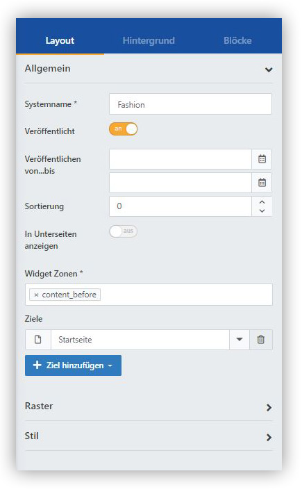
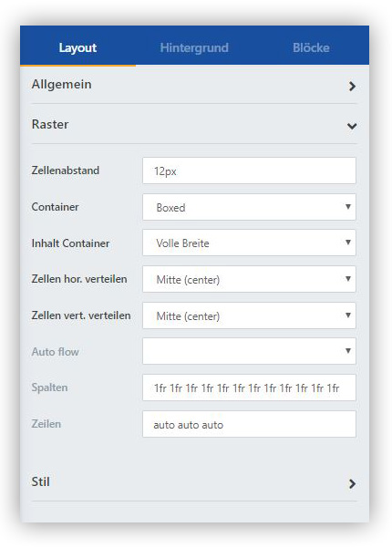
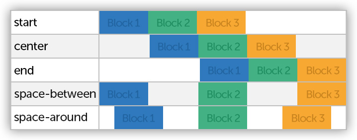
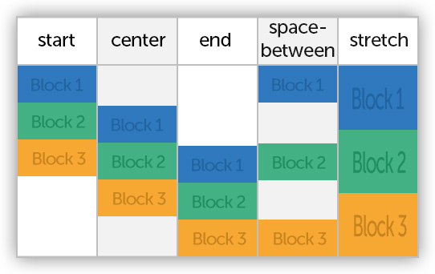
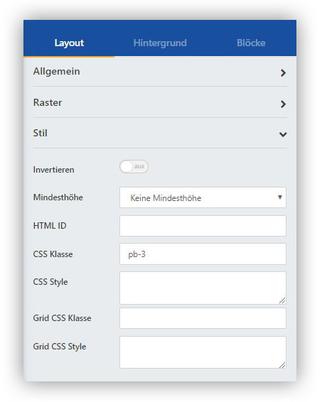

# Toolbox Story-Optionen

## Layout

**Allgemein**

**Systemname:** Name der Story

**Veröffentlicht:** Bestimmt, ob die Story angezeigt wird (Siehe _Veröffentlichungsoptionen_)

**Veröffentlichen von … bis:** Beschränkt den Zeitraum, in dem die Story angezeigt wird (optional)

**Sortierung:** Bestimmt die Anzeigereihenfolge mehrerer Storys innerhalb derselben Widget-Zone.

**In Unterseiten anzeigen:** Bestimmt, ob die Story auch in Unterseiten angezeigt werden soll. Dazu zählen Listen mit einem Seitenindex größer als 1 oder mit mindestens einem aktiven Filter.

**Widget-Zonen:** Bestimmt die Positionierung der Story auf der Seite. (Siehe [_Widget Zonen_](../sonstiges/widget-zonen.md))

**Ziele:** Bestimmt die Zielseite beziehungsweise die Zielseiten, auf denen die Story angezeigt wird. (Siehe _Veröffentlichungsoptionen_)

## Veröffentlichungsoptionen

Eine Story kann in mehreren Widget-Zonen und auf mehreren Zielseiten gleichzeitig dargestellt werden.\
Damit Ihre Story auf der gewünschten Seite erscheint, weisen Sie mindestens eine **Widget-Zone** und eine **Zielseite** zu und aktivieren **Veröffentlicht**. Widget-Zonen bestimmen die Positionierung Ihrer Story auf der gewünschten Seite.

**Raster**

**Zellenabstand:** Definiert den Abstand zwischen den Zellen. Hier können Sie zwischen relativen und absoluten Angaben wählen. Alle möglichen Maßeinheiten finden Sie unter [_Größeneinheiten_](../sonstiges/glossar.md).\
[https://css-tricks.com/snippets/css/complete-guide-grid/#prop-grid-gap](https://css-tricks.com/snippets/css/complete-guide-grid/#prop-grid-gap)

**Container:** Legt die Breite des äußeren Containers fest. (Siehe _Containergrößen_)

**Inhaltscontainer:** Legt die Breite des inneren Containers fest. (Siehe _Containergrößen_)

**Zellen horizontal verteilen:** Legt fest, wie Zellen horizontal verteilt werden, wenn der Container breiter ist als alle Zellen zusammen. (Siehe _Zellen horizontal verteilen - justify-content_)\
[https://css-tricks.com/snippets/css/complete-guide-grid/#prop-justify-content](https://css-tricks.com/snippets/css/complete-guide-grid/#prop-justify-content)

**Zellen vertikal verteilen:** Legt fest, wie Zellen vertikal verteilt werden, wenn der Container höher ist als alle Zellen zusammen. (Siehe _Zellen vertikal verteilen - align-content_)\
[https://css-tricks.com/snippets/css/complete-guide-grid/#prop-align-content](https://css-tricks.com/snippets/css/complete-guide-grid/#prop-align-content)

**Auto-Flow:** _(Nur für erfahrene Anwender)_ Definiert, wie der Algorithmus zur automatischen Platzierung von Elementen vorgeht. (Siehe _Auto-Flow_)\
[https://css-tricks.com/snippets/css/complete-guide-grid/#prop-grid-auto-flow](https://css-tricks.com/snippets/css/complete-guide-grid/#prop-grid-auto-flow)

**Spalten:** _(Nur für erfahrene Anwender)_ Hier können Sie manuell Spalten definieren. Tragen Sie dafür einfach die gewünschte Größe und Einheit Ihrer Spalte ein. Separieren Sie einzelne Einträge mit Leerzeichen. Hierbei ist zu beachten, dass die Bearbeitung des Rasters mithilfe der [_Rasterwerkzeuge_](../benutzeroberflache/das-raster.md) komfortabler und intuitiver ist.

**Zeilen:** _(Nur für erfahrene Anwender)_ Hier können Sie manuell Zeilen definieren. Tragen Sie dafür einfach die gewünschte Größe und Einheit Ihrer Reihe ein. Separieren Sie einzelne Einträge mit Leerzeichen. Hierbei ist zu beachten, dass die Bearbeitung des Rasters mithilfe der _Rasterwerkzeuge_ komfortabler und intuitiver ist.

## Containergrößen

**Volle Breite:** Container beansprucht die volle Anzeigebreite.

**Adaptiv:** Beschränkt die Containergröße auf 88 % der verfügbaren Anzeigebreite. Es wird jeweils 6 % Innenabstand an den beiden Seiten, links und rechts, angewendet.

**Boxed:** Beschränkt die Containerbreite auf die Breite des Inhaltsbereichs.

## Zellen horizontal verteilen – justify-content

Diese Einstellung definiert, wie zusätzlich freier Platz innerhalb des Containers genutzt und auf der horizontalen Achse angeordnet wird. Zusätzlich freier Platz innerhalb Ihrer Story kann entstehen, wenn die Größe aller Zellen kleiner als der Container ist. Zum Beispiel wenn Sie drei Spalten mit absoluten Werten von z. B. 20% definieren. So beanspruchen alle Spalten Ihrer Story nur 60% der Containerbreite, 40% sind freier Platz.

**Start:** Alle Elemente sind linksbündig ausgerichtet.

**Center:** Alle Elemente sind zur Mitte ausgerichtet.

**End:** Alle Elemente sind rechtsbündig ausgerichtet.

**Space-between:** Elemente werden so angeordnet, dass der freie Platz zwischen den Elementen verteilt wird.

**Space-around:** Der freie Platz wird um jedes Element herum aufgeteilt.

## Zellen vertikal verteilen – align-content

Diese Einstellung definiert, wie zusätzlich freier Platz innerhalb des Containers genutzt und auf der vertikalen Achse angeordnet wird.

**Start:** Alle Elemente sind am oberen Rand ausgerichtet.

**Center:** Alle Elemente sind zur Mitte ausgerichtet.

**End:** Alle Elemente sind am unteren Rand ausgerichtet.

**Space-around:** Elemente werden so angeordnet, dass der freie Platz zwischen den Elementen verteilt wird.

**Stretch:** Alle Elemente werden über den freien Platz gestreckt und füllen den Container komplett aus.

## Auto flow (Für erfahrene Anwender)

Wenn Elemente nicht explizit auf dem Raster platziert sind, werden diese automatisch angeordnet. Dafür verfügen Sie über folgende Konfigurationsoptionen, um die Anordnung durch den Algorithmus anzupassen:

**Reihen:** Füllt zuerst Reihen und fügt bei Bedarf neue hinzu.

**Spalten:** Füllt zuerst Spalten und fügt bei Bedarf neue hinzu.

**Reihen ohne Leerräume:** Ähnlich wie Reihen, versucht allerdings Lücken zu füllen, wenn möglich. Sollten nachfolgende Elemente kleiner sein und Zwischenräume füllen können, werden diese dort platziert.

**Spalten ohne Leerräume:** Ähnlich wie Spalten, versucht allerdings Lücken zu füllen, wenn möglich. Sollten nachfolgende Elemente kleiner sein und Zwischenräume füllen können, werden diese dort platziert.

**Stil**

**Invertieren:** Invertiert Textfarbe und Ausblendeffekt. Diese Option ist bei dunklen Hintergrundfarben zu empfehlen, um Text deutlich lesbar darzustellen.

**Mindesthöhe:** Bestimmt die Mindesthöhe des Containers unabhängig vom Inhalt. Wird erst ab der Tablet-Landscape-Auflösung angewendet. Einstellungen sind Mittel (400px) und Hoch (700px).

**HTML-ID:** Legt die HTML-ID fest.

**CSS-Klasse:** Extra CSS-Klassen für den äußeren Container.

**CSS-Stil:** Inline CSS für den äußeren Container.

**Grid-CSS-Klasse:** Extra CSS-Klassen für den Story-Container.

**Grid-CSS-Stil:** Inline CSS für den Story-Container.
