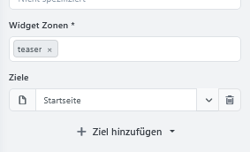

# Widget-Zonen

Widget-Zonen sind vordefinierte Positionen auf den Seiten Ihres Shops. Sie bestimmen, **an welcher Stelle** ein Inhalt erscheint, zum Beispiel oberhalb des Seiteninhalts, innerhalb eines bestimmten Seitenbereichs oder vor dem Footer.

Widget-Zonen können unter anderem für folgende Inhalte verwendet werden:

- Widgets installierter Plugins,
- Storys aus dem [Page Builder](../plugins/pagebuilder.md),
- eigene Inhalte aus [Seiten & Inhalte verwalten](seiten-inhalte-verwalten.md).

Die Widget-Zonen selbst sind für Kunden nicht sichtbar.

## Anzeige der Widget-Zonen aktivieren

Aktivieren Sie in den Developer Tools die Einstellung **Widget-Zonen darstellen**, um die verfügbaren Positionen im Shop-Frontend sichtbar zu machen. Die Anzeige ist bei regulären Shopaufrufen auf angemeldete Administratoren beschränkt.

Eine Anleitung zur Aktivierung finden Sie unter [Developer Tools](../plugins/devtools.md#anzeige-der-widget-zonen-aktivieren).

## Widget-Zonen im Shop anzeigen

Das Widget-Zonen-Menü zeigt die auf der aktuellen Shopseite verfügbaren Positionen. Über das Menü können Sie eine Widget-Zone hervorheben und ihren Namen kopieren. Die angezeigten Zonen unterscheiden sich je nach Seite, Theme und aktiven Funktionen.

Die Bedienung des Menüs wird unter [Widget-Zonen mit den Developer Tools anzeigen](../plugins/devtools.md#widget-zonen-im-shop-anzeigen) beschrieben.

## Widget-Zone verwenden

Für die Platzierung eines Inhalts werden normalerweise zwei Angaben benötigt:

1. **Zielseite:** Legt fest, auf welcher Seite oder bei welchen Inhalten die Ausgabe erfolgen soll.
2. **Widget-Zone:** Bestimmt die Position innerhalb dieser Seite.

Eine Page-Builder-Story kann beispielsweise einer Produktseite als Ziel und einer Widget-Zone oberhalb der Produktbeschreibung zugeordnet werden.

Welche Widget-Zonen zur Auswahl stehen, hängt von der jeweiligen Seite, dem verwendeten Theme und der eingesetzten Funktion ab. Einige Plugins bestimmen ihre Widget-Zone automatisch.

## Die passende Position auswählen

Die Namen der Widget-Zonen geben häufig einen Hinweis auf ihre Position. Zusätze wie `before` und `after` kennzeichnen beispielsweise Bereiche vor oder nach einem bestimmten Seiteninhalt.

Gehen Sie bei der Auswahl folgendermaßen vor:

1. Öffnen Sie die gewünschte Seite im Shop.
2. Öffnen Sie das Widget-Zonen-Menü.
3. Wählen Sie eine Zone aus, um ihre Position hervorzuheben.
4. Kopieren Sie bei Bedarf den Namen der Zone.
5. Hinterlegen Sie diese Widget-Zone beim gewünschten Inhalt.

Prüfen Sie das Ergebnis anschließend direkt auf der vorgesehenen Seite.

## Mehrere Inhalte in einer Widget-Zone

Werden mehrere Inhalte derselben Widget-Zone zugeordnet, bestimmt deren Sortierung die Reihenfolge der Ausgabe.

Bei Plugin-Widgets kann die Reihenfolge unter **CMS > Widgets** per Drag-and-drop angepasst werden. Weitere Informationen finden Sie unter [Widgets anordnen](widgets-anordnen.md).

## Wenn ein Inhalt nicht angezeigt wird

Prüfen Sie in diesem Fall:

- Ist der Inhalt veröffentlicht oder aktiviert?
- Wurde die richtige Zielseite ausgewählt?
- Ist eine passende Widget-Zone zugewiesen?
- Ist die Widget-Zone auf der aufgerufenen Seite vorhanden?
- Wird die Anzeige durch eine zeitliche, Shop- oder Kundengruppen-Einstellung eingeschränkt?
- Befindet sich der Inhalt wegen seiner Sortierung weiter oben oder unten als erwartet?

Für eine Kontrolle mit unterschiedlichen Themes oder Shops können Sie die [Vorschau für Designs & Shops](../allgemeine-konzepte/vorschau-fur-designs-shops.md) verwenden.
