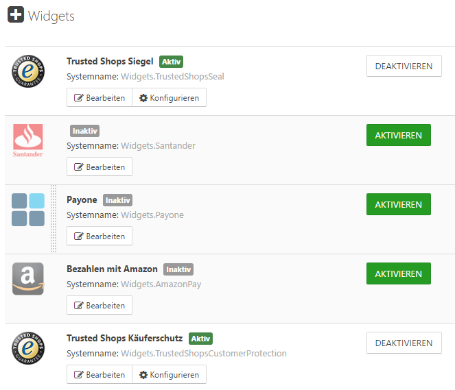

# Widgets anordnen

Plugins stellen Widgets bereit, die Inhalte im Frontend ausgeben oder unsichtbare Inhalte wie Skripte einbinden. Widgets sind die öffentliche Darstellung eines Plugins, mit denen Ihre Kunden interagieren können. Die Bereiche, in denen Widgets angezeigt werden, werden im Plugin festgelegt und sind abhängig von der jeweiligen Funktion des Widgets (z. B. müssen Skripts im oberen Bereich eines HTML-Dokuments vorhanden sein). Beispiele für Widgets sind Analysewerkzeuge oder Prüfsiegel. Sie können Widgets aktivieren und anpassen, indem Sie sie über **CMS > Widgets** ansteuern. Mit **Aktivieren/Deaktivieren** können Sie Widgets und ihre öffentliche Anzeige in Ihrem Shop an- und ausschalten. Der Button **Konfigurieren** führt Sie in den Konfigurationsbereich des jeweiligen Plugins. Wenn es mehrere Widgets gibt, die für die gleiche _Widget Zone_ festgelegt wurden, werden sie in der Reihenfolge angezeigt, in der sie im Backend angezeigt werden. Sie können eine andere Anzeigereihenfolge festlegen, indem Sie die Widgets im Backend per Drag-and-drop verschieben.

## Beispiel 1 (Tracking-Skript)

Stellen Sie sich vor, Sie möchten Nutzerstatistiken erfassen. Wenn Sie nicht ein speziell für diese Aufgabe erstelltes Widget benutzen, benötigen Sie dazu ein Skript im Head-Bereich Ihrer Seite, das die Besuche erfasst und an einen Drittanbieter weitergibt. Wenn Sie E-Commerce-Statistiken (wie beispielsweise Bestellungen) verfolgen möchten, müssen Sie gewisse Variablen wie die Bestellnummer oder die Bestellmenge dynamisch in das Skript einfügen und es auf der entsprechenden Seite platzieren, in diesem Fall auf der Seite _Bestellvorgang abgeschlossen_. Ein Widget (wie Google Analytics) fügt die notwendigen Werte automatisch in das Skript ein und gibt es an der richtigen Stelle aus.

## Beispiel 2 (Prüfsiegel-Widget)

Stellen Sie sich vor, dass Sie Ihren Kunden die Möglichkeit geben möchten, Rezensionen über ihre Erfahrungen in Ihrem Shop abzugeben, und Sie möchten dafür den Service einer renommierten Firma nutzen, die vielen Menschen bekannt ist und der Vertrauen entgegengebracht wird. Ein Widget, das für diese Aufgabe geschaffen wurde, zeigt den Button dafür automatisch nach Abschluss des _Bestellvorgan&#x67;_&#x73; an, um Ihre Kunden auf die Seite dieses Dienstleisters zu führen, von dem die Ergebnisse der Bewertungen wiederum auf Ihrer Seite angezeigt werden.

## Widget-Zonen

Widget-Zonen sind Platzhalter, die es Ihnen erlauben, die Ausgabe von Widgets und HTML-Blöcken überall in Ihrem Shop einzufügen. Jeder Bereich in Smartstore ist mit zahlreichen Widget-Zonen versehen, die Ihnen die maximale Freiheit geben, die Ausgabe eines Widgets an jeder beliebigen Stelle zu platzieren, auch wenn viele Widgets die Widget Zone, in der sie angezeigt werden, selbst bestimmen. Sie können Widget-Zonen auch dazu nutzen, um Ihren eigenen HTML-Inhalt überall im Shop zu platzieren. Weitere Informationen dazu, wie Sie eigene HTML-Inhalte im Shop anzeigen können, lesen Sie bitte [Seiten & Inhalte verwalten](seiten-inhalte-verwalten.md). Für weitere Informationen lesen Sie bitte [Widget-Zonen](widget-zonen.md).
