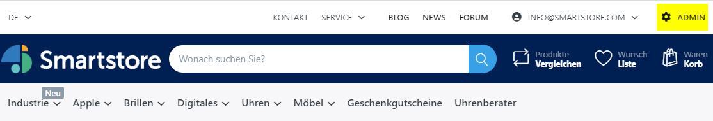
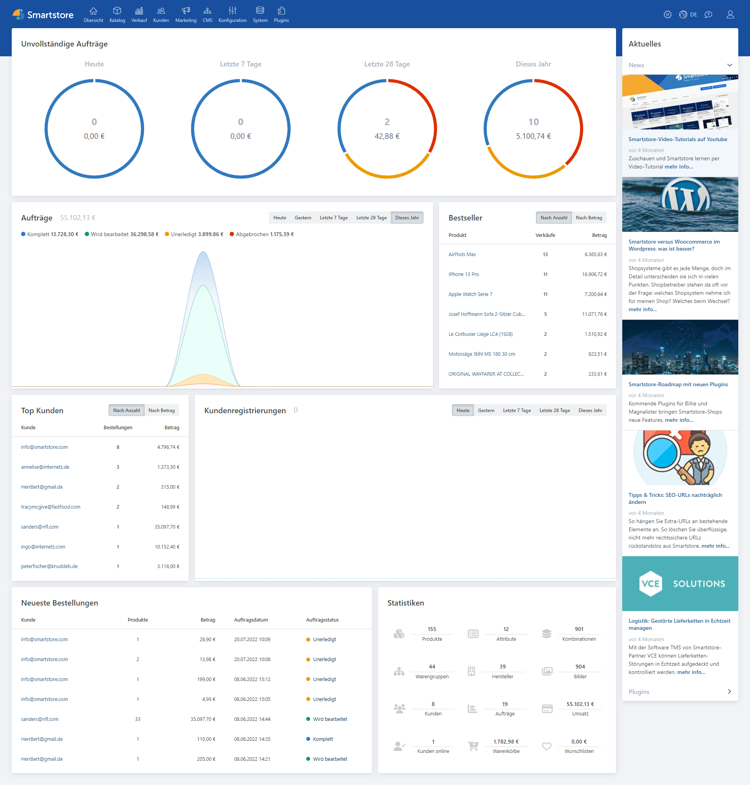
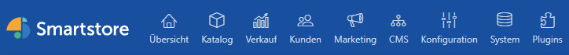
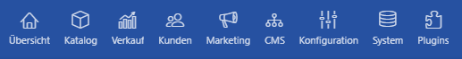
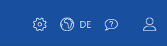

# Das Backend entdecken

Das **Smartstore-Backend** stellt Ihnen eine Benutzeroberfläche zur Verfügung, die Ihnen dabei hilft, Ihren Shop und Ihren Produktkatalog einfach zu verwalten. Um zur Backend-Benutzeroberfläche zu gelangen, loggen Sie sich bitte ein. Sobald Sie als Shop-Administrator angemeldet sind, finden Sie einen Link in der Hauptnavigationsleiste des Shops sowie im Verwaltungsmenü für Ihren Account.

1. Verwaltungsmenü für das Konto
2. Verwaltungslink

Anschließend wird die **Smartstore-Backend-Benutzeroberfläche** angezeigt.

Die Benutzeroberfläche besteht aus den folgenden Bereichen:

* Übersicht / Dashboard
* Links rechts oben
* Arbeitsbereich
* Newsbereich

## Hauptnavigationsleiste

Die **Hauptnavigationsleiste** gibt Ihnen Zugang zu den Kernmodulen von **Smartstore**, dazu gehören **Übersicht/Dashboard, Katalog, Verkauf, Kunden, Marketing, CMS, Konfiguration, System** und **Plugins**.

Die **Hauptnavigationsleiste** gibt Ihnen Zugang zu den folgenden wichtigen Modulen. Wenn Sie weitere Informationen benötigen, folgen Sie einfach den jeweiligen Links.

* [**Übersicht**](die-ubersicht.md) - Hier finden Sie die Statistiken für Ihren Shop, dazu gehören Auftragssummen, Bestseller nach Menge, Bestseller nach Betrag, registrierte Kunden und unvollständige Aufträge.
* [**Katalog**](../verwalten/katalog/) - Erlaubt die Erstellung und Verwaltung von Warengruppen und Produkten. Sie können hier auch Hersteller, Produktrezensionen, Tags und Attribute bearbeiten.
* [**Verkauf**](../verwalten/verkauf/) - Erlaubt die Verwaltung von Aufträgen, Sendungen, wiederkehrenden Zahlungen, Retourenwünschen, Geschenkgutscheinen, Warenkörben, Wunschzetteln, Bestsellern und unverkäuflichen Produkten.
* [**Kunden**](kunden/) - Erlaubt das Hinzufügen, Bearbeiten, Entfernen und die Verwaltung aller Kunden. Sie können auch Kundengruppen, Bestellungen, Bonuspunkte, Warenkörbe und Wunschlisten verwalten.
* [**Marketing**](marketing-promotion/) - Erlaubt das Hinzufügen, Bearbeiten und Verwalten von Rabatten, Partnerprogrammen, Newsletter-Abonnenten und Kampagnen.
* [**CMS**](content-management/) - Erlaubt die Verwaltung von Inhalten, die mit Ihrem Shop in Verbindung stehen, dazu gehören Seiten und Inhalte, News, Blogs, Foren, Umfragen und Widgets. Hier können Sie auch Nachrichtenvorlagen bearbeiten.
* [**Konfiguration**](konfiguration/) - Erlaubt die Konfiguration des Kernsystems und regionale Einstellungen. Sie können hier Shops, Zahlungsarten, Listen, E-Mail-Konten, Zugriffsrechte, ACL und Themes konfigurieren.
* [**System**](../handbuch/system-and-wartung/) - Erlaubt Ihnen, Systeminformationen, die E-Mail-Verwaltung, SEO-Namen, Warnungen und geplante Aufgaben einzusehen.
* [**Plugins**](../handbuch/plugins/) - Erlaubt die Installation und Aktualisierung von Plugins. Sie können hier auch SMS-Anbieter und Developer Tools verwalten.

## Links rechts oben

Über die **Links rechts oben** können Sie Ihre Kontoeinstellungen zu konfigurieren, den Shop anzusehen, eine Sprache auszuwählen, den Hilfebereich aufzurufen und sich aus **Smartstore** abzumelden.

| **Option**                                          | **Beschreibung**                                                                                                                |
| --------------------------------------------------- | ------------------------------------------------------------------------------------------------------------------------------- |
|             | Zeigt Ihnen eine Drop-down-Liste mit Möglichkeiten, Ihren Shop anzusehen, den Cache zu leeren und die Anwendung neu zu starten. |
|  | Erlaubt die Sprachauswahl für die Anwendung.                                                                                    |
|             | Hier erreichen Sie die Online-Hilfe.                                                                                            |
|             | Hier können Sie Ihre Kontoeinstellungen konfigurieren und sich abmelden.                                                        |

## Übersicht

In der **Übersicht** können Sie alle Module in **Smartstore** aufrufen und bearbeiten.

