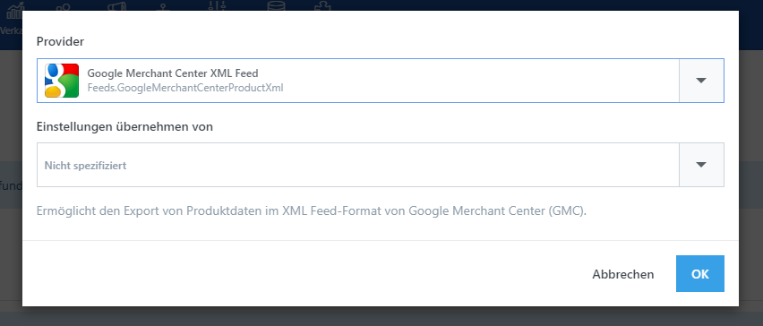

# Exportprofile verwalten

Der Zweck eines Datenexports ist der Massenexport verschiedenen Daten wie Produkten oder Kunden, damit sie außerhalb von SmartStore.NET verwendet werden können.

Ein Exportprofil ist ein Konfigurationselement, das alle benötigten Informationen für einen Datenexport enthält, um den Exportvorgang auf Ihrer individuellen Bedürfnisse abzustimmen. Dazu gehören:

- **Planung**: Automatisch ausgelöstes Exportieren
- **Aufteilung**: Partitionierung/Segmentierung von Daten
- **Filter**: Begrenzung von Daten
- **Projektion**: Projektions-Informationen für die Daten
- **Konfiguration**: Formatspezifische Einstellungen
- **Bereitstellung**: Veröffentlichungsinformation für den Abschluß eines Exports?

Jedes Exportprofil ist mit einem Export Provider verbunden. Ein Export Provider bereitet die zu exportierenden Daten in dem von ihm festgelegten Datenformat auf. In der Regel wird der Provoder durch Plugins zur Verfügung gestellt. Beispiele von Export Providern sind OpenTrans, BMEcat, GMC Feed u.s.w.

Um Exportprofile zu verwalten, gehen Sie zu **Konfiguration > Exportieren**.

In der Liste können Sie ein Profil direkt ausführen, indem Sie **Jetzt ausführen** drücken und sich dann die Fortschrittsanzeige des Exports ansehen. Der Button **Ereignisprotokoll** öffnet die Log-Datei des zuletzt durchgeführten Exports. Sie enthält alle wichtigen Informationen und alle Fehlermeldungen, die bei der letzten Ausführung des Exportprofils aufgetreten sind.

  

> [!INFO]
> Wenn Sie die exportierten CSV-Dateien in Excel editieren möchten, dann importieren Sie sie bitte über **Daten** - **Aus Text/CSV** - **Daten transformieren**. Bei **angewendete Schritte** löschen Sie bitte den Eintrag **Geänderter Typ**. Zuletzt **Schließen und laden**. Excel erkennt Dezimal- und Tausendertrennzeichen nicht korrekt und würde ohne diese Schritte Währungswerte wie z.B. Produktpreise falsch laden.

## Exportprofile erstellen und bearbeiten

Klicken Sie auf **Neues Profil**, um ein neues Exportprofil zu erstellen. Dann öffnet sich ein Dialogfenster, in dem Sie einen Export Provider auswählen müssen. Sie können auch ein bereits vorhandenes Profil auswählen und dessen Einstellungen in das neue Profil kopieren. Nachdem Sie auf **OK** geklickt haben, werden Sie zu dem neuen Exportprofil weitergeleitet.

Um ein Exportprofil zu bearbeiten, klicken Sie auf den Namen des Profils in der Profilliste.

### Allgemein

In dieser Registerkarte können Sie den Namen des Profils festlegen und einstellen, ob es aktiv ist. Deaktivierte Profile werden niemals ausgeführt. Die Seite fasst auch die wichtigsten informationen über den Export Provider zusammen, gibt also Autor, Version, Dateityp u.s.w. an.

Datenexporte können automatisch ausgeführt werden, da der Export von einer **Geplanten Aufgabe** durchgeführt wird, die bei der Erstellung jedem Exportprofil zugeordnet wird. Die Standardeinstellung ist immer ungeplant, mit anderen Worten wird das Profil nicht automatisch ausgeführt. Klicken Sie **Ausführen**, um einen Link für die verbundene Aufgabe zu erhalten und die Planungseinstellungen zu verändern. 

### Aufteilung

In dieser Registerkarte können Sie die Aufteilung Ihrer Daten festlegen.

| 120px\|Eingabefeld | Beschreibung |
| --- | --- |
| Überspringen | Legt die Anzahl der zu überspringenden Datensätze fest. |
| Begrenzen | Legt die maximale Anzahl der zu verarbeitenden Datensätze fest. |
| Stapelgröße | Legt die maximale Anzahl der Datensätze pro Exportdatei fest. 0 ist der Standard und bedeutet, dass alle Datensätze in eine Datei exportiert werden. |
| Per Shop | Legt fest, ob für jeden Shop ein separater Verarbeitungsdurchlauf erfolgen soll. Für jeden Shop wird eine neue Datei erzeugt. |

### Filter

In dieser Registerkarte können Sie die Filtereinstellungen vornehmen, die die Menge an Daten, die exportiert werden sollen, begrenzt. Der Filter ist abhängig vom gewählten Objekttyp, z. B. bietet ein Produktexport andere Filteroptionen als ein Export der Aufträge.

### Projektion

In dieser Registerkarte geben Sie die Einstellungen ein, die auf den Export sowie die zu exportierenden Daten projeziert werden.

> [!INFO]
> Einige dieser Einstellungen sind aus technischen Gründen in der Vorschau nicht zu sehen. Sie haben nur einen Einfluss auf den tatsächlichen Export.

### Konfiguration

In dieser Registerkarte können Sie den Export Provider konfigurieren, den Sie bei der Erstellung des Profils ausgewählt haben. Jeder Provider kann seine eigenen Konfigurations-Einstellungen bereitstellen wenn zusätzliche Einstellungsmöglichkeiten benötigt werden. Wenn Produkte beispielsweise für das Google Merchant Center exportiert werden, möchte Google Informationen über Zustand, Altersgruppe, Geschlecht usw. erhalten. Diese Informationen sind nur beim Export für das Google Merchant Center relevant. Aus diesem Grund werden Einstellungsmöglichten direkt vom GMC-Provider in der Registerkarte Konfiguration angeboten. Die Registerkarte kann auch leer sein, wenn ein Provider keine Konfiguration erfordert.

### Bereitstellung

In dieser Registerkarte können Sie festlegen, was mit den Daten am Ende eines Exports geschehen soll. In einem ersten Schritt werden die Daten immer in einem temporären, lokalen Ordner der Anwendung gespeichert, der nicht öffentlich über das Internet erreichbar ist. Die folgenden Einstellungen stehen in Verbindung mit diesem temporären Speichern der Daten:

180px|EingabefeldBeschreibungOrdnerpfadLegt den relativen Pfad des Ordners fest, in den die Daten exportiert werden.Muster für Dateinamen

Legt das Muster fest, nach dem Dateinamen erzeugt werden. Der Button **Beispiel** erlaubt Ihnen, eine Voransicht auf das Ergebnis der Namensauflösung. Das Muster unterstützt folgende Platzhalter:

| Platzhalter | Beschreibung |
| --- | --- |
| %Profile.Id% | Der numerische Identifier des Exportprofils. |
| %Profile.FolderName% | Der Name des Exportordners für dieses Profil. |
| %Profile.SeoName% | Der SEO-freundliche Name des Exportprofils. |
| %ExportProfile.FolderName% | Der Name des Exportordners des Profils. |
| %Store.Id% | Der numerische Identifier des Shops des aktuellen Exportvorgangs. |
| %Store.SeoName% | Der seo-freundliche Name des Shops des aktuellen Exportvorgangs. Löst sich als `allstores` auf, wenn die Option **Per Shop** aktiviert wurde. |
| %File.Index% | Ein auf 1 basierender Datei-Index. |
| %Random.Number% | Eine zufällige Nummer. |
| %Timestamp% | Ein UTC Zeitstempel. |

> [!INFO]
> Platzhalter sollen die Erstellung eindeutiger Dateinamen vereinfachen. Achten Sie darauf, Muster zu vermeiden, die zu nicht-eindeutigen Namen führen und somit Konflikte hervorrufen.

ZIP-Archiv erstellen

Legt fest, ob die Exportdateien in einem ZIP-Archiv zusammengefasst werden sollen. Das Archiv wird im temporären Ordner des Exportprofils erstellt und trägt dessen Namen.

Nach erfolgreicher Veröffentlichung aufräumen

Löscht bei Beendigung des Exports alle erzeugten Daten bis auf die Log-Datei und das Zip-Archiv.

E-Mail Benachrichtigung

Legt die E-Mail Adresse fest, an welche eine Benachrichtigung über die Fertigstellung des Exports verschickt werden soll. Sie können hier auch mehrere Email Adressen angeben.

> [!INFO]
> System-Exporte (wie Produkt- oder Kategorie-Exporte) senden stets eine E-Mail-Benachrichtigung .

  

  

Im nächsten Schritt erstellen Sie optional eines oder mehrere Veröffentlichungsprofile, um festzulegen, wie Sie mit den Exportdateien weiter vorgehen möchten. Es gibt vier Veröffentlichungstypen: Dateisystem, E-Mail, HTTP, FTP und Öffentlicher Ordner. Die Grundeinstellungen sind:

| 180px\|Eingabefeld | Beschreibung |
| --- | --- |
| Name | Name der Bereitstellung. |
| Aktiv | Bestimmt ob die Bereitstellung aktiv ist und somit ausgeführt wird. |
| ZIP-Archiv erstellen | Bestimmt ob alle Exportdateien in eine ZIP-Datei zusammengefasst werden und diese in das Archiv statt einzelne Dateien zusammen kommen. |

#### Dateisystem

Die Exportdateien werden in das lokale Ordnerverzeichnis des Servers, auf dem der Shop installiert wurde, kopiert.

| 180px\|Eingabefeld | Beschreibung |
| --- | --- |
| In öffentlichen Ordner kopieren | Legt fest, ob die Dateien in den öffentlichen Ordner **Exchange** des Shops kopiert werden. Dateien im **Exchange** Ordner sind öffentlich, weil sie über das Netz angesteuert werden können. Sie müssen keinen Verzeichnispfad angeben, wenn diese Option aktiviert wurde. |
| Ordnerpfad | Der Ordnerpfad, falls die vorhergehende Option deaktiviert wurde. |

#### E-Mail

Eine E-Mail, die die Exportdateien als Attachment enthält, wird verschickt.

| 180px\|Eingabefeld | Beschreibung |
| --- | --- |
| E-Mail-Konto | Gibt den E-Mail-Account an, der genutzt wird, um die Daten zu versenden. |
| E-Mail-Adressen | Gibt die E-Mail-Adressen an, die die Daten erhalten sollen. |
| E-Mail-Betreff | Legt den Betreff der E-Mail fest. |

#### HTTP

Überträgt die Exportdateien via HTTP.

| 180px\|Eingabefeld | Beschreibung |
| --- | --- |
| URL\\Host | Gibt die URL oder den Hostnamen an, zu der/dem die Daten gesendet werden sollen. |
| HTTP Übertragungstyp | Legt fest, wie die Exportdateien via HTTP übertragen werden. `Simple POST` erstellt eine POST-Anforderung für jede Datei. `Multipart form data POST` sendet alle Dateien in einem einzigen Post als mehrteilige Formulardaten. |
| Benutzername | Bestimmt den Nutzernamen, falls dieser für die Übertragung benötigt wird. |
| Passwort | Gibt das Passwort an, falls dieses für die Übertragung benötigt wird. |

#### FTP

Überträgt die Exportdateien via FTP.

| 180px\|Eingabefeld | Beschreibung |
| --- | --- |
| URL\\Host | Legt die URL oder den Hostnamen fest, an die/den die Daten gesendet werden sollen. |
| Benutzername | Legt den Nutzernamen fest, falls einer für die Übertragung benötigt wird. |
| Passwort | Legt das Passwort fest, falls eines für die Übertragung benötigt wird. |
| Passivmodus | Legt fest, ob die Daten aktiv oder passiv gesendet werden. |
| SSL verwenden | Legt fest, ob eine SSL (Secure Sockets Layer) Verbindung genutzt wird. |

  

## Vorschau der Exportdaten

Klicken Sie auf **Vorschau,** um auf die Vorschau-Seite zu gelangen. Die Exportdaten werden dort in einer Datentabelle angezeigt.

Sie können den Exportvorgang hier auch direkt starten. Sie können nicht nur alle Daten exportieren, sondern auch einzelne Einträge auswählen, um diese zu exportieren.

> [!INFO]
> Einige Projektions-Einstellungen werden aus technischen Gründen nicht in der Vorschau angezeigt, Sie werden ausschließlich den tatsächlichen Export angewendet.