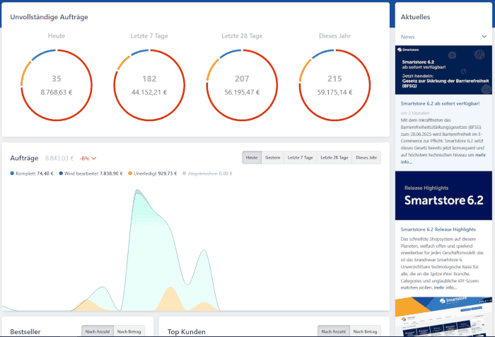
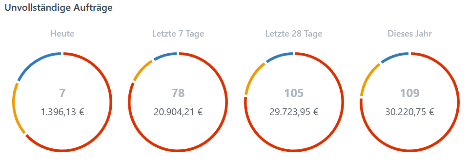
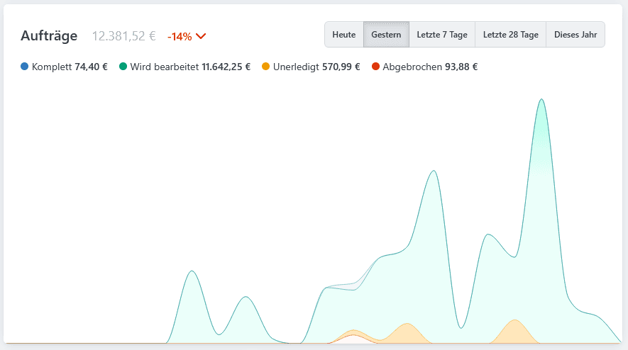
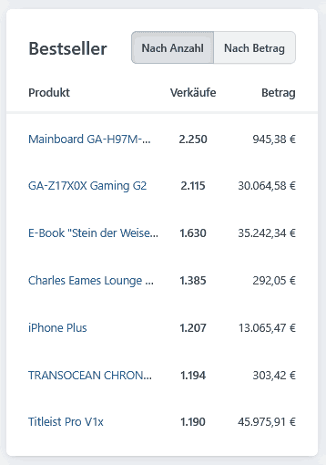
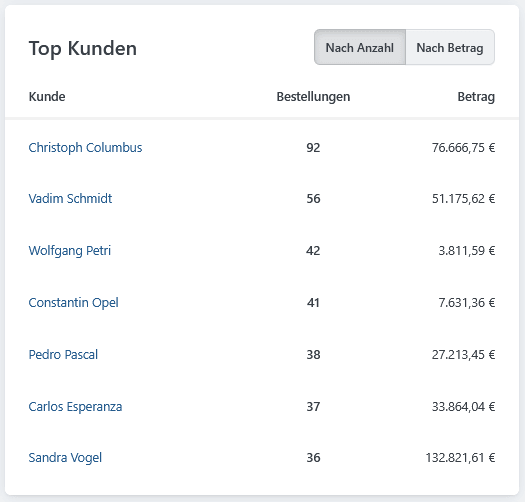
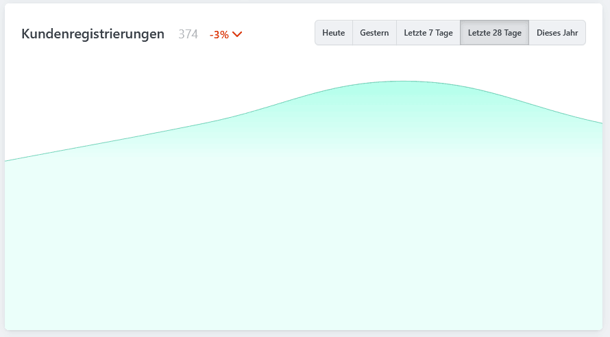
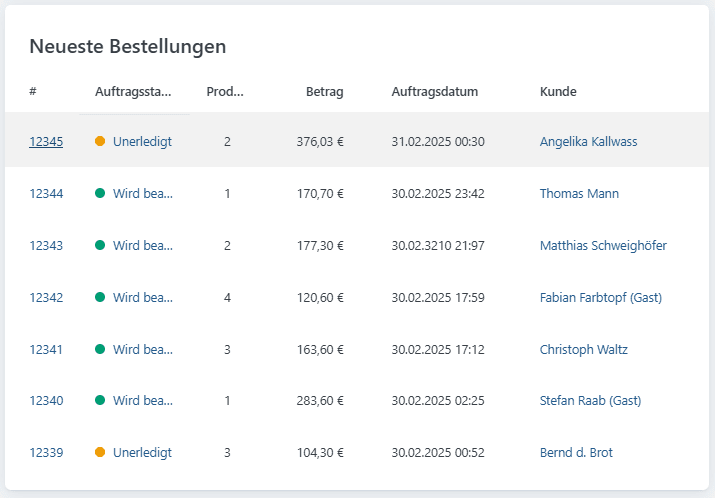
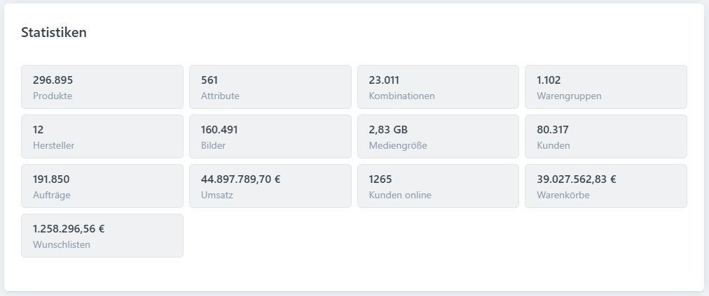
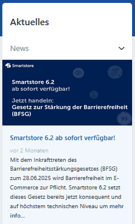

# Die Übersicht

Die Startseite des Backends bündelt wichtige Kennzahlen, Statistiken und aktuelle Informationen zu Ihrem Shop.

Das **Dashboard** stellt diese Daten in Diagrammen und Listen dar. So erkennen Administratoren den aktuellen Shopstatus auf einen Blick und können auf relevante Entwicklungen reagieren.


**Farben der Diagramme:** Alle Farben, die in den Verlaufs- und Tortendiagrammen der Dashboard-Karten verwendet werden, werden über die **Theme-Konfiguration** gesteuert. Standardmäßig handelt es sich um die folgenden Farben: **Rot**, **Sonnengelb**, **Blau**, **Grün** und **Grau**.\
Sollten Änderungen in der Theme-Konfiguration vorgenommen worden sein, können die Farben entsprechend abweichen.


## Unvollständige Aufträge

Dieser Bereich zeigt noch nicht vollständig abgeschlossene Aufträge. So erkennen Administratoren schnell, welche Vorgänge noch bearbeitet werden müssen.

Um die Auswertung übersichtlich zu halten, stehen verschiedene Zeiträume zur Verfügung.\
\- **Heute** – zeigt unvollständige Aufträge des aktuellen Tages.\
\- **Letzte 7 Tage** – Übersicht über die letzten sieben Tage.\
\- **Diesen Monat** – unvollständige Aufträge im aktuellen Kalendermonat.\
\- **Dieses Jahr** – Gesamtübersicht aller unvollständigen Aufträge des laufenden Jahres.


**Hinweis zur Darstellung**: Die unvollständigen Aufträge werden in einem **Tortendiagramm** dargestellt. Die Segmente sind nach Status farblich unterteilt. **Rot**: Nicht geliefert, **Sonnengelb**: Unbezahlt, **Blau**: Neu.


## Aufträge

Dieser Bereich gibt einen Überblick über alle abgeschlossenen Bestellungen einschließlich der damit erzielten Umsätze. Damit lassen sich zeitliche Entwicklungen und Umsatztrends im Shop nachvollziehen.\
Die Auswahl der Zeiträume erfolgt analog zu den **Unvollständigen Aufträgen**.


**Hinweis zur Darstellung**: Die Daten werden in einem **Verlaufsdiagramm** visualisiert, dabei werden verschiedene Kurven zur Unterscheidung der Auftragsarten farblich hervorgehoben.\
**Blau**: Komplett, **Grün**: Wird bearbeitet, **Sonnengelb**: Unerledigt, **Grau**: Abgebrochen.


## Bestseller

Dieser Bereich zeigt die erfolgreichsten Produkte im Shop. Für jedes Produkt werden der Name, die Anzahl der Verkäufe sowie der erzielte Umsatz angezeigt. Die Daten können wahlweise nach verkaufter Stückzahl oder nach Umsatz sortiert werden. Auf diese Weise lassen sich die beliebtesten Artikel schnell identifizieren und Trends im Kaufverhalten der Kunden erkennen.


Wenn Sie auf den Link des Produktnamens klicken, erreichen Sie die **Produktdetailseite**.


## Top-Kunden

Dieser Bereich zeigt die umsatzstärksten beziehungsweise aktivsten Kunden im Shop. Angezeigt werden der Kundenname, die Anzahl der Bestellungen sowie der insgesamt erzielte Umsatz. Die Daten können entweder nach der Anzahl der Bestellungen oder nach dem Umsatz sortiert werden. Dadurch lassen sich die wichtigsten Stammkunden leicht identifizieren.


Wenn Sie auf den Link des Kundennamens klicken, erreichen Sie die **Kundenseite**.


## Kundenregistrierungen

Dieser Bereich zeigt die Entwicklung neuer Kundenkonten im Shop. Damit lässt sich erkennen, wie stark die Kundenbasis im jeweiligen Zeitraum wächst.\
Die Auswahl der Zeiträume und Färbung der Kurven erfolgt analog zu **Aufträge**.

## Neueste Bestellungen

Dieser Bereich listet die zuletzt eingegangenen Aufträge auf. Zu jeder Bestellung werden die Auftragsnummer, der aktuelle Status, die Anzahl der bestellten Produkte, der Gesamtbetrag, das Auftragsdatum und der Name des Kunden angezeigt. Dadurch ist sofort ersichtlich, welche Bestellungen zuletzt eingegangen sind und wie ihr Bearbeitungsstand ist.


Wenn Sie auf den Link der Kundennummer beziehungsweise des Auftragsstatus klicken, erreichen Sie die **Auftragsseite**. Der Link des Kundennamens führt zur **Kundenseite**.


## Statistiken

Dieser Bereich gibt einen kompakten Überblick über die wichtigsten Kennzahlen des Shops. Er zeigt unter anderem die Anzahl der **Produkte**, **Attribute**, **Kombinationen**, **Warengruppen**, **Hersteller** und **Bilder**, die **Mediengrößen** sowie die Gesamtzahl der **Kunden** und **Aufträge**. Darüber hinaus werden der **Umsatz**, die Anzahl der aktuell im Shop aktiven Kunden (**Kunden online**), die Gesamtsumme der **Warenkörbe** und der **Wunschlisten** dargestellt. Auf diese Weise lassen sich schnell zentrale Informationen zur Shop-Struktur und zu den Aktivitäten im Shop erfassen.

## Aktuelles

In der Seitenleiste werden Nachrichten und Informationen direkt von **Smartstore** eingebunden. Hier finden sich z. B. Hinweise zu Updates, neuen Funktionen oder wichtigen Mitteilungen.

