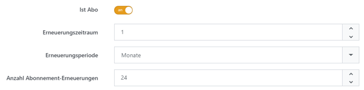

# Mit Abonnements umgehen

Abonnements sind Produkte, die periodisch in Rechnung gestellt und ausgeliefert werden müssen. 

## Anwendungsszenario

Stellen Sie sich vor, Sie betreiben einen Buchladen, der auch Zeitschriftenabos verkauft. Dafür müssten Sie Ihren Kunden den Preis eines Magazins in bestimmten Abständen in Rechnung stellen. Smartstore ist für dieses Szenario optimal geeignet. Sie müssen dafür lediglich die Option **Ist Abo** in der Registerkarte **Allgemein** in der Produktkonfiguration aktivieren. Dann legen Sie den Zeitabstand fest, indem Sie die Zeiteinheit (**Erneuerungsperiode**) und die Dauer (**Erneuerungszeitraum**) angeben. Schließlich geben Sie noch die Anzahl der **Abonnement-Erneuerungen** ein. Nehmen wir an, dass Sie ein sechsmonatiges Abonnement für ein Magazin verkaufen möchten, das monatlich erscheint. Dann setzen Sie den **Erneuerungszeitraum** auf 1, die **Erneuerungsperiode** auf *Monat* und die Anzahl der **Abonnement-Erneuerungen** auf 6.

Für weitere Informationen zur Produktkonfiguration lesen Sie bitte [Produkte erstellen und bearbeiten](../produkte-verwalten/produkte-erstellen-und-bearbeiten.md). Für weitere Informationen zum Umgang mit wiederkehrenden Zahlungen lesen Sie bitte [Wiederkehrende Zahlungen verwalten](../../../benutzer-handbuch/verkauf/wiederkehrende-zahlungen-verwalten.md).