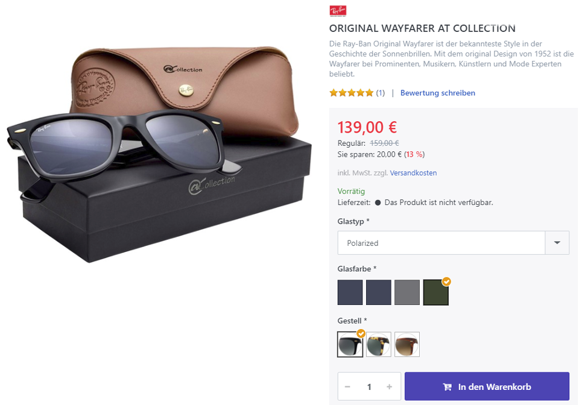

# Wie funktionieren Produktvarianten?

Produktvarianten helfen Ihnen unterschiedliche Versionen und Formen des gleichen Produkts zu verwalten. Sie können Varianten eines Produkts über die Registerkarte **Attribute** in der Produktdetailkonfiguration anlegen und verwalten. 

 

## Anwendungsszenario

Stellen Sie sich vor, Sie verkaufen T-Shirts in Ihrem Onlineshop. Ein T-Shirt ist normalerweise in unterschiedlichen Farben und Größen erhältlich. Da Sie für das Produkt mit unterschiedlichen Attributen nicht ständig neue Produkteinträge erstellen wollen, können Sie die Attribute Ihrem Produkt hinzufügen, um unterschiedliche Varianten besser verwalten zu können. Um Produktvarianten für ein T-Shirt zu erstellen, gehen Sie auf die Registerkarte **Atttribute** in der Produktdetailkonfiguration und fügen die gewünschten Attribute (z. B. Farbe und Größe) hinzu. Wenn Sie das Farbenattribut hinzufügen, sollten Sie den Typ **Farbflächen** wählen, für das Attribut Größe den Typ **Dropdown-Liste**. Nachdem Sie die Attribute hinzugefügt haben, enthalten Sie zunächst mal noch keinerlei Werte (z. B. Größe > S,M,L,XL). Als nächstes müssen Sie also Werte zu Ihren Attributen hinzufügen. Dies können Sie tun, indem Sie auf den Link **Attributwerte bearbeiten/ansehen** in der Tabelle klicken. Nachdem Sie die Werte hinzugefügt haben, gibt es zwei Optionen zum Handling Ihrer Attribute: Sie können es darauf beruhen lassen oder Attributkombinationen erstellen, die individuelle Produktdaten für jede Attributkombination ermöglichen (z. B. Lagerbestand, Preis, SKU, etc.) Sie können sogar ein Produktbild auswählen, das angezeigt wird, wenn der Kunde Attribute auswählt, die zu dieser Kombination gehören.

## Attribute

Bevor Sie neue Attribute hinzufügen können, müssen sie in **Katalog > Produktattribute** angelegt werden. In diesem Bereich können Sie ein neues Produktattribut anlegen, indem Sie es mit einem Namen versehen, der als eindeutiger Name für dieses Attribut in Ihrem Shop dienen wird. Sobald es erstellt wurde, können Sie unterschiedliche Namen und Beschreibungen für jede Sprache, die Sie für Ihren Shop konfiguriert haben, anlegen.

Wenn Sie ein Produktattribut zu Ihrem Produkt hinzufügen, können Sie die folgenden Werte konfigurieren.

  

AttributeBeschreibungAttributLegt das Produktattribut fest.Anzeigetext

Legt einen textuellen Wert fest, der in Ihrem Shop neben dem Attribute angezeigt wird. Der Zweck dieses Wertes ist dem Kunden einen zusätzlichen Hinweis über die Nutzung des Attributes zu geben.

Ist erforderlich

Legt fest ob die Auswahl eines Attributwerts durch den Kunden zwingend erforderlich ist, bevor der Kunde das Produkt dem Warenkorb zufügen kann.

Typ

Legt den Steuerelement-Typ fest, der im Frontend erzeugt wird. Sie können unter den folgenden Typen auswählen:

| Typ | Beschreibung |
| --- | --- |
| Dropdown-Liste | Erzeugt eine Dropwdown-Liste, um Kunden einen der hinterlegten Attributwerte wählen zu lassen. |
| Radiobuttonliste | Erzeugt eine Radiobuttonliste, um Kunden einen der hinterlegten Attributwerte wählen zu lassen. |
| Kontrollkästchen | Erzeugt Kontrollkästchen für jeden Wert, um Kunden einen der hinterlegten Attributwerte wählen zu lassen. |
| Textbox | Erzeugt eine Textbox. |
| Mehrzeilige Textbox | Erzeut eine mehrzeilige Textbox. |
| Kalender | Erzeugt einen Kalender, mit welchen Kunden ein Datum wählen können. |
| Datei Upload | Erzeugt ein Datei Upload Feld, mit welchem Kunden Dateien hochladen können. |
| Farbflächen | Erzeugt Farbflächen, um Kunden eine Farbe auswählen zu lassen. |

ReihenfolgeLegt die Reihenfolge der Anzeige im Frontend fest.WerteEnthält die Attributwerte.

##   
Attributwerte

Abhängig vom ausgewählten Typ können Sie unterschiedliche Felder oder keines bearbeiten. Wenn Sie die Typen **Textbox, Mehrzeilige Textbox, Kalender** oder **Datei Upload** auswählen, können Sie keine Werte hinzufügen, da der Wert dieser Typen durch den Kunden bestimmt wird, die frei mit diesen Steuerelementen interagieren können. Für den Typ **Farbflächen** können Sie Farbwerte angeben, die als Flächen erzeugt werden und von Ihren Kunden auf der Produktdetails-Seite ausgesucht werden können, indem sie darauf klicken. Farbflächen können auch in der Produktbox aus Produktlisten angezeigt werden, wenn die folgende Option aktiviert ist: **Konfiguration > Einstellungen > Katalog-Einstellungen > Produktlisten > Zeige Farbvarianten in Produktlisten** . Wenn Sie Werte zu einem Attribut hinzufügen, können Sie die folgenden Daten dafür spezifizieren.

  

| 250px\|Feld | Beschreibung |
| --- | --- |
| Name | Name des Attributwerts, wie er im Frontend angezeigt wird. Erlaubt unterschiedliche Werte für jede angelegte Sprache. |
| RGB-Frabe | Der RGB-Wert der Farbe, die im Frontend erzeugt wird. Nur für den Typ **Farbflächen** verfügbar. |
| Alias | Zur internen Verwendung (Entwicklerfunktion). |
| Verknüpftes Produkt | Wenn Sie den Werttyp **Produkt** anstelle von **Einfach** benutzen, können Sie ein Produkt als Variantenwert hinzufügen, das automatisch zum Warenkorb hinzugefügt wird, sobald der Kunde das Attribut wählt. |
| Mehr-/Minderpreis   | Mehr-/Minderpreis   . Der Wert wird auf der Produktdetailseite neben dem Wert angezeigt, wenn die folgende Option aktiviert ist: **Konfiguration > Einstellungen > Katalog-Einstellungen > Produktdetail > Mehr- und Minderpreise bei Variant-Kombinationen anzeigen** . |
| Mehr-/Mindergewicht | Passt das Gewicht für dieses Attribut an. |
| Vorausgewählt | Spezifiziert, ob der Wert vorausgewählt ist, wenn der Kunde die Produktdetailseite betritt. |
| Reihenfolge | Legt die Reihenfolge der Anzeige fest. |

##   
Attribut-Kombinationen

Wenn Sie produktbezogene Daten (z. B. unterschiedliche SKUs, Preise, etc.) für Ihre Attribute verwalten möchten, müssen Sie **Attribut-Kombinationen** erstellen, indem Sie auf **Alle Kombinationen erstellen** klicken oder Attribut-Kombinationen manuell erstellen, indem Sie auf **Hinzufügen** klicken. Sie können die folgenden Daten für jede Attribut-Kombination bearbeiten, indem Sie auf die Kombination in der Tabelle klicken. All diese Werte werden im Hintergrund mit einer AJAX- Anforderung geladen und auf der Produktdetailseite angezeigt, wenn der Kunde die zugehörigen Attributwerte auswählt.

| 250px\|Feld | Beschreibung |
| --- | --- |
| Aktiv | Gibt an, ob die Kombination aktiv ist und durch Ihre Kunden ausgewählt werden kann. |
| Bilder | Aktivieren Sie die Bilder, die diese Attribut-Kombination zeigen. Die ausgewählten Bilder werden angezeigt, wenn ein Kunde die zugehörigen Attributwerte auswählt. Die ausgewählten Bilder werden von der Produktdetailseite ausgeschlossen, sobald die Anzahl der Produktbilder die Anzahl der möglichen Bilder, die mit folgender Einstellung festgelegt wurde, übersteigt: **Konfiguration > Einstellungen > Katalog-Einstellungen > Produktdetail > Anzahl, ab der Bilder nur noch bei Variantenwechsel angezeigt werden** |
| #   | Die SKU/Produktnummer. |
| Hersteller-Produktnummer | Produktnummer des Herstellers. |
| EAN | EAN (Europa), GTIN (Global Trade Item Number), UPC (USA), JAN (Japan) oder ISBN (Bücher). |
| Preis | Legt den Preis für die Attribut-Kombination fest. |
| Lieferzeit | Legt die Lieferzeit für die Attribut-Kombination fest. |
| Grundeinheit | Der Bezugswert für den Grundpreis (z.B. "1 Liter"). Formel: {Grundeinheit} {Maßeinheit} = {Verkaufspreis} / {Menge}. |
| Menge | Tatsächliche Menge des Produktes pro Verpackungseinheit in der angegebenen Maßeinheit (z.B. 250 ml Duschgel entspricht "0,25", wenn {Maßeinheit}=Liter und {Grundeinheit}=1). |
| Länge | Die Länge des Produktes. |
| Breite | Die Breite des Produktes. |
| Höhe | Die Höhe des Produktes. |
| Lagerbestand | Gibt den Lagerbestand an. Beachten Sie, dass der Lagerbestand einer Kombination nur dann automatisch reduziert wird, wenn die Option **Lagerbestandsführung** in der Registerkarte **Inventar** in der Produktdetailkonfiguration mit **Lagerbestand mit Attributen führen** belegt ist. |
| Bestellung ohne Lagerbestand möglich | Legt fest, ob das Produkt auch bei einem Lagerbestand <=0 bestellt werden kann. |

> [!INFO]
> Wenn Sie neue Attributwerte hinzufügen, müssen Sie die Kombinationen neu erstellen, um alle aktuellen Werte Ihren Kombinationen zuzuweisen.