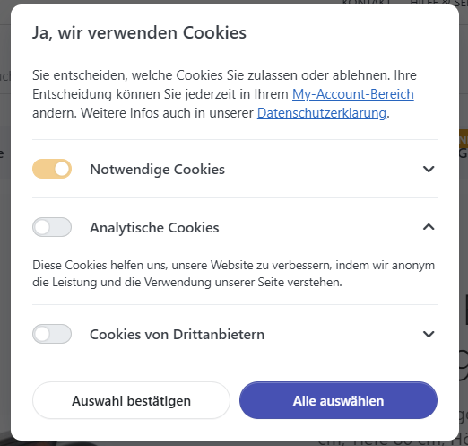
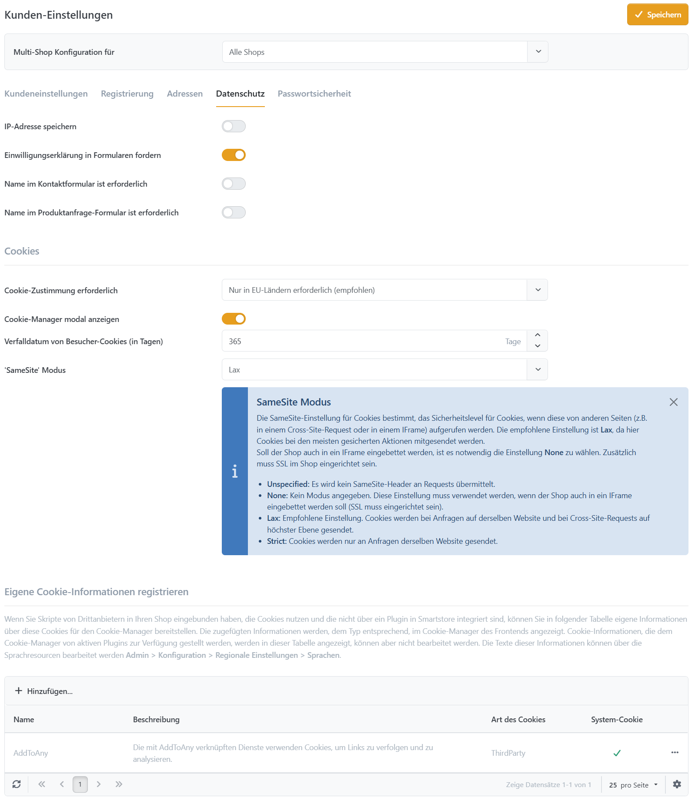

# Cookie-Manager

Die E-Privacy-Richtlinie 2002/58/EG auch bekannt als auch als "Cookie-Richtlinie" - ist eine EU-Richtlinie, die den Datenschutz für Internet-Nutzer erhöhen soll. Dazu soll der User der Verwendung von Cookies zustimmen müssen, bevor diese auf Webseiten eingesetzt werden dürfen. Die Datenschutzrichtlinien der EU besagen, dass alle Webseiten in der EU die Einwilligung ihrer Besucher einholen müssen, um Cookies auf den Endgeräten der Nutzer speichern zu dürfen. Eine Ausnahme gilt hier für sogenannte Session-Cookies. Das sind Cookies, die für die Funktion einer Webseite unentbehrlich sind.

Mit dem Cookie-Manager stellen Sie ihren Kunden diese Möglichkeit zur Verfügung. Die Informationen, die im Cookie-Manager dargestellt werden, können entweder von Plugins bereitgestellt werden (jene, die Cookies nutzen und die erst aktiv werden, sobald der Nutzung des jeweiligen Cookie-Typs zugestimmt wurde), oder sie können durch den Shop-Betreiber im Backend selbst hinzugefügt werden.

## Der Cookie-Manager im Frontend

Beim ersten Besuch Ihres Shops wird dem Besucher der Cookie-Manager angezeigt. Kunden haben nun die Möglichkeit auszuwählen, welche Cookies sie zulassen möchten.&#x20;



### Cookie-Typen

**Notwendige Cookies**&#x20;

Notwendige Cookies sind Cookies, die vom Shopsystem genutzt werden und ohne die der Shop nicht funktionieren kann. Gemäß Richtlinie ist für diese Cookies keine Zustimmung erforderlich. Aus dem Grund lässt sich diese Option vom Shop-Besucher nicht verändern und ist für ihn bereits vorausgewählt. Nachfolgend finden Sie eine Liste der notwendigen Cookies, die von Smartstore gesetzt werden.

| **Cookie-Name** | **Nutzung** |
| :--- | :--- |
| .Smart.Session | Dieses Cookie wird verwendet, um den Sitzungsstatus des Benutzers über HTTP-Anfragen hinweg beizubehalten. |
| .Smart.Identity | Dieses Cookie wird verwendet, um registrierte Benutzer über Anfragen hinweg zu authentifizieren und zu identifizieren. |
| .Smart.Visitor | Dieses Cookie wird verwendet, um Gast-Benutzer, die nicht registriert sind, zu verfolgen und zu identifizieren. |
| .Smart.CookieConsent | Dieses Cookie wird verwendet, um die Cookie-Präferenzen und die vom Kunden im Cookie-Manager getroffenen Auswahlentscheidungen zu speichern. |
| .Smart.RecentlyViewedProducts | Dieses Cookie speichert die Produkt-IDs der Produkte, die der Kunde kürzlich angesehen hat. |
| .Smart.ComparedProducts | Dieses Cookie wird verwendet, um die Liste der Produkte zu speichern, die der Benutzer vergleichen möchte. |
| .Smart.Antiforgery | Dieses Cookie wird verwendet, um die Anwendung vor Cross-Site Request Forgery (CSRF) Angriffen zu schützen. |
| .Smart.Consent | Dieses Cookie wird verwendet, um den Status der DSGVO-Zustimmung des Benutzers für die Datenverarbeitung zu speichern. |
| .Smart.TempData | Dieses Cookie wird verwendet, um temporäre Daten zwischen Anfragen zu speichern, was typischerweise für korrekte Weiterleitungen (Redirects) benötigt wird. |
| .Smart.ExternalAuth | Dieses Cookie wird verwendet, um die Authentifizierung über externe Anbieter (z. B. Google, Facebook) zu verwalten. |
| .Smart.StoreIdOverride | Dieses Cookie wird verwendet, um die Standard-Shop-Auswahl in Multi-Store-Szenarien zu überschreiben. |
| .Smart.PreviewModeOverride | Dieses Cookie wird verwendet, um den Vorschaumodus für das Testen unveröffentlichter Inhalte zu aktivieren oder zu deaktivieren. |
| .Smart.PreviewToolOpen | Dieses Cookie wird verwendet, um den Status (offen/geschlossen) des Vorschau-Tool-Panels zu speichern. |
| .Smart.UserThemeChoice | Dieses Cookie wird verwendet, um die bevorzugte Theme-Auswahl des Benutzers (z. B. Light- oder Dark-Mode) zu speichern. |

**Analytische Cookies**

Mit Hilfe analytischer Cookies sammeln statistische Webdienste, wie z.B. Google Analytics, Daten über das Nutzungsverhalten einer Webseite. Diese Daten werden von Seiten-Betreibern zur Verbesserung der eigenen Webseite genutzt.

**Third Party Cookies**

Dienste, die erweiterte Funktionen anbieten, wie z.B. LivePerson Chat, setzen teilweise auch Cookies ein, um diese Dienste in den Shop integrieren zu können.

## Der Cookie-Manager im Backend

Der Cookie Manager kann unter **Admin > Konfiguration > Einstellungen > Kunden > Datenschutz** aktiviert oder deaktiviert werden. Je nach aktivierten Plugins werden im Cookie-Manager jetzt bereits Informationen zur Cookie-Nutzung im Frontend angezeigt.&#x20;

Wenn Sie ihre eigenen Scripte einbinden möchten, die Cookies nutzen, können Sie Informationen darüber ebenfalls im Backend unter **Datenschutz** bereitstellen.&#x20;



Um die zugehörigen Scripte einzubinden, gibt es entweder die Möglichkeit diese als Widget im Backend hinzuzufügen oder sie direkt in Views einzubinden.

#### Topics&#x20;

Um ein Script, das Cookies setzt als solches zu markieren, fügen Sie es zunächst zu, unter **Admin > CMS > Seiten**. Das Topic muss nun als Widget ausgegeben werden, indem die Option **Als HTML Widget darstellen** aktiviert wird. Die Option Cookie Type bestimmt nun, ob das Script abhängig von der Kundenauswahl im Cookie-Manager ausgegeben wird. Informationen über das Cookie können wie weiter oben beschrieben in den Datenschutz-Einstellungen hinterlegt werden.

#### Views

Die Scripte können nach Abfrage, ob die jeweilige Cookie-Art erlaubt wurde, auch in Views eingebunden werden.

```
@using SmartStore.Core.Plugins;
@using SmartStore.Services.Customers;

@{
    var cm = EngineContext.Current.Resolve<CookieManager>();
    var isMyCookieAllowed = cm.IsCookieAllowed(this.ViewContext, CookieType.Analytics);
}

@(isMyCookieAllowed == true)
{
    <script>
        ...
    </script>
}
```

#### Scripte

Innerhalb von Scripten können Sie den Status, der vom Kunden gesetzten Cookie-Einstellungen, über das CookieManager-Objekt abfragen. Hier stehen Ihnen die beiden Properties _AllowsAnalytics_ und _AllowsThirdParty_ zur Verfügung. Ein Initialisierungscode eines Scriptes könnte dann so aussehen:

```
if (CookieManager.AllowsAnalytics) {
	// Initialisierung mit Cookies
} else {
	// Initialisierung ohne Cookies
}
```

Der Google Tag Manager ist ein Dienst von Google, mit dem Sie Tracking-Codes und verbundene Code-Fragmente in Ihren Shop einbinden können. Damit dieser ohne Cookies initialisiert wird, muss man ihm eine ID übergeben, die für jeden Shop-Besucher eindeutig ist. Dazu haben wir dem Window-Namespace eine Variable zugefügt die sich mit _window.ClientId_ abrufen lässt.

**Beispiel für die Initialisierung des Google Tag Managers ohne Cookies**

```
gtag('config', 'GOOGLE_ID', {
	client_storage: 'none',
	client_id: window.ClientId
});
```

#### Länder

Ein Cookie-Hinweis ist nur für Länder in der EU erforderlich, daher gibt es die Möglichkeit, den Hinweis auf Länderebene auszuschalten. Um den Cookie-Manager für Besucher eines Landes zu deaktivieren, navigieren Sie zu **Admin > Konfiguration > Regionale Einstellungen > Länder > Land** und deaktivieren die Option **Cookie-Manager anzeigen**
