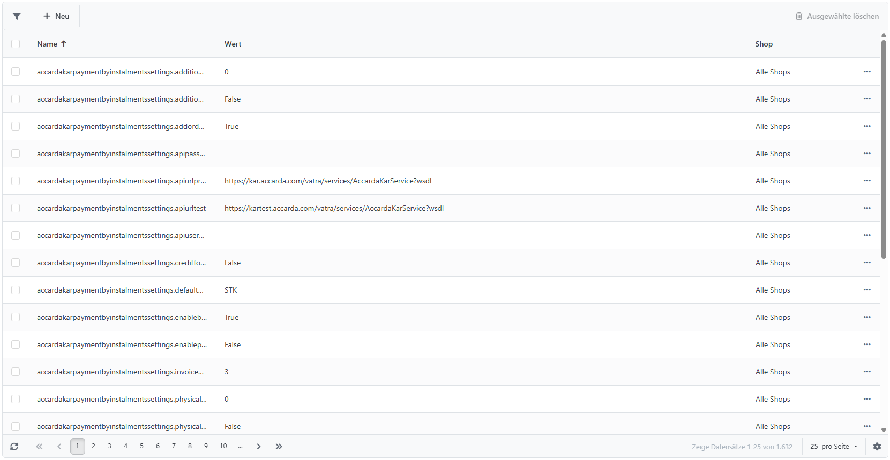

# Alle Einstellungen (fortgeschritten)

Im Bereich **Alle Einstellungen** finden Sie jede Einstellung, die in Smartstore vorgenommen werden kann, mit Ausnahme der Einstellungen für die Konfiguration von Themes. In Smartstore gibt es versteckte Funktionen, für die keine Einstellungsmöglichkeit in den jeweiligen Konfigurationsbereichen vorgesehen sind. Ein Grund dafür ist, dass wir den Konfigurationsbereich übersichtlich halten und ihn nicht mit einer Vielzahl von Einstellungen überfrachten wollen, die nur wenige Administratoren brauchen. Sie können jedoch jede Einstellung in Smartstore im Bereich **Alle Einstellungen** finden und editieren. Für weitere Informationen dazu, wie Sie die von Ihnen gesuchte Einstellung finden, lesen Sie bitte den Abschnitt **Tabellenansichten durchsuchen** in [Tabellenansichten](../../allgemeine-konzepte/tabellenansichten.md).

