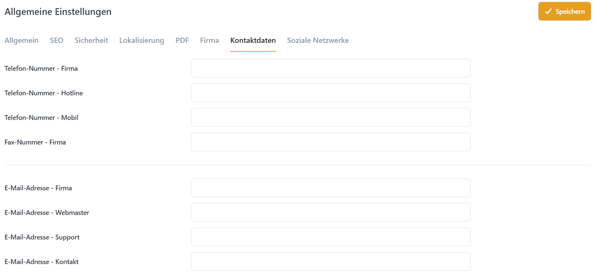

# Allgemeine Einstellungen

Im Bereich **Allgemeine Einstellungen** können Sie globale Einstellungen für verschiedene Bereiche vornehmen. Es gibt nicht für jede Einstellung eine Erklärung, da einige selbsterklärend sind. Wenn die Einstellung, die Sie suchen nicht dokumentiert ist, fahren Sie bitte mit dem Mauszeiger über den Platz zwischen Titel und Eingabefeld der Einstellung. Es taucht dann ein Fragezeichen auf, das Ihnen einen Hinweis zur Benutzung dieser Einstellung gibt.

## Allgemein

| Einstellung | Beschreibung |
| :--- | :--- |
| Shop geschlossen | Mit dieser Einstellung können Sie den Shop für Wartungsarbeiten schließen. |
| Administrator kann geschlossenen Shop sehen | Der Administrator kann den Shop ansehen, auch wenn er geschlossen ist. |

## Suchmaschinen

| Einstellung | Beschreibung |
| :--- | :--- |
| Titel-Trennzeichen | Legt das Seiten-Titel-Trennzeichen fest. |
| Seiten-Titel-Anpassung | SEO-relevante Seitentitel-Anpassung. Der erzeugte Seitentitel könnte z. B. statt `MEINSHOP.DE | SEITE NAME` lauten `SEITE NAME | MEINSHOP.DE`. |
| Standard-Titel | Legt den Standard-Titel für Seiten im Shop fest. |
| Standard-Meta-Keywords | Legt die Standard-Meta-Keywords für alle Seiten fest. Für Warengruppen, Produkte und Hersteller können diese individuell angegeben werden. |
| Standard-Meta-Beschreibung | Legt die Standard-Meta-Beschreibung (description) fest. Diese kann für Warengruppen, Produkte und Hersteller nochmal individuell angepasst werden. |
| Nicht-westliche Zeichensätze konvertieren | Konvertiert Buchstaben mit Akzentzeichen aus SEO-relevanten Namen zu Buchstaben ohne Akzentzeichen. |
| Kanonische Urls aktivieren | Aktiviert kanonische Urls (Canonical Tags), um Duplicate Content zu vermeiden. |
| Regel für kanonischen Domänennamen | Erzwingt die permanente Umleitung zu einem einzelnen Domänennamen für ein besseres Seitenranking (z. B. `meinshop.de` > `www.meinshop.de` oder umgekehrt). |
| Extra Disallows für robots.txt | Geben Sie hier zusätzliche Pfade an, die als Disallow-Einträge zur `robots.txt` hinzugefügt werden sollen. Jeder Eintrag muss in einer neuen Zeile erfolgen. |

## Sicherheit

| Einstellung | Beschreibung |
| :--- | :--- |
| Sicherheitsschlüssel (private key) | Der Sicherheitsschlüssel wird benutzt, um sensible Daten zu verschlüsseln. |
| Für den Adminbereich erlaubte IP | Der Zugriff auf den Adminbereich kann nur noch über diese IP-Adresse erfolgen. Lassen Sie dieses Feld leer, wenn Sie den Zugang zum Backend nicht beschränken möchten. Nutzen Sie Kommata, um mehrere IPs einzugeben. |
| Honeypot aktivieren | Honeypot ist eine simple, aber zuverlässige Bot-Erkennungsmethode, die ohne Captcha auskommt. Wenn aktiv, werden Registrierungs- und Kontaktformular vor Bots und Angreifern geschützt. |
| Captcha aktivieren | Ein CAPTCHA ist ein automatisierter Test, der echte Nutzer von Bots unterscheidet, z. B. durch eine kurze Aufgabe oder eine unsichtbare Risikoprüfung. Es schützt Formulare und Logins vor Spam und Missbrauch.  Diese Option aktiviert den Spamschutz mittels **Google reCAPTCHA**. Smartstore unterstützt sowohl Version 2 als auch Version 3.  Um den Dienst zu nutzen, benötigen Sie ein Konto bei [Google reCAPTCHA](https://www.google.com/recaptcha/admin).  1. Erstellen Sie dort einen neuen Key. 2. Hinterlegen Sie den **Websiteschlüssel (Public Key)** und den **Geheimen Schlüssel (Private Key)** in den entsprechenden Feldern. 3. Wählen Sie die Theme-Einstellung passend zu Ihrem Key (V2 oder V3). |
| Auf Seiten anzeigen | Legt fest, auf welchen Formularen (z. B. Kontaktseite, Registrierung) das Captcha aktiv sein soll. |


**Probleme mit reCAPTCHA V3?**

Falls der Button im Formular nicht reagiert ("flackert") und in der Browser-Konsole ein Fehler `400 ERR_BLOCKED_BY_ORB` erscheint, prüfen Sie bitte unseren Troubleshooting-Guide. Oft liegt dies an einem falschen Key-Typ.

[Zur Problemlösung: Google reCAPTCHA V3 Fehler](../../../troubleshooting/google-recaptcha-v3-fehler.md)


## Lokalisierung

| Einstellung | Beschreibung |
| :--- | :--- |
| Sprachressourcen zwischenspeichern | Legt fest, ob alle Sprachressourcen beim Anwendungsstart global zwischengespeichert werden sollen. Dadurch verzögert sich zwar der Anwendungsstart, aber Seiten werden u. U. deutlich schneller aufgebaut. |
| Suchmaschinenfreundliche URLs | Wenn aktiviert, werden lesbare URLs (SEO-URLs) generiert. |
| Verhalten bei Standardsprache | Legt das Redirect-Verhalten fest, wenn eine Seite in der Standardsprache angefordert wird (die Standardsprache ist die erste aktive Sprache eines Shops). |
| Verhalten bei ungültiger Sprache | Legt das Redirect-Verhalten fest, wenn eine Seite mit einem ungültigen bzw. inaktiven SEO-Code (Sprachkürzel) angefordert wird. |
| Bilder zur Sprachauswahl verwenden | Aktivieren, wenn Sie Flaggen-Icons zur Sprachauswahl verwenden möchten. |
| Browsersprache erkennen | Legt fest, ob beim Erstbesuch die Browsersprache des Besuchers automatisch erkannt und zugewiesen werden soll (wenn inaktiv, wird die Standardsprache des Shops zugewiesen). |

## PDF

| Einstellung | Beschreibung |
| :--- | :--- |
| PDFs aktivieren | Aktiviert die PDF-Generierung. Bestellbestätigungen und Rechnungen können als PDF heruntergeladen werden. |
| US-Letter-Format benutzen | Legt fest, ob das amerikanische Letter-Format benutzt werden soll. Sonst wird das DIN A4-Format benutzt (Standard). |
| PDF Logo | Legt das Logo für die PDF-Rechnung fest. Eine kleine Dateigröße wird empfohlen, um die Generierung zu beschleunigen. |

## Firma und Kontaktdaten

Hier können Sie alle unternehmensbezogenen Daten eingeben (z. B. Unternehmensadresse, E-Mails, Telefonnummer, Kontonummer, u.s.w.). Diese Daten werden an unterschiedlichen Stellen (im Footer, in der Auftragsbestätigung, PDFs, u.s.w.) angezeigt.

## Soziale Netzwerke

In der Registerkarte _Soziale Netzwerke_ können Sie festlegen, ob Ihre Auftritte in sozialen Netzwerken angezeigt werden. Wenn Sie die Option aktivieren, können Sie all Ihre sozialen Netzwerkkanäle eingeben. Wenn Sie eines oder mehrere der sozialen Netzwerke nicht anzeigen möchten, lassen Sie das entsprechende Feld einfach leer. Die Logos und Links zu Netzwerken, die nicht von Ihnen angegeben wurden, werden auch nicht im Frontend Ihres Shops dargestellt.