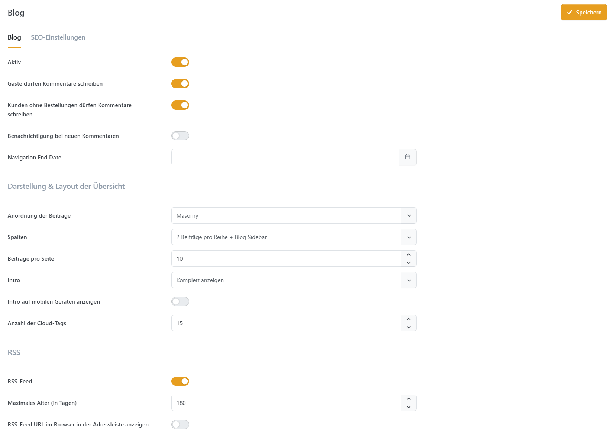

# Blog

| Einstellung                                          | Beschreibung                                                                                                 |
| ---------------------------------------------------- | ------------------------------------------------------------------------------------------------------------ |
| Aktiv                                                | Aktiviert den Blog in Ihrem Shop.                                                                            |
| Gäste dürfen Kommentare schreiben                    | Legt fest, ob nicht registrierte Benutzer (Gäste) Kommentare hinterlassen dürfen.                            |
| Kunden ohne Bestellungen dürfen Kommentare schreiben | Legt fest, ob Kunden Kommentare schreiben dürfen, auch wenn sie noch nie einen Artikel gekauft haben.        |
| Benachrichtigung bei neuen Kommentaren               | Benachrichtigt den Shopbetreiber, wenn ein neuer Blog-Kommentar verfasst wurde.                              |
| Enddatum der Navigation                              | Definiert das Datum, bis zu dem der Blog-Link in der Shop-Navigation erscheint.                              |
| Anordnung der Beiträge                               | Wählt das visuelle Layout für die Blog-Auflistung (z. B. Masonry).                                           |
| Spalten                                              | Bestimmt das Rasterlayout und die Position der Seitenleiste (z. B. 2 Beiträge pro Reihe + Blog Sidebar).     |
| Beiträge pro Seite                                   | Legt die Anzahl der Beiträge fest, die pro Seite angezeigt werden.                                           |
| Intro                                                | Steuert, wie viel vom Inhalt des Blogbeitrags in der Listenansicht angezeigt wird (z. B. Komplett anzeigen). |
| Intro auf mobilen Geräten anzeigen                   | Legt fest, ob der Intro-Text auch auf mobilen Geräten angezeigt werden soll.                                 |
| Anzahl der Cloud-Tags                                | Die Anzahl der Blog-Tags, die in der Tag-Cloud (Schlagwortwolke) erscheinen.                                 |
| RSS-Feed                                             | Aktiviert generell den RSS-Feed für den Blog.                                                                |
| Maximales Alter (in Tagen)                           | Legt das maximale Alter (in Tagen) für Beiträge fest, die im RSS-Feed enthalten sein sollen.                 |
| RSS-Feed URL im Browser in der Adressleiste anzeigen | Legt fest, ob der Link zum Blog-RSS-Feed in der Adressleiste des Kundenbrowsers angezeigt werden soll.       |
