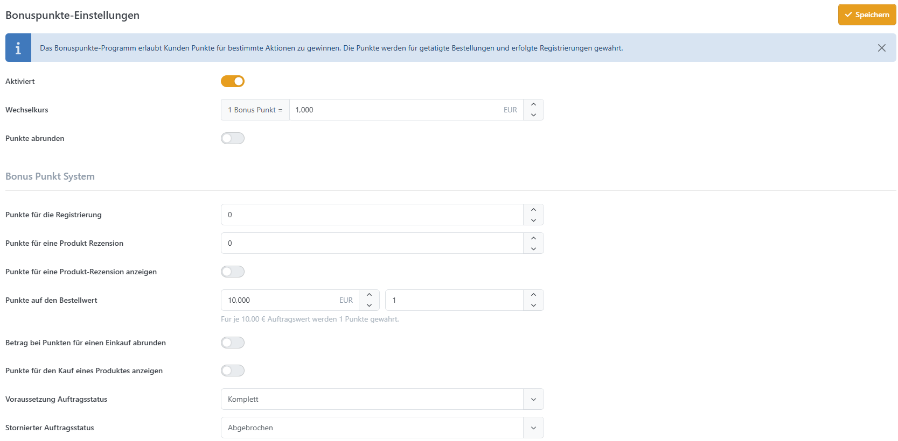

# Bonuspunkte-Einstellungen

| Einstellung                                   | Beschreibung                                                                                                                  |
| --------------------------------------------- | ----------------------------------------------------------------------------------------------------------------------------- |
| Aktiviert                                     | Legt fest, ob das Bonuspunkte-Programm aktiviert ist.                                                                         |
| Wechselkurs                                   | Legt den Wechselkurs für Bonuspunkte fest (z. B. 1 Bonuspunkt = 1,00 EUR).                                                    |
| Punkte abrunden                               | Legt fest, ob bei der Punkteberechnung abgerundet werden soll.                                                                |
| Punkte für die Registrierung                  | Anzahl der Bonuspunkte, die für eine erfolgreiche Registrierung gewährt werden.                                               |
| Punkte für eine Produktrezension              | Anzahl der Bonuspunkte, die für das Verfassen einer Produktrezension gewährt werden.                                          |
| Punkte für eine Produkt-Rezension anzeigen    | Wenn aktiviert, wird dem Kunden angezeigt, wie viele Punkte er für eine Rezension erhalten kann.                              |
| Punkte auf den Bestellwert                    | Legt fest, wie viele Punkte für den Einkauf gewährt werden (z. B. 1 Punkt für alle 10,00 € Auftragswert).                     |
| Betrag bei Punkten für einen Einkauf abrunden | Wenn aktiviert, wird die Anzahl der Punkte für einen Einkauf abgerundet.                                                      |
| Punkte für den Kauf eines Produktes anzeigen  | Wenn aktiviert, wird auf der Produktdetailseite angezeigt, wie viele Punkte man durch den Kauf dieses Produkts erhalten kann. |
| Voraussetzung Auftragsstatus                  | Die Bonuspunkte werden gewährt, sobald der Auftrag diesen Status erreicht hat (z. B. Komplett).                               |
| Stornierter Auftragsstatus                    | Die Bonuspunkte werden wieder abgezogen, wenn der Auftrag diesen Status erreicht (z. B. Abgebrochen).                         |
