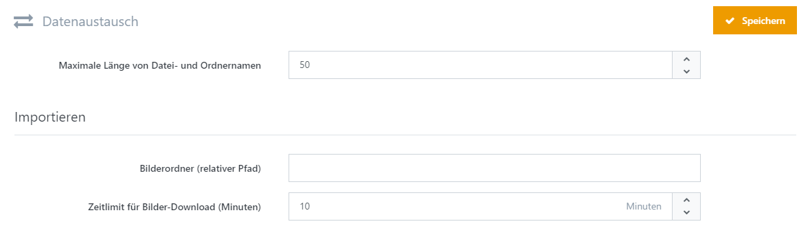

# Datenaustausch-Einstellungen

|                                           |                                                                                                                   |
| ----------------------------------------- | ----------------------------------------------------------------------------------------------------------------- |
| Maximale Länge von Datei- und Ordnernamen | Legt die maximale Länge von Datei- und Ordnernamen fest, die im Rahmen eines Imports oder Exports erzeugt wurden. |
| Bilderordner (relativer Pfad)             | Legt einen relativen Pfad zu einem Ordner mit zu importierenden Bildern fest (z. B. Inhalt\Bilder).               |
| Zeitlimit für Bilder-Download (Minuten)   | Legt das Zeitlimit für den Bilder-Download in Minuten fest.                                                       |
| E-Mail zum Importabschluss                | Legt fest, ob eine E-Mail bei Abschluss eines Imports verschickt werden soll.                                     |
