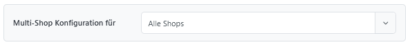
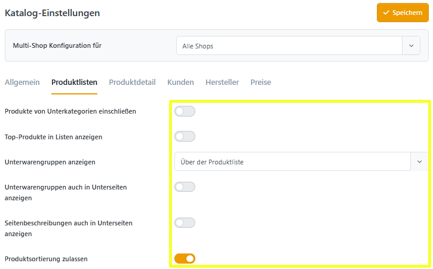
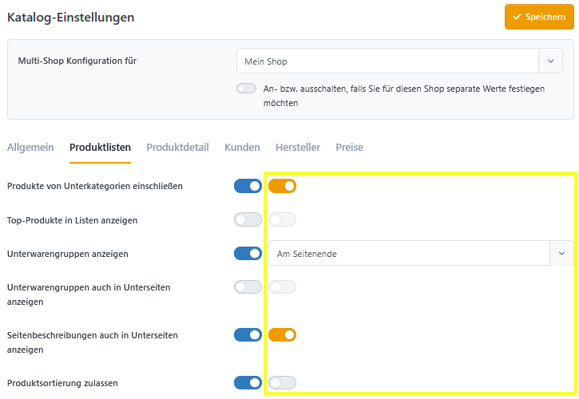
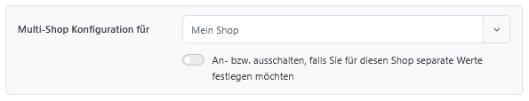
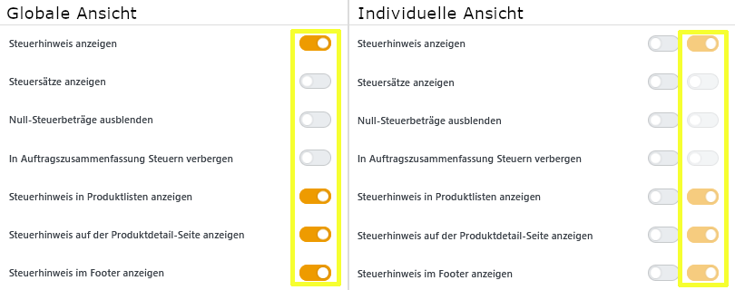

# Multi-Shop Konfiguration

Enthält eine Installation mehrere Shop-Konfigurationen, handelt es sich um einen **Multi-Shop**.

## Shopauswahl

Mit Smartstore können Nutzer für fast alle Einstellungen individuelle Werte pro Shop hinterlegen. Dies wird über die Shopauswahl gesteuert, die sich oben auf jeder entsprechenden Einstellungsseite befindet.

<figure><figcaption></figcaption></figure>

Standardmäßig ist hier die Option „**Alle Shops**” ausgewählt. Diese Werte werden verwendet, sofern keine individuellen Einstellungen vorgenommen wurden.

<figure><figcaption></figcaption></figure>

## Individuelle Einstellungen

Bei Auswahl eines individuellen Shops wird vor jede Einstellung eine zusätzliche Checkbox hinzugefügt. Mit dieser kann festgelegt werden, ob die Einstellung separat für den ausgewählten Shop hinterlegt (aktiv/blau) oder die globale Einstellung verwendet werden soll (inaktiv/grau).

<figure><figcaption></figcaption></figure>


Die individuelle Einstellung kann nicht editiert werden, wenn der globale Modus ausgewählt ist.


In der Shopauswahl gibt es zusätzlich die Möglichkeit, über eine Checkbox (unter dem Dropdown-Menü) bei allen unberührten Einstellungen zwischen „individuell” und „global” zu wechseln. Bereits bearbeitete Werte sind hiervon nicht betroffen und bleiben auf dem eingestellten Wert.

<figure><figcaption></figcaption></figure>

### Ausschließlich für Experten?

Lassen Sie sich nicht aus der Ruhe bringen, wenn Ihnen in der Multi-Store-Konfiguration eine Einstellungsseite mit doppelt so vielen Schaltern wie zuvor angezeigt wird. Auch hier gilt:

<table><thead><tr><th width="324">Linke Checkbox</th><th width="321.5">Rechte Checkbox</th></tr></thead><tbody><tr><td>Schalter für die individuelle Einstellung</td><td>Schalter für den einzustellenden Wert</td></tr></tbody></table>

<figure><figcaption></figcaption></figure>
