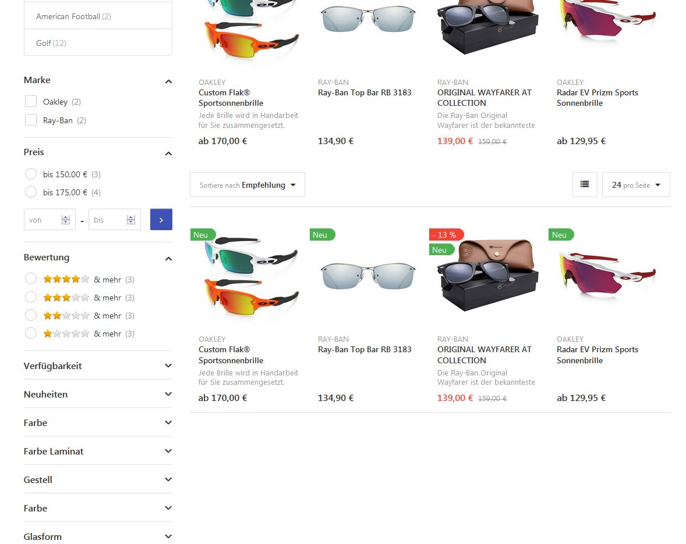

# Facettensuche / Filter

Durch dem in den Premium und Enterprise Editionen enthaltenen MegaSearchPlus Plugin lassen sich die Suchtreffer durch eine Facettennavigation eingrenzen.

### Beispiel einer Facettennavigation:

Welche Inhalte in der Facettennavigation angezeigt werden, wird im [MegaSearch Plugin](../../plugins-designs/megasearch-plugin.md) , in den Produktdetails unter dem Tab [Spezifikationsattribute](../../../abcd/katalog/spezifikationsattribute-verwalten.md) und bei den [Produktattributen](../../../abcd/katalog/produkte-verwalten/wie-funktionieren-produktvarianten.md) festgelegt.

Die Einstellungen in den Produktdetails haben eine höhere Gewichtung als die Einstellungen der Spezifikationsattribute. Diese wiederum haben eine höhere Gewichtung als die globalen Einstellungen im MegaSearch Plugin.

Beispiele:

Produktdetails: Filtern zulassen = ja\
Spezifikations-Attribute-Einstellungen: Filtern ermöglichen = ja\
Spezifikations-Attribut wird in der Facettensuche angezeigt.

Produktdetails: Filtern zulassen = nein\
Spezifikations-Attribute-Einstellungen: Filtern ermöglichen = ja\
Das jeweilige Spezifikations-Attribut wird in der Facettensuche nicht angezeigt.

Produktdetails: Filtern zulassen = nicht spezifiziert\
Spezifikations-Attribute-Einstellungen: Filtern ermöglichen = ja\
Spezifikations-Attribut wird in der Facettensuche angezeigt.

Produktdetails: Filtern zulassen = nicht spezifiziert\
Spezifikations-Attribute-Einstellungen: Filtern ermöglichen = nein\
Das jeweilige Spezifikations-Attribut wird in der Facettensuche nicht angezeigt.

Produktdetails: Filtern zulassen = ja\
Spezifikations-Attribute-Einstellungen: Filtern ermöglichen = ja\
Mega Search: Filter für Spezifikationsattribute aktivieren = Nein\
Das jeweilige Spezifikations-Attribut wird in der Facettensuche nicht angezeigt.
