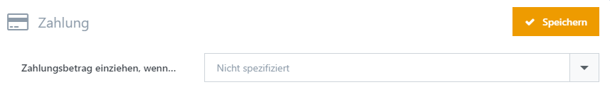

# Zahlung

|     |     |
| --- | --- |
| Zahlungsbetrag einziehen, wenn… | Legt das Ereignis fest, zu dem der Zahlungsbetrag automatisch eingezogen wird. Die gewählte Zahlart muss hierfür Buchungen unterstützen. |
| Zahlungsart-Icons auf der Produktdetailseite | Bestimmt, für welche Zahlarten Icons zur Information über die akzeptierten Zahlungsarten auf Produktdetailseiten angezeigt werden. |