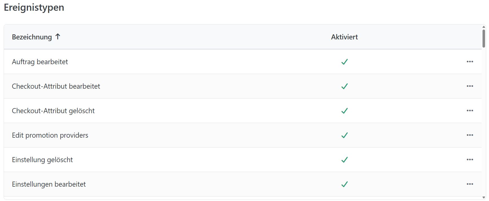

# Ereignistypen einrichten

In einem Shop gibt es Vorgänge, die täglich mehrfach auftreten. Smartstore protokolliert diese im **Aktivitätslog**, das Sie unter **Kunden > Aktivitätslog** aufrufen können. Bei der Installation von Smartstore werden unterschiedliche Ereignistypen angelegt. Sie können jedoch selbst entscheiden, welche Aktivitäten für Sie relevant sind und deshalb protokolliert werden sollen. Um Aktivitäten von der Aufzeichnung auszunehmen, öffnen Sie **Konfiguration > Ereignistypen**. Dort können Sie die Protokollierung bestimmter Ereignisse aktivieren oder deaktivieren. Setzen oder entfernen Sie dazu in der Tabelle den Haken bei **Aktiviert** und klicken Sie anschließend auf **Speichern**.

## Einige interessante Ereignistypen

|                                                        |                                                                                                           |
| ------------------------------------------------------ | --------------------------------------------------------------------------------------------------------- |
| Öffentlicher Shop. Produktrezension hinzugefügt        | Fügt ein Ereignis zum Log hinzu, sobald eine Produktrezension zu einem Ihrer Produkte geschrieben wurde.  |
| Öffentlicher Shop. Foren-Beitrag erstellt              | Fügt ein Ereignis zum Log hinzu, sobald ein Beitrag im Forum geschrieben wurde.                           |
| Öffentlicher Shop. Produkt zur Wunschliste hinzugefügt | Fügt ein Ereignis zum Log hinzu, sobald ein Produkt auf die Wunschliste eines Ihrer Kunden gesetzt wurde. |

