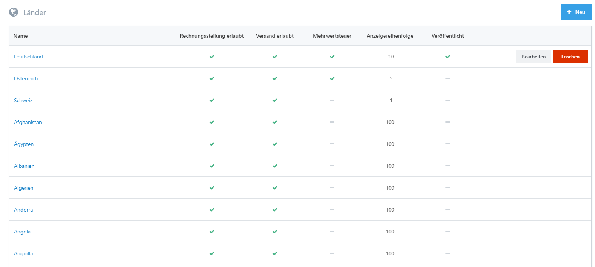

# Länder und Regionen verwalten

Wenn Sie einen Shop betreiben, gibt es Funktionen, die Daten aufgrund der von Ihnen vorgenommenen Ländereinstellungen beziehen oder zurückliefern. So können Sie zum Beispiel basierend auf dem Herkunftsland Ihres Kundes festlegen, ob die Preise in Ihrem Shop inklusive oder exklusive Mehrwertsteuer dargestellt werden. Sie können z.B. auch abhängig vom Land, das bei einer Bestellung in der Lieferadresse angegeben wird Einstellungen vornehmen, um Versandkosten zu berechnen. Um Länder in Ihrem Shop zu verwalten, gehen Sie **Konfiguration > Regionale Einstellungen > Länder**. 

## Landesinformationen

|     |     |
| --- | --- |
| Name | Name des Landes. |
| Rechnungsstellung erlaubt | Aktiviert die Rechnungsstellung für Kunden aus diesem Land. |
| Versand erlaubt    | Ermöglicht den Versand an Kunden aus diesem Land. |
| Länderkürzel (ISO 639)    | Zweibuchstabiges Länderkürzel für dieses Land. Eine komplette Liste befindet sich unter [http://de.wikipedia.org/wiki/ISO-3166-1-Kodierliste](http://de.wikipedia.org/wiki/ISO-3166-1-Kodierliste). |
| Länderkürzel (3 Zeichen)    | Dreibuchstabiges Länderkürzel nach ISO 3166. |
| ISO-Code | Der numerische ISO-Code für dieses Land. Eine komplette Liste der ISO-Codes finden Sie auf [http://en.wikipedia.org/wiki/ISO\_3166-1\_numeric](http://en.wikipedia.org/wiki/ISO_3166-1_numeric). |
| Mehrwertsteuer | Legt fest ob die EU-Mehrwertsteuer berechnet werden soll. |
| Veröffentlicht | Legt fest, ob dieses Land im Shop sichtbar sein soll. |
| Anzeigereihenfolge | Legt die Anzeigereihenfolge fest. Der Wert 1 bedeutet, dass dieses Land ganz oben in der Liste angezeigt wird. |
| Adressenformat | Das Adressformat gemäß der Landes-Richtlinien. |

## Regionen

Sie können eine beliebige Anzahl von Regionen für jedes Land anlegen, das in Ihrem Shop konfiguriert ist. Diese Regionen werden überall in Ihrem Shop auftauchen, wo Länder ausgewählt werden können. Direkt unterhalb des Ländereingabeelements werden nach der Auswahl des Landes alle für dieses Land aktiven Regionen nachgeladen. Wenn es Staaten/Provinzen für die in Ihrem Shop aktiven Länder gibt, können Sie Versandkosten auch basierend  auf der Region einrichten, die Ihr Kunde beim Bestellvorgang auswählt. Wenn Sie eine Region erstellen oder verändern möchten, können Sie einen lokalisierten Anzeigennamen angeben, eine Abkürzung und die Anzeigereihenfolge. Sie können außerdem spezifizieren, ob die Region in Ihrem Shop veröffentlicht wird.