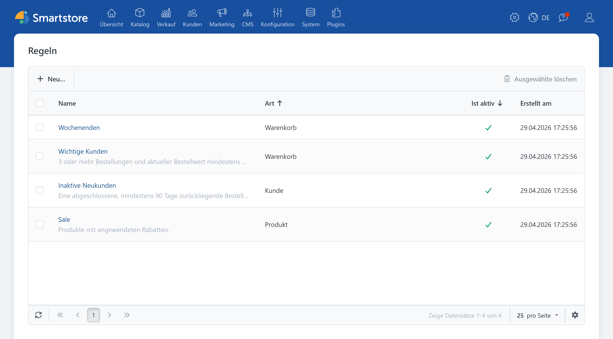
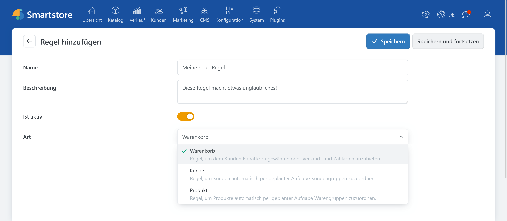
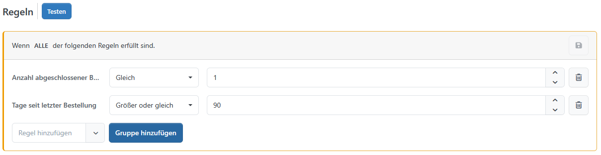

# Regeln

> Verständlich gebaut, schnell einsatzbereit

Mit dem **Regeln** lassen sich Bedingungen für Produkte, Kunden und Warenkörbe direkt in der Administration zusammenstellen. Programmierkenntnisse sind dafür nicht erforderlich. Die erstellten Regelsätze können anschließend für Rabatte, Kundengruppen, Kategorien sowie Versand- und Zahlungsarten verwendet werden.

**Regeln** trennen dabei die Bedingung von der auszuführenden Aktion. Ein Regelsatz bestimmt beispielsweise, wann ein Kunde einen Rabatt erhalten darf. Die Höhe und Art des Rabatts werden weiterhin in den Rabatteinstellungen festgelegt.


Die **Regeln** definieren, unter welchen Voraussetzungen eine Aktion angewendet wird. Die gewünschte Aktion muss separat eingerichtet und anschließend mit dem Regelsatz verknüpft werden.


## Die zentrale Regelübersicht

Unter **System &rarr; Regeln** finden Sie die zentrale Übersicht aller angelegten Regelsätze. Hier werden Warenkorb-, Kunden- und Produktregeln gemeinsam angezeigt.

Die Übersicht enthält unter anderem den Namen, den Anwendungsbereich (Art), den Aktivierungsstatus und das Erstellungsdatum eines Regelsatzes. Über den Namen kann ein vorhandener Regelsatz zur Bearbeitung geöffnet werden. Nicht aktive Regelsätze bleiben in der Übersicht sichtbar, werden bei der Auswertung jedoch nicht berücksichtigt.

Neue Regelsätze können ebenfalls direkt über diese Übersicht angelegt werden. Dabei wird der gewünschte Art beim Erstellen ausgewählt.

Zusätzlich stehen gefilterte Übersichten für die einzelnen Regeltypen zur Verfügung:

- **Marketing &rarr; Warenkorbregeln**
- **Kunden &rarr; Kundenregeln**
- **Katalog &rarr; Produktregeln**

Diese Ansichten zeigen ausschließlich die Regelsätze des jeweiligen Art. Sie eignen sich besonders für die tägliche Verwaltung, wenn gezielt an Warenkorb-, Kunden- oder Produktregeln gearbeitet werden soll.

## Welche Regeln gibt es?

Smartstore unterscheidet drei Anwendungsbereiche:

| Regelart | Typische Verwendung |
| --- | --- |
| **Warenkorbregeln** | Rabatte sowie verfügbare Versand- oder Zahlungsarten steuern |
| **Kundenregeln** | Kunden anhand festgelegter Merkmale automatisch Kundengruppen zuordnen |
| **Produktregeln** | Produkte anhand ihrer Eigenschaften automatisch Kategorien zuordnen |

Der gewählte Anwendungsbereich bestimmt, welche Bedingungen in den **Regeln** zur Verfügung stehen. Eine Warenkorbregel kann beispielsweise den Warenkorbwert, enthaltene Produkte oder Kundeneigenschaften prüfen. Eine Produktregel arbeitet dagegen mit Produktmerkmalen wie Hersteller, Preis, Bestand oder Schlagwörtern.

## So ist ein Regelsatz aufgebaut

Ein Regelsatz besteht aus allgemeinen Angaben und den eigentlichen Bedingungen. Zu den allgemeinen Angaben gehören:

- ein aussagekräftiger Name,
- eine optionale Beschreibung,
- der Aktivierungsstatus,
- und der Anwendungsbereich.

Die Beschreibung hat keinen Einfluss auf die Auswertung. Sie hilft jedoch dabei, Zweck und Verwendung eines Regelsatzes später schneller nachzuvollziehen.

Jede Bedingung besteht üblicherweise aus drei Teilen:

1. der zu prüfenden Eigenschaft,
2. einem Vergleichsoperator,
3. und dem gewünschten Vergleichswert.

Eine einfache Bedingung könnte beispielsweise lauten:

> **Warenkorb-Zwischensumme** ist größer als oder gleich **100 Euro**.

Die drei Teile sind: `Zwischensumme des Warenkorbes` &plus; `Größer als oder gleich` &plus; `100`

Welche Vergleichsoperatoren angeboten werden, hängt von der gewählten Eigenschaft ab. Bei Zahlen können beispielsweise Größenvergleiche verwendet werden. Bei Texten oder Auswahllisten stehen entsprechend passende Vergleiche zur Verfügung.

## Einen Regelsatz erstellen

1. Öffnen Sie **System &rarr; Regeln** oder eine der gefilterten Regelübersichten.
2. Klicken Sie auf **Neu hinzufügen**.
3. Geben Sie einen Namen für den Regelsatz ein.
4. Ergänzen Sie bei Bedarf eine kurze Beschreibung.
5. Aktivieren Sie den Regelsatz.
6. Wählen Sie den gewünschten Anwendungsbereich (Art).
7. Speichern Sie den neuen Regelsatz.

Die eigentlichen Bedingungen können erst nach dem ersten Speichern angelegt werden. Der gewählte Anwendungsbereich ist anschließend fest mit dem Regelsatz verbunden und kann nicht mehr geändert werden.

## Bedingungen festlegen

Nach dem ersten Speichern erscheint der Bereich zur Bearbeitung der Regeln. Öffnen Sie die Auswahl **Regel hinzufügen** und wählen Sie die gewünschte Bedingung aus. Anschließend legen Sie den Vergleich und den passenden Wert fest.

Bei Warenkorb- und Kundenregeln können mehrere Bedingungen unterschiedlich miteinander verknüpft werden:

- **Alle Regeln müssen erfüllt sein:** Jede Bedingung des Regelsatzes muss zutreffen.
- **Mindestens eine Regel muss erfüllt sein:** Es genügt, wenn eine der Bedingungen zutrifft.

Für umfangreichere Warenkorb- oder Kundenregeln lassen sich zusätzliche Gruppen anlegen. Auf diese Weise können verschiedene Kombinationen aus verpflichtenden und alternativen Bedingungen abgebildet werden.

## Beispiel: Rabatt ab einem bestimmten Warenkorbwert

Ein Rabatt soll nur gewährt werden, wenn die Zwischensumme des Warenkorbs mindestens 100 Euro beträgt.

Dazu wird eine Warenkorbregel mit folgender Bedingung erstellt:

> **Zwischensumme des Warenkorbes** ist größer als oder gleich **100 Euro**.

Nach dem Speichern wird der Regelsatz einem zuvor eingerichteten Rabatt zugewiesen. Die **Regeln** prüfen die Voraussetzung. Die Rabatteinstellungen bestimmen dagegen die Höhe, die Berechnungsart und weitere Eigenschaften des Rabatts.

Soll der Rabatt zusätzlich nur für registrierte Kunden gelten, kann eine weitere Bedingung ergänzt werden. In diesem Fall müssen beide Bedingungen erfüllt sein.

## Regeln testen

Über die Funktion **Regeln testen** lässt sich kontrollieren, welche Daten den Bedingungen entsprechen. Die Prüfung verändert keine Zuordnungen und eignet sich daher gut zur Kontrolle vor dem produktiven Einsatz.

Je nach Regeltyp zeigt Smartstore unterschiedliche Ergebnisse:

- Bei einer Warenkorbregel wird geprüft, ob der aktuelle Warenkorb des angemeldeten Administrators die Bedingungen erfüllt.
- Bei einer Kundenregel wird die Anzahl der passenden Kunden angezeigt.
- Bei einer Produktregel wird die Anzahl der passenden Produkte ermittelt.

Ein erfolgreiches Testergebnis bedeutet zunächst nur, dass passende Daten gefunden wurden. Damit die Regel tatsächlich eine Wirkung hat, muss der Regelsatz noch dem gewünschten Rabatt, der Versandart, Zahlungsart, Kundengruppe oder Kategorie zugeordnet werden.

## Regelsätze anwenden

Ein Regelsatz entfaltet erst dann eine Wirkung, wenn er mit einem passenden Objekt verknüpft wird.

Warenkorbregeln können in den Einstellungen von Rabatten, Versandarten und Zahlungsarten ausgewählt werden. Die Bedingungen werden während der Nutzung des Shops geprüft. Auf diese Weise kann Smartstore entscheiden, ob der Rabatt oder die jeweilige Zahlungs- beziehungsweise Versandart angeboten werden darf.

Kundenregeln werden einer Kundengruppe zugeordnet. Die passenden Kunden können anschließend über die entsprechende Funktion oder eine geplante Aufgabe ermittelt und der Kundengruppe hinzugefügt werden.

Produktregeln werden einer Kategorie zugeordnet. Auch hier kann die Zuordnung über die vorgesehene Funktion oder eine geplante Aufgabe aktualisiert werden. Dadurch lassen sich dynamisch gepflegte Kategorien aufbauen, deren Produkte anhand definierter Kriterien zusammengestellt werden.

In der Bearbeitungsansicht eines Regelsatzes zeigt Smartstore außerdem an, welchen Objekten der Regelsatz bereits zugeordnet ist. So lässt sich leichter erkennen, an welchen Stellen eine Änderung Auswirkungen haben kann.

## Beispielregeln

**Regeln** können für viele unterschiedliche Abläufe verwendet werden. Einige typische Beispiele sind:

### Rabatt ab einem Mindestbestellwert

Der Rabatt soll ab einer Warenkorb-Zwischensumme von 100 Euro gelten.

- **Anwendungsbereich:** Warenkorbregel
- **Verknüpfung:** Alle Regeln müssen erfüllt sein
- **Bedingung:** `Zwischensumme des Warenkorbes` &plus; `größer als oder gleich` &plus; `100`
- **Verwendung:** Den Regelsatz dem gewünschten Rabatt zuordnen.

### Wochenendaktion

Der Rabatt soll ausschließlich samstags und sonntags gelten.

- **Anwendungsbereich:** Warenkorbregel
- **Verknüpfung:** Alle Regeln müssen erfüllt sein
- **Bedingung:** `Wochentag` &plus; `ist eine von` &plus; [`Samstag`, `Sonntag`]
- **Verwendung:** Den Regelsatz dem Rabatt für die Wochenendaktion zuordnen.

### Rabatt für Stammkunden

Der Rabatt soll Kunden angeboten werden, die mindestens fünf Bestellungen aufgegeben oder insgesamt mindestens 1.000 Euro ausgegeben haben.

- **Anwendungsbereich:** Warenkorbregel
- **Verknüpfung:** Mindestens eine Regel muss erfüllt sein
- **Bedingung 1:** `Anzahl der Aufträge` &plus; `Größer oder gleich` &plus; `5`
- **Bedingung 2:** `Ausgegebener Betrag` &plus; `Größer oder gleich` &plus; `1000`
- **Verwendung:** Den Regelsatz dem Stammkundenrabatt zuordnen.

### Premium-Versand

Die Versandart soll ab einer Warenkorb-Zwischensumme von 250 Euro oder einem Warenkorbgewicht von mindestens 20 Kilogramm angeboten werden.

- **Anwendungsbereich:** Warenkorbregel
- **Verknüpfung:** Mindestens eine Regel muss erfüllt sein
- **Bedingung 1:** `Warenkorb-Zwischensumme` &plus; `Größer oder gleich` &plus; `250`
- **Bedingung 2:** `Gewicht aller Produkte im Warenkorb` &plus; `Größer oder gleich` &plus; `20`
- **Verwendung:** Den Regelsatz der Versandart **Premium-Versand** zuordnen.

### Kundengruppe für inaktive Kunden

Kunden sollen als inaktiv gelten, wenn sie mindestens eine abgeschlossene Bestellung besitzen und ihre letzte Bestellung mindestens 180 Tage zurückliegt.

- **Anwendungsbereich:** Kundenregel
- **Verknüpfung:** Alle Regeln müssen erfüllt sein
- **Bedingung 1:** `Anzahl der Aufträge` &plus; `Größer oder gleich` &plus; `1`
- **Bedingung 2:** `Tage seit der letzten Bestellung` &plus; `Größer oder gleich` &plus; `180`
- **Verwendung:** Den Regelsatz der Kundengruppe **Inaktive Kunden** zuordnen. Die Zuordnung erfolgt beim erneuten Anwenden der Regeln oder über die entsprechende geplante Aufgabe.

### Automatische Aktionskategorie

Produkte mit einem zugewiesenen Rabatt sollen automatisch in einer Kategorie für Sonderangebote erscheinen.

- **Anwendungsbereich:** Produktregel
- **Verknüpfung:** Alle Regeln müssen erfüllt sein
- **Bedingung:** `Hat angewendete Rabatte` &plus; `Gleich` &plus; `Ja`
- **Verwendung:** Den Regelsatz der Kategorie **Sonderangebote** zuordnen. Die Produktzuordnung erfolgt beim erneuten Anwenden der Regeln oder über die entsprechende geplante Aufgabe.

### Zahlung per Rechnung

Die Zahlungsart soll registrierten Kunden und Mitgliedern einer ausgewählten Kundengruppe zur Verfügung stehen.

- **Anwendungsbereich:** Warenkorbregel
- **Verknüpfung:** Alle Regeln müssen erfüllt sein
- **Bedingung:** `In Kundengruppe` &plus; `Links enthält ALLE Werte von rechts` &plus; [`Registriert`, `Rechnungskunden`]
- **Verwendung:** Den Regelsatz der Zahlungsart **Rechnung** zuordnen.

### Automatische Herstellerkategorie

Alle Produkte eines bestimmten Herstellers sollen automatisch in einer eigenen Kategorie erscheinen.

- **Anwendungsbereich:** Produktregel
- **Verknüpfung:** Alle Regeln müssen erfüllt sein
- **Bedingung:** `Hersteller` &plus; `ist eine von` &plus; `Beispielhersteller`
- **Verwendung:** Den Regelsatz der gewünschten Herstellerkategorie zuordnen. Die Produktzuordnung erfolgt beim erneuten Anwenden der Regeln oder über die entsprechende geplante Aufgabe.